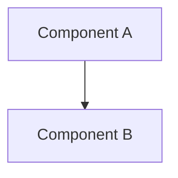

## Summary

One paragraph explanation of the RFC.

## Motivation

Why are we doing this? What problem are we solving? What use cases does it support?
What is the expected outcome?

## Detailed Design

This is the bulk of the RFC. Explain the design in enough detail for someone familiar
with the system to understand, and implement. This should get into specifics and
corner-cases, and include examples of how the feature is used.

### Architecture Diagram

### API/Interface Changes

Describe any new APIs or changes to existing interfaces.

### Data Model Changes

Describe any changes to data models or database schema.

## Alternatives Considered

What other designs have been considered? What is the impact of not doing this?

- Alternative 1: [description and trade-offs]
- Alternative 2: [description and trade-offs]

## Trade-offs

| Aspect          | Option A | Option B | Decision |
| --------------- | -------- | -------- | -------- |
| Performance     |          |          |          |
| Complexity      |          |          |          |
| Maintainability |          |          |          |
| Cost            |          |          |          |

## Impact Analysis

### Affected Systems

- [ ] Frontend
- [ ] Order Service
- [ ] Notification Service
- [ ] Infrastructure
- [ ] CI/CD Pipeline

### Backward Compatibility

- [ ] Fully backward compatible
- [ ] Breaking changes with migration path
- [ ] Breaking changes without migration

### Security Implications

Describe any security considerations or impacts.

### Performance Implications

Describe expected performance impacts (latency, throughput, resource usage).

## Implementation Plan

1. Phase 1: [description]
2. Phase 2: [description]
3. Phase 3: [description]

## Open Questions

- Question 1: ?
- Question 2: ?

## References

- Related ADR: docs/adr/...
- External documentation: [link]
- Similar implementations: [link]

## Decision Log

| Date | Decision | Rationale | Decision Maker |
| ---- | -------- | --------- | -------------- |
|      |          |           |                |
