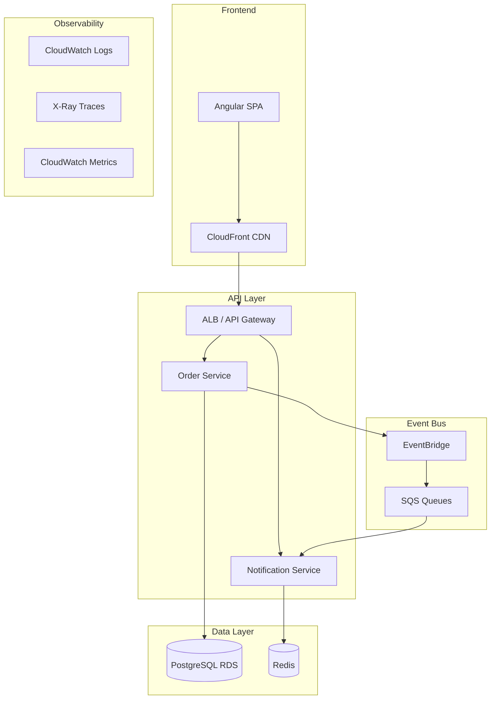
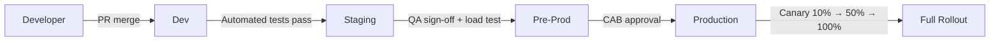
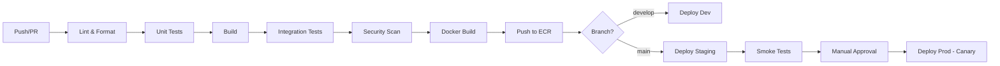
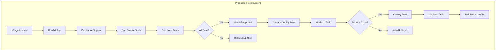
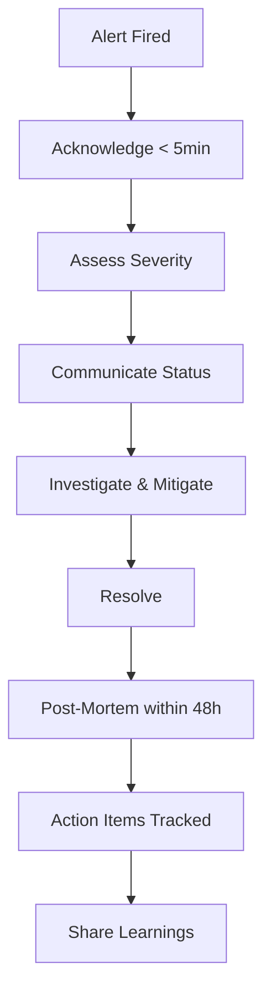
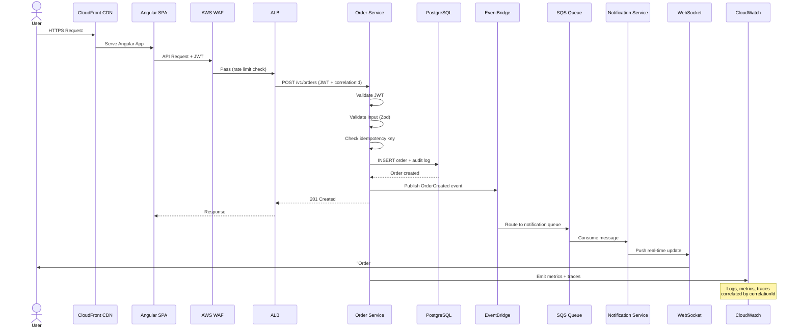

# Production-Ready App — Fortune 500 SDLC Master Plan

## App Concept: **OrderFlow** — Real-Time Order Management System

A cloud-native, event-driven microservices application for managing orders with real-time status tracking and notifications.

> **Purpose**: Hands-on learning & interview prep. Deploy, validate, demonstrate — then destroy all resources. Not a long-running production app.

> **Scope Philosophy**: App functionality is intentionally **minimal** (2 services, 3 screens). The value is in the **architecture, DevOps, CI/CD, observability, and security practices** — not in building a feature-rich product. Every line of business logic exists only to exercise an enterprise pattern.

---

## Tech Stack

| Layer         | Technology                                        |
| ------------- | ------------------------------------------------- |
| Frontend      | Angular 18+, TypeScript 5.4+, SASS, Jest, Cypress |
| Backend       | Node.js 22 LTS, Express 4.x, TypeScript, Jest     |
| Messaging     | AWS SQS, EventBridge                              |
| Database      | PostgreSQL (RDS), Redis (ElastiCache)             |
| Cloud         | AWS (ECS Fargate, ALB, CloudFront, Route 53)      |
| IaC           | AWS CDK (TypeScript)                              |
| CI/CD         | GitHub Actions                                    |
| Containers    | Docker, ECR                                       |
| Observability | CloudWatch, X-Ray, OpenTelemetry                  |
| Security      | AWS WAF, Secrets Manager, IAM, SonarQube          |

---

## Architecture Overview



> **Why 2 services?** Minimum to demonstrate: inter-service communication, event-driven architecture, independent deployments, distributed tracing, and contract testing. Adding more services adds feature scope, not architectural learning.

---

## SDLC Methodology

Following **Fortune 500 enterprise standards**:

- **Agile/Scrum** with 2-week sprints
- **Trunk-Based Development** with short-lived feature branches
- **Architecture Decision Records (ADRs)** for every major decision
- **RFC Process** for cross-cutting concerns
- **Definition of Done (DoD)** enforced at PR level
- **Change Advisory Board (CAB)** simulation for production deploys
- **SLO/SLI/SLA** defined before first deploy
- **Blameless Post-Mortems** for incidents

---

## Phase 0: Foundation & Governance (Week 1)

### 0.1 Repository Setup

- [ ] Create monorepo with Nx workspace
- [ ] Configure branch protection rules (require PR, 1 approval, status checks pass)
- [ ] Enforce **signed commits** (branch protection: require commit signing)
- [ ] Define branch naming convention (`feature/<ticket>-<slug>`, `hotfix/`, `release/v*`)
- [ ] Setup CODEOWNERS file
- [ ] Configure commit conventions (Conventional Commits)
- [ ] Setup Husky + lint-staged for pre-commit hooks
- [ ] Configure `.editorconfig`, `.prettierrc`, `.eslintrc`
- [ ] Pin toolchain versions: `.nvmrc` (Node 22.x), `.tool-versions` (Nx, AWS CDK)
- [ ] Initialize `CHANGELOG.md` with Keep a Changelog format
- [ ] Create PR template and issue templates (bug, feature, RFC)
- [ ] Create `SECURITY.md` (vulnerability disclosure policy + contact + SLA for response)

### 0.2 Governance Documents

- [ ] Write `CONTRIBUTING.md` (branching strategy, PR process, review checklist)
- [ ] Write `CODE_OF_CONDUCT.md` (Contributor Covenant — required for all enterprise GitHub orgs)
- [ ] Write `RFC-TEMPLATE.md` (problem statement, proposal, alternatives, trade-offs, decision)
- [ ] Write `ADR-001-monorepo-strategy.md`
- [ ] Write `ADR-002-event-driven-architecture.md`
- [ ] Write `ADR-003-database-per-service.md`
- [ ] Write `ADR-004-api-versioning-strategy.md` (URL-based: `/v1/orders`)
- [ ] Write `ADR-005-service-to-service-auth.md` (IAM Task Roles + event envelope signing)
- [ ] Write `ADR-006-observability-strategy.md` (CloudWatch + X-Ray + OpenTelemetry decision)
- [ ] Write `ADR-007-authentication-approach.md` (JWT RS256, token lifetimes, refresh strategy)
- [ ] Define `DEFINITION_OF_DONE.md`
- [ ] Define `DATA_GOVERNANCE.md` (data classification: Public/Internal/Confidential/Restricted; PII fields; retention schedule; right-to-deletion)
- [ ] Create `THREAT_MODEL.md` (STRIDE analysis: identify assets, trust boundaries, threats, mitigations before first line of code)
- [ ] Create `RUNBOOK.md` template
- [ ] Create `INCIDENT_RESPONSE_PLAN.md` (roles, escalation matrix, severity definitions, communication templates)
- [ ] Create `DISASTER_RECOVERY_PLAN.md` (RPO: 1 hour, RTO: 30 min, failover runbook)
- [ ] Define SLO targets (99.9% availability, p95 < 200ms, error rate < 0.1%)
- [ ] Define `ERROR_BUDGET_POLICY.md` (freeze non-critical deploys when budget < 20%)
- [ ] Define `CHANGE_MANAGEMENT_PROCESS.md` (change types: standard/normal/emergency; CAB cadence; rollback criteria)

### 0.3 Project Structure

```
orderflow/
├── .github/
│   ├── workflows/          # CI/CD pipelines
│   ├── PULL_REQUEST_TEMPLATE.md
│   ├── ISSUE_TEMPLATE/
│   └── CODEOWNERS
├── apps/
│   ├── web/                # Angular frontend (3 screens)
│   ├── order-service/      # Express microservice (CRUD + auth)
│   └── notification-svc/   # Express microservice (events + WebSocket)
├── libs/
│   ├── shared-types/       # Shared TypeScript interfaces
│   ├── event-schemas/      # Event contracts (JSON Schema)
│   ├── logger/             # Shared structured logging
│   ├── auth/               # Shared auth middleware
│   └── testing-utils/      # Shared test helpers
├── infra/                  # AWS CDK stacks
├── docs/
│   ├── adr/                # Architecture Decision Records
│   ├── rfc/                # RFC documents
│   ├── runbooks/           # Operational runbooks
│   ├── api/                # OpenAPI specs
│   ├── diagrams/           # Architecture diagrams
│   └── evidence/           # Screenshots, reports (pre-teardown)
├── scripts/                # Automation scripts
├── CHANGELOG.md
├── CODE_OF_CONDUCT.md
├── CONTRIBUTING.md
├── SECURITY.md
├── .nvmrc
├── .tool-versions
├── nx.json
├── package.json
└── tsconfig.base.json
```

### 0.4 Definition of Done Checklist

Every PR must satisfy:

- [ ] Unit tests written (≥80% coverage)
- [ ] Integration tests for new endpoints
- [ ] Contract test updated if API contract changes (Pact)
- [ ] No SonarQube critical/blocker issues
- [ ] No high/critical Snyk vulnerabilities introduced
- [ ] Dependency license check passed (no GPL in proprietary code)
- [ ] API docs updated (OpenAPI spec)
- [ ] ADR written for architectural changes
- [ ] RFC referenced/closed if applicable
- [ ] Changelog updated (`CHANGELOG.md`)
- [ ] No secrets in code (pre-commit hook + TruffleHog scan)
- [ ] Security review completed for auth/input-validation changes
- [ ] Threat model updated if trust boundary or data flow changes
- [ ] Performance impact assessed
- [ ] Accessibility checked (frontend — axe-core)
- [ ] Error handling with proper HTTP codes
- [ ] Structured logging added (correlation ID propagated)
- [ ] Commit signed (GPG)

---

## Phase 1: Backend Microservices (Weeks 2–4)

### 1.0 API Contract-First Development

> **Fortune 500 Standard**: Define API contracts (OpenAPI 3.1) BEFORE writing implementation code. All teams agree on interfaces first.

- [ ] Define OpenAPI specs for both services in `docs/api/`
- [ ] Generate TypeScript types from OpenAPI specs (openapi-typescript)
- [ ] Define event schemas in AsyncAPI 3.0 format (`docs/api/async/`)
- [ ] API versioning via URL path (`/v1/orders`)
- [ ] Backward compatibility rule: existing fields never removed, only deprecated

### 1.1 Shared Libraries First

- [ ] `libs/shared-types` — Domain models, DTOs, event interfaces
- [ ] `libs/event-schemas` — JSON Schema + AsyncAPI validation for events
- [ ] `libs/logger` — Winston/Pino structured logger with correlation IDs
- [ ] `libs/auth` — JWT validation middleware
- [ ] `libs/http-client` — Axios wrapper with retry, circuit breaker, correlation ID propagation
- [ ] `libs/testing-utils` — Factory functions, mock builders, test DB setup

### 1.2 Order Service (Core — includes Auth)

> Single service handles orders AND authentication. Keeps scope small while exercising all enterprise patterns.

**Auth endpoints (minimal):**

- [ ] `POST /v1/auth/register` — email + password, returns JWT
- [ ] `POST /v1/auth/login` — returns access token (15min) + refresh token (7d)
- [ ] Password hashing with bcrypt (cost factor: 12)
- [ ] JWT issuance with RS256
- [ ] PII handling: email encrypted at rest, masked in logs
- [ ] GDPR: consent timestamp on register, `DELETE /v1/auth/me` for right-to-deletion

**Order endpoints (core CRUD):**

- [ ] `POST /v1/orders` — create order (item name, quantity, notes)
- [ ] `GET /v1/orders` — list user's orders (cursor-based pagination)
- [ ] `GET /v1/orders/:id` — order detail
- [ ] `PATCH /v1/orders/:id/status` — update status (pending → confirmed → shipped → delivered)

**Enterprise patterns exercised:**

- [ ] Express app scaffold with TypeScript
- [ ] PostgreSQL with Prisma ORM (migrations, seeding)
- [ ] Event publishing on state transitions (OrderCreated, StatusChanged)
- [ ] Input validation with Zod (generated from OpenAPI schemas)
- [ ] Health check endpoint (`/health` liveness, `/ready` readiness)
- [ ] Graceful shutdown handling (SIGTERM → drain connections → close DB → exit)
- [ ] Rate limiting per API key
- [ ] Request/response logging with correlation ID
- [ ] Audit trail table for all state changes (who, what, when, before/after)
- [ ] Idempotency keys on `POST` endpoints (prevent duplicate orders)
- [ ] OpenAPI response validation middleware

### 1.3 Notification Service (Event Consumer)

> Exercises: async messaging, SQS consumption, WebSocket, DLQ, idempotency.

- [ ] SQS consumer (long-polling) — listens for OrderCreated, StatusChanged
- [ ] WebSocket for real-time push (Socket.IO with Redis adapter)
- [ ] Retry with exponential backoff + DLQ
- [ ] Idempotency (deduplication by messageId)
- [ ] Health check endpoints (`/health`, `/ready`)
- [ ] Graceful shutdown (drain SQS, close WebSocket connections)

### 1.4 Service-to-Service Communication

> **Fortune 500 Standard**: All internal service communication must be authenticated and authorized.

- [ ] Service identity via IAM Task Roles (no shared credentials)
- [ ] Event envelope schema: `{ source, type, correlationId, timestamp, data, version }`
- [ ] Dead letter queue monitoring with automated alerting
- [ ] Circuit breaker on all downstream HTTP calls (opossum: 50% failure → open)

### 1.5 Testing Strategy (Backend)

```
Testing Pyramid:
┌─────────────────┐
│   E2E (5%)      │  ← Contract tests, smoke tests
├─────────────────┤
│ Integration(20%)│  ← Supertest + testcontainers (real DB)
├─────────────────┤
│  Unit (75%)     │  ← Jest, isolated logic, mocked deps
└─────────────────┘
```

- [ ] Unit tests: Jest with mocked dependencies (≥80% coverage)
- [ ] Integration tests: Supertest + Docker PostgreSQL (testcontainers)
- [ ] Contract tests: Pact between Order Service ↔ Notification Service
- [ ] Load tests: k6 scripts (target: 500 RPS, p95 < 200ms)
- [ ] Mutation testing: Stryker (≥70% mutation score)

---

## Phase 2: Containerization & Local Dev (Week 5)

### 2.1 Dockerfiles (Multi-Stage)

- [ ] Base image: `node:22-alpine`
- [ ] Multi-stage builds (build → prune → runtime)
- [ ] Non-root user execution
- [ ] Health check instructions
- [ ] `.dockerignore` optimized
- [ ] Image size target: < 150MB per service

### 2.2 Docker Compose (Local Dev)

- [ ] All services orchestrated
- [ ] PostgreSQL + Redis + LocalStack (AWS emulation)
- [ ] Hot-reload for development
- [ ] Shared network for inter-service communication
- [ ] Volume mounts for code changes
- [ ] Seed scripts for local data

### 2.3 Dockerfile Best Practices

```dockerfile
# Example: Order Service
FROM node:22-alpine AS builder
WORKDIR /app
COPY package*.json ./
RUN npm ci --only=production && npm cache clean --force
COPY . .
RUN npm run build

FROM node:22-alpine AS runtime
RUN addgroup -g 1001 -S appgroup && adduser -S appuser -u 1001
WORKDIR /app
COPY --from=builder --chown=appuser:appgroup /app/dist ./dist
COPY --from=builder --chown=appuser:appgroup /app/node_modules ./node_modules
USER appuser
EXPOSE 3000
HEALTHCHECK --interval=30s --timeout=3s CMD wget -qO- http://localhost:3000/health || exit 1
CMD ["node", "dist/main.js"]
```

---

## Phase 3: Infrastructure as Code (Week 6)

### 3.1 AWS CDK Stacks

- [ ] **NetworkStack** — VPC, subnets (public/private), NAT Gateway, security groups
- [ ] **DatabaseStack** — RDS PostgreSQL, ElastiCache Redis
- [ ] **ECSStack** — Fargate cluster, task definitions, services, ALB
- [ ] **EventStack** — EventBridge bus, SQS queues, DLQs
- [ ] **CDNStack** — CloudFront distribution, S3 bucket (frontend), Route 53
- [ ] **MonitoringStack** — CloudWatch dashboards, alarms, X-Ray
- [ ] **SecurityStack** — WAF rules, Secrets Manager, IAM roles (least privilege)

### 3.2 Environment Strategy & Promotion Flow



```
Environments:
├── dev          # Auto-deploy on PR merge to develop
├── staging      # Auto-deploy on merge to main (pre-prod mirror)
├── pre-prod     # Production-identical config, final validation
└── production   # Manual approval + canary deploy
```

**Artifact Promotion Rule**: Same Docker image SHA promoted through all environments. No rebuilds between stages.

- [ ] Environment-specific CDK context files
- [ ] Parameter Store for configuration (not env vars)
- [ ] Secrets Manager for credentials (rotation every 90 days automated)
- [ ] Cross-stack references via exports
- [ ] Environment parity enforced (same CDK stacks, different params)

### 3.3 IaC Best Practices

- [x] CDK unit tests with assertions library — 42 assertions across 4 test suites
- [ ] `cdk diff` in CI before deploy — deferred to Phase 4 (GitHub Actions)
- [x] Tagging strategy (team, environment, cost-center, service)
- [ ] Drift detection scheduled — deferred to Phase 4 (EventBridge scheduled rule)
- [x] Destruction protection on prod resources

### 3.4 Known Gaps (Deferred)

> Items identified during Phase 3 implementation that were not completed. Must be resolved before Phase 5 (CD).

- [ ] **Secrets rotation not automated** — `secretsRotationDays: 90` is defined in `EnvironmentConfig` but no `SecretRotationSchedule` CDK construct is wired. Requires a Lambda-backed rotation function for RDS credentials and JWT secret. Tracked for Phase 4/5.
- [ ] **Parameter Store for non-secret config** — Plan specifies "Parameter Store for configuration (not env vars)". Currently `REDIS_HOST`, `EVENT_BUS_NAME`, `PORT`, etc. are passed as plain ECS `environment` vars in `ECSStack`. These should be migrated to `ssm.StringParameter` and referenced via `ecs.Secret.fromSsmParameter()`.
- [ ] **Route 53 not provisioned** — CDNStack omits Route 53 records; requires a real registered domain and ACM certificate. Deferred until a domain is available. ALB currently serves HTTP only (TLS terminated at CloudFront).

---

## Phase 4: CI Pipeline — GitHub Actions (Weeks 6–7)

### 4.1 Pipeline Architecture



### 4.2 CI Workflows

- [ ] **pr-checks.yml** — Runs on every PR
  - Lint (ESLint + Stylelint)
  - Format check (Prettier)
  - Unit tests with coverage
  - Build verification
  - Bundle size check (fail if > threshold)
  - SonarQube analysis
  - Dependency vulnerability scan (npm audit, Snyk)
  - License compliance check
  - Nx affected (only test/build changed services)

- [ ] **integration-tests.yml** — Runs on PR to main
  - Spin up Docker Compose
  - Run integration test suite
  - Contract tests (Pact)
  - API schema validation (OpenAPI)

- [ ] **security-scan.yml** — Scheduled daily + on PR
  - SAST: SonarQube/CodeQL
  - DAST: OWASP ZAP (staging)
  - Container scanning: Trivy
  - Dependency check: Snyk/Dependabot
  - Secret scanning: TruffleHog

### 4.3 Quality Gates (PR Merge Blockers)

| Gate                                 | Threshold     |
| ------------------------------------ | ------------- |
| Unit test coverage                   | ≥ 80%         |
| No critical/blocker SonarQube issues | 0             |
| No high/critical vulnerabilities     | 0             |
| Build successful                     | Required      |
| At least 1 approval                  | Required      |
| All status checks pass               | Required      |
| No merge conflicts                   | Required      |
| Lighthouse performance               | ≥ 90          |
| Bundle size delta                    | < 5% increase |

---

## Phase 5: CD Pipeline — Deployment (Weeks 7–8)

### 5.1 Deployment Strategy



### 5.2 Deployment Configurations

- [ ] **Blue-Green** for frontend (CloudFront + S3)
- [ ] **Canary** for backend services (ECS weighted target groups)
- [ ] **Feature Flags** via AWS AppConfig for gradual rollout
- [ ] **Database Migrations** — Forward-only, backward-compatible
- [ ] **Rollback** — Automated on error rate spike (CloudWatch alarm → Lambda)

### 5.3 Release Process (Fortune 500 Standard)

1. **Release Branch** — Cut from `main` after sprint
2. **Release Candidate** — Tag as `v1.2.0-rc.1`
3. **Staging Validation** — QA sign-off, performance baseline
4. **Change Request** — Document in change log (who, what, why, rollback plan)
5. **CAB Approval** — Simulated approval gate in GitHub Actions
6. **Production Deploy** — Canary with auto-rollback
7. **Post-Deploy Verification** — Smoke tests + synthetic monitoring
8. **Release Tag** — `v1.2.0` with release notes

### 5.4 Zero-Downtime Deployment Checklist

- [ ] Database migrations are backward-compatible
- [ ] API versioning maintained (no breaking changes)
- [ ] Health checks configured (liveness + readiness)
- [ ] Connection draining enabled (ALB: 30s)
- [ ] Graceful shutdown in services (SIGTERM handling)
- [ ] Circuit breakers configured (downstream failures)
- [ ] Feature flags for risky changes

---

## Phase 6: Observability & Monitoring (Week 8)

### 6.1 Three Pillars

**Logs (CloudWatch Logs)**

- [ ] Structured JSON logging (Pino)
- [ ] Correlation ID propagated across services
- [ ] Log levels: ERROR → PagerDuty, WARN → Slack, INFO → CloudWatch
- [ ] Log retention: 30 days hot, 90 days cold (S3)
- [ ] Sensitive data masking (PII)

**Metrics (CloudWatch Metrics)**

- [ ] RED metrics per service (Rate, Errors, Duration)
- [ ] Business metrics (orders/min, revenue, conversion)
- [ ] Infrastructure metrics (CPU, memory, connections)
- [ ] Custom dashboards per service + aggregate
- [ ] Anomaly detection alarms

**Traces (AWS X-Ray)**

- [ ] Distributed tracing across all services
- [ ] Trace sampling: 5% normal, 100% on errors
- [ ] Service map visualization
- [ ] Latency breakdown per dependency
- [ ] Trace-to-log correlation

### 6.2 Alerting Strategy

| Severity      | Response Time     | Channel           | Example                 |
| ------------- | ----------------- | ----------------- | ----------------------- |
| P1 - Critical | 5 min             | PagerDuty + Phone | Service down, data loss |
| P2 - High     | 15 min            | PagerDuty + Slack | Error rate > 1%         |
| P3 - Medium   | 1 hour            | Slack             | Latency degradation     |
| P4 - Low      | Next business day | Email             | Disk usage > 70%        |

### 6.3 Synthetic Monitoring

- [ ] External health probes every 60s (CloudWatch Synthetics canaries)
- [ ] Critical user journey replay (login → create order → verify status)
- [ ] Multi-region probe (us-east-1, eu-west-1) to detect regional issues
- [ ] SSL certificate expiry monitoring (alert at 30 days)
- [ ] DNS resolution monitoring
- [ ] Third-party dependency health checks (SQS, EventBridge availability)

### 6.4 SLO Dashboard

- [ ] Availability: 99.9% (43.8 min/month error budget)
- [ ] Latency p95: < 200ms
- [ ] Error rate: < 0.1%
- [ ] Throughput: sustain 500 RPS
- [ ] Error budget burn rate visualization

### 6.5 Error Budget Policy

> **Fortune 500 Standard**: Error budgets drive reliability vs. velocity trade-offs.

| Budget Remaining | Action                                                   |
| ---------------- | -------------------------------------------------------- |
| > 50%            | Normal development velocity, feature work prioritized    |
| 20% – 50%        | Increased review rigor, mandatory load tests on features |
| < 20%            | Feature freeze — reliability work only                   |
| Exhausted (0%)   | All hands on reliability, post-mortem mandatory          |

- [ ] Automated error budget calculation (CloudWatch metric math)
- [ ] Weekly error budget report to stakeholders
- [ ] Budget burn rate alerts (fast-burn: 2% in 1h, slow-burn: 5% in 6h)

---

## Phase 7: Security Hardening (Week 9)

### 7.1 Application Security

- [ ] Input validation on all endpoints (Zod schemas)
- [ ] SQL injection prevention (parameterized queries via Prisma)
- [ ] XSS prevention (Angular built-in + CSP headers)
- [ ] CSRF protection (SameSite cookies + tokens)
- [ ] Rate limiting per IP and per user
- [ ] Request size limits
- [ ] CORS strict configuration
- [ ] Security headers (Helmet.js)

### 7.2 Infrastructure Security

- [ ] VPC with private subnets for services
- [ ] Security groups (least privilege, no 0.0.0.0/0)
- [ ] IAM roles per service (least privilege)
- [ ] Secrets in AWS Secrets Manager (rotated every 90 days)
- [ ] Encryption at rest (RDS, S3, Redis)
- [ ] Encryption in transit (TLS 1.3)
- [ ] WAF rules (SQL injection, XSS, rate limiting)
- [ ] VPC Flow Logs enabled

### 7.3 CI/CD Security

- [ ] SAST in every PR (SonarQube/CodeQL)
- [ ] Container image scanning (Trivy)
- [ ] Dependency vulnerability alerts (Dependabot)
- [ ] Secret scanning (GitHub Advanced Security)
- [ ] Signed commits required
- [ ] Immutable container tags (SHA-based)
- [ ] SBOM generation per release

### 7.4 Data Governance & Privacy

> **Fortune 500 Standard**: Every system handling user data must comply with privacy regulations.

- [ ] Data classification matrix (Public, Internal, Confidential, Restricted)
- [ ] PII fields identified and encrypted at rest + in transit
- [ ] Data retention policy: order data 7 years, user sessions 30 days, logs 90 days
- [ ] Right-to-deletion implementation (GDPR Article 17)
- [ ] Data processing agreements documented
- [ ] Consent management (opt-in tracking with timestamps)
- [ ] PII masking in logs (email, phone, address auto-redacted)
- [ ] Data flow diagram documenting PII movement across services

### 7.5 Compliance

- [ ] OWASP Top 10 addressed (mapped per vulnerability with mitigation proof)
- [ ] SOC 2 Type II controls mapped (access logs, MFA, encryption, change mgmt)
- [ ] Audit trail for all state changes (immutable append-only log)
- [ ] Access review documentation (quarterly simulated review)
- [ ] SBOM (Software Bill of Materials) generated per release
- [ ] License compliance scan (no GPL in proprietary code)
- [ ] Penetration test checklist (simulated, documented findings)

---

## Phase 8: Performance & Resilience (Weeks 9–10)

### 8.1 Performance Optimization

- [ ] CDN caching for static assets (CloudFront)
- [ ] API response caching (Redis, Cache-Control headers)
- [ ] Database query optimization (indexes, EXPLAIN ANALYZE)
- [ ] Connection pooling (PgBouncer pattern)
- [ ] Pagination for list endpoints (cursor-based)
- [ ] Compression (gzip/brotli)
- [ ] Angular bundle optimization (tree-shaking, lazy loading)

### 8.2 Resilience Patterns

- [ ] Circuit breaker (opossum library)
- [ ] Retry with exponential backoff + jitter
- [ ] Bulkhead isolation (separate thread pools)
- [ ] Timeout on all external calls (5s default)
- [ ] Dead Letter Queues for failed events
- [ ] Graceful degradation (fallback responses)
- [ ] Chaos engineering tests (kill containers, inject latency)

### 8.3 Auto-Scaling

- [ ] ECS Service Auto Scaling (CPU > 60%, memory > 70%)
- [ ] Target tracking scaling policies
- [ ] Scheduled scaling for known traffic patterns
- [ ] RDS read replicas for read-heavy patterns (documented, not deployed for learning)

### 8.4 Capacity Planning

> **Fortune 500 Standard**: Production systems must have documented capacity baselines and growth projections.

- [ ] Baseline capacity per service (max RPS, memory ceiling, DB connections)
- [ ] Connection pool sizing (PostgreSQL: 20 per service instance, Redis: 50)
- [ ] Queue depth thresholds (SQS: alert at 1000, DLQ: alert at 1)
- [ ] Storage growth projection (S3 analytics: ~1GB/month estimate)
- [ ] Cost-per-request calculation for FinOps reporting

### 8.5 Load Testing

- [ ] k6 scripts for each service
- [ ] Baseline: 500 RPS sustained for 10 minutes
- [ ] Spike test: 2000 RPS for 2 minutes
- [ ] Soak test: 200 RPS for 1 hour
- [ ] Results compared against SLO targets
- [ ] Load test in CI before production deploy

---

## Phase 9: Production Operations (Weeks 10–11)

### 9.1 Operational Readiness Review (ORR)

Before go-live, verify:

- [ ] All SLOs defined and dashboards live
- [ ] Alerting configured and tested (fire test alert, verify delivery)
- [ ] Runbooks written for top 5 failure scenarios
- [ ] On-call rotation defined (simulated) with escalation matrix
- [ ] Rollback tested and documented (< 5 min to previous version)
- [ ] Disaster recovery plan documented (RPO: 1 hour, RTO: 30 min)
- [ ] Load test results meet SLO targets
- [ ] Security review completed (OWASP checklist signed off)
- [ ] Data backup strategy verified (RDS automated snapshots, S3 versioning)
- [ ] Incident response process documented
- [ ] Synthetic monitoring canaries deployed and green
- [ ] Error budget baseline established
- [ ] All API contracts validated against OpenAPI specs
- [ ] PII data flow documented and approved

### 9.2 Runbooks

Create runbooks for:

- [ ] Service unresponsive (restart, scale, investigate)
- [ ] Database connection exhaustion
- [ ] Message queue backlog growing
- [ ] High error rate spike
- [ ] Memory leak detected
- [ ] Failed deployment rollback
- [ ] Data corruption recovery

### 9.3 Incident Management Process



### 9.4 On-Call & Escalation Matrix

| Level | Role                  | Response Time | Action                              |
| ----- | --------------------- | ------------- | ----------------------------------- |
| L1    | On-Call Engineer      | 5 min         | Acknowledge, triage, run runbook    |
| L2    | Senior Engineer       | 15 min        | Deep investigation, coordinate fix  |
| L3    | Tech Lead / Architect | 30 min        | Architectural decisions, war room   |
| L4    | Engineering Manager   | 1 hour        | Stakeholder communication, resource |

- [ ] Escalation triggers defined (no ack in 10min → auto-escalate)
- [ ] Communication templates (internal status, external status page)
- [ ] War room protocol (bridge call, shared doc, roles assigned)

### 9.5 Maintenance & Iteration

- [ ] Dependency updates (Dependabot weekly)
- [ ] Monthly security patching
- [ ] Quarterly disaster recovery drill
- [ ] Sprint retrospectives on operational health
- [ ] Error budget review (monthly)
- [ ] Cost optimization review (monthly)

---

## Timeline Summary

| Phase            | Duration    | Key Deliverable                          |
| ---------------- | ----------- | ---------------------------------------- |
| 0: Foundation    | Week 1      | Monorepo, governance docs, ADRs          |
| 1: Backend       | Weeks 2–4   | 2 microservices with tests               |
| 2: Containers    | Week 5      | Docker Compose local dev                 |
| 3: IaC           | Week 6      | AWS CDK stacks                           |
| 4: CI            | Weeks 6–7   | GitHub Actions with quality gates        |
| 5: CD            | Weeks 7–8   | Canary deploys with auto-rollback        |
| 6: Observability | Week 8      | Dashboards, alerts, tracing              |
| 7: Security      | Week 9      | SAST/DAST, WAF, encryption               |
| 8: Performance   | Weeks 9–10  | Load tests, circuit breakers, auto-scale |
| 9: Operations    | Weeks 10–11 | Runbooks, ORR, incident process          |
| 10: Frontend     | Weeks 11–12 | Angular app (3 screens) with test suite  |
| 11: Teardown     | Final day   | Evidence capture, destroy all resources  |

**Total: ~12 weeks for production-grade delivery**

---

## Fortune 500 Practices Applied

| Practice               | Implementation                         |
| ---------------------- | -------------------------------------- |
| ADRs                   | Every major decision documented        |
| Trunk-Based Dev        | Short-lived branches, daily merges     |
| Quality Gates          | Automated, non-negotiable in CI        |
| Code Review            | Required, CODEOWNERS enforced          |
| Security Shift-Left    | SAST/DAST in CI, not just prod         |
| Feature Flags          | Decouple deploy from release           |
| Canary Deploys         | Gradual rollout with auto-rollback     |
| SLOs/Error Budgets     | Data-driven reliability decisions      |
| Blameless Post-Mortems | Learning culture, not blame            |
| Change Management      | CAB approval for production changes    |
| Chaos Engineering      | Proactive resilience validation        |
| SBOM & Compliance      | Audit trail, SOC 2 alignment           |
| Cost Governance        | Tagging, budgets, optimization reviews |
| Documentation          | Living docs, not afterthoughts         |

---

## Getting Started

```bash
# 1. Install prerequisites
node --version  # v22.x
npm --version   # v10.x
aws --version   # AWS CLI v2
docker --version

# 2. Create monorepo
npx create-nx-workspace orderflow --preset=ts

# 3. Add Angular app
npx nx g @nx/angular:app web

# 4. Add Express services
npx nx g @nx/express:app order-service
npx nx g @nx/express:app notification-service

# 5. Add shared libraries
npx nx g @nx/js:lib shared-types
npx nx g @nx/js:lib event-schemas
npx nx g @nx/js:lib logger

# 6. Start development
npx nx serve web
npx nx serve order-service
```

---

## AWS Cost Strategy (Temporary Deployment)

Since this is a **learn → deploy → validate → teardown** exercise:

| Service                              | Est. Cost (2-3 days live) |
| ------------------------------------ | ------------------------- |
| ECS Fargate (2 services × 0.25 vCPU) | ~$1.50                    |
| RDS PostgreSQL (db.t3.micro)         | ~$1.50                    |
| ElastiCache Redis (cache.t3.micro)   | ~$1.50                    |
| ALB                                  | ~$2                       |
| CloudFront                           | ~$0.50                    |
| S3                                   | ~$0.10                    |
| CloudWatch                           | ~$1                       |
| **Total (2-3 day validation)**       | **~$8-10**                |

### Cost-Saving Rules

- Use **AWS Free Tier** wherever eligible (RDS, ElastiCache, S3)
- Deploy to **single AZ only** (no multi-AZ needed for learning)
- Use **smallest instance types** (t3.micro, 0.25 vCPU Fargate)
- Keep resources live only **2-3 days** for validation
- Run `cdk destroy --all` immediately after validation
- Use **LocalStack** for 90% of development (free, local AWS emulation)
- Only deploy to real AWS for final integration test + canary demo

### Teardown Command

```bash
# Destroy ALL AWS resources in one command
cd infra && cdk destroy --all --force

# Verify nothing remains (avoid surprise bills)
aws resourcegroupstaggingapi get-resources \
  --tag-filters Key=project,Values=orderflow \
  --region us-east-1
```

---

## Key Metrics to Track (Resume/Interview)

After completion, you'll be able to speak to:

- Designed and deployed **event-driven microservices** architecture on AWS
- Achieved **99.9% availability** with canary deployments and auto-rollback
- Implemented **CI/CD pipeline** with 8+ quality gates reducing defect escape rate
- Reduced **mean time to recovery (MTTR)** to < 5 minutes via auto-rollback
- Load tested to **500 RPS** with p95 latency < 200ms
- Applied **OWASP Top 10** mitigations with SAST/DAST in pipeline
- Infrastructure as Code with **100% AWS CDK** coverage
- **Distributed tracing** across services with X-Ray correlation

---

---

## Phase 10: Frontend Angular App (Weeks 11–12)

### 10.1 Angular Setup

- [ ] Angular 18+ with standalone components
- [ ] SASS with BEM methodology
- [ ] Lazy-loaded feature modules (orders, auth)
- [ ] Angular Material for components
- [ ] State management with NgRx (Signal Store)
- [ ] Environment-based configuration (dev, staging, prod)

### 10.2 Features (3 Screens Only)

> Minimum screens to exercise: routing, guards, API integration, WebSocket, state management.

**Screen 1 — Login/Register** (auth guard, JWT interceptor)

- [ ] Login form, register form, token storage
- [ ] Auth guard on protected routes
- [ ] HTTP interceptor for JWT attachment + 401 redirect

**Screen 2 — Order List** (data table, real-time updates)

- [ ] Table with pagination (cursor-based)
- [ ] Create order button → modal/dialog form
- [ ] Real-time status badge updates via WebSocket
- [ ] Loading skeleton states

**Screen 3 — Order Detail** (status timeline, actions)

- [ ] Status timeline visualization (pending → confirmed → shipped → delivered)
- [ ] Update status action button
- [ ] Toast notification on status change (WebSocket)

**Cross-cutting (all screens):**

- [ ] Global error handling (interceptor + error boundary)
- [ ] Loading states and skeleton screens
- [ ] Responsive layout (mobile-first)

### 10.3 Frontend Quality

- [ ] Jest unit tests for components and services (≥80%)
- [ ] Cypress E2E tests for critical user journeys
- [ ] Lighthouse CI (performance ≥90, accessibility ≥95)
- [ ] Bundle analysis with webpack-bundle-analyzer
- [ ] SASS linting with stylelint
- [ ] Strict TypeScript (no `any`, strict null checks)
- [ ] Internationalization ready (i18n)
- [ ] **WCAG 2.1 AA compliance** (axe-core automated checks in CI)
- [ ] Keyboard navigation for all interactive elements
- [ ] Screen reader testing (NVDA/VoiceOver) for critical flows
- [ ] Color contrast ratio ≥ 4.5:1 for all text
- [ ] Visual regression tests (Percy or Chromatic)
- [ ] CSP headers configured (no `unsafe-inline`, no `unsafe-eval`)

### 10.4 Frontend Architecture

```
apps/web/src/
├── app/
│   ├── core/               # Singleton services, guards, interceptors
│   ├── shared/             # Reusable components, pipes, directives
│   ├── features/
│   │   ├── auth/           # Login, register
│   │   └── orders/         # Order list, order detail, create dialog
│   ├── store/              # NgRx Signal Store
│   └── app.routes.ts
├── assets/
├── environments/
├── styles/                 # Global SASS, variables, mixins
└── test-setup.ts
```

---

## Phase 11: Teardown & Documentation (Final Day)

### 11.1 Capture Evidence (Before Destroy)

- [ ] Screenshot all CloudWatch dashboards
- [ ] Export load test results (k6 HTML report)
- [ ] Record canary deployment in action (screen recording)
- [ ] Save X-Ray service map screenshot
- [ ] Export CI/CD pipeline run summary
- [ ] Document final SLO compliance numbers
- [ ] Save architecture diagram as PNG

### 11.2 Destroy All Resources

- [ ] Run `cdk destroy --all --force`
- [ ] Verify ECR images deleted
- [ ] Verify S3 buckets emptied and deleted
- [ ] Verify CloudWatch log groups deleted
- [ ] Check AWS Cost Explorer — confirm $0 ongoing charges
- [ ] Remove AWS credentials from GitHub Secrets (if desired)

### 11.3 Portfolio-Ready Artifacts

Keep in the repo (code + docs remain free on GitHub):

- [ ] All source code (monorepo stays on GitHub)
- [ ] Architecture diagrams (Mermaid in markdown)
- [ ] ADRs documenting decisions
- [ ] CI/CD pipeline YAML files
- [ ] CDK stacks (IaC as proof)
- [ ] Load test scripts + saved results
- [ ] Screenshots folder (`docs/evidence/`)
- [ ] README with project overview + tech choices

> This repo becomes your **portfolio piece** — interviewers can review code, architecture, CI/CD, and IaC without needing live infrastructure.

---

---

## End-to-End Request Flow (Full Lifecycle)

> Validates that every layer is covered from user click to database and back.



---

## Fortune 500 Compliance Matrix

| #   | Enterprise Requirement      | Implementation                                          | Phase |
| --- | --------------------------- | ------------------------------------------------------- | ----- |
| 1   | API Contract-First          | OpenAPI 3.1 + AsyncAPI 3.0 specs before code            | 1     |
| 2   | API Versioning              | URL-based `/v1/`, backward compat, 90-day deprecation   | 1     |
| 3   | Service Authentication      | JWT (user-facing) + IAM Task Roles (service-to-service) | 1     |
| 4   | Audit Trail                 | Immutable append-only log for all state changes         | 1     |
| 5   | Data Governance (GDPR)      | PII encryption, consent tracking, right-to-deletion     | 1, 8  |
| 6   | Testing Pyramid             | 75% unit, 20% integration, 5% E2E + contract tests      | 1, 10 |
| 7   | Accessibility (WCAG 2.1 AA) | axe-core CI, keyboard nav, screen reader tested         | 10    |
| 8   | Container Security          | Non-root, Trivy scan, immutable SHA tags                | 2     |
| 9   | Infrastructure as Code      | 100% CDK, drift detection, destruction protection       | 3     |
| 10  | Environment Promotion       | Same artifact SHA promoted dev → staging → prod         | 3, 5  |
| 11  | Quality Gates               | 8+ automated gates, non-negotiable in CI                | 4     |
| 12  | Security Shift-Left         | SAST + DAST + container scan + secret scan in CI        | 4, 7  |
| 13  | Canary Deployments          | 10% → 50% → 100% with auto-rollback                     | 5     |
| 14  | Zero-Downtime               | Blue-green (FE), canary (BE), graceful shutdown         | 5     |
| 15  | Observability (3 Pillars)   | Structured logs + metrics + distributed traces          | 6     |
| 16  | Synthetic Monitoring        | External probes, critical journey replay                | 6     |
| 17  | Error Budget Policy         | Feature freeze when budget < 20%                        | 6     |
| 18  | SLO/SLI/SLA                 | 99.9% avail, p95 < 200ms, error < 0.1%                  | 6     |
| 19  | OWASP Top 10                | Mapped per vulnerability with mitigation proof          | 7     |
| 20  | SOC 2 Alignment             | Access logs, MFA, encryption, change management         | 7     |
| 21  | Resilience Patterns         | Circuit breaker, retry, bulkhead, chaos tests           | 8     |
| 22  | Capacity Planning           | Baselines documented, scaling thresholds defined        | 8     |
| 23  | Disaster Recovery           | RPO: 1h, RTO: 30min, documented failover procedure      | 9     |
| 24  | On-Call & Escalation        | 4-level matrix, auto-escalation, war room protocol      | 9     |
| 25  | Blameless Post-Mortems      | Within 48h, action items tracked to completion          | 9     |
| 26  | Change Management (CAB)     | Change request → approval gate → deploy                 | 5, 9  |
| 27  | FinOps / Cost Governance    | Tagging, budget alerts, cost-per-request tracking       | 3, 9  |
| 28  | SBOM & License Compliance   | Generated per release, no GPL in proprietary code       | 4, 7  |
| 29  | Documentation Automation    | OpenAPI → Swagger UI, ADRs, living runbooks             | All   |
| 30  | Portfolio Evidence          | Screenshots, reports, diagrams preserved pre-teardown   | 11    |

---

**Created**: 2026-05-11
**Updated**: 2026-05-11 (Phase 0 Fortune 500 alignment review; Phase 2 Frontend moved to Phase 10)
**Author**: Nilesh Shinde
**Status**: Planning
**Lifecycle**: Temporary (deploy → validate → destroy)
