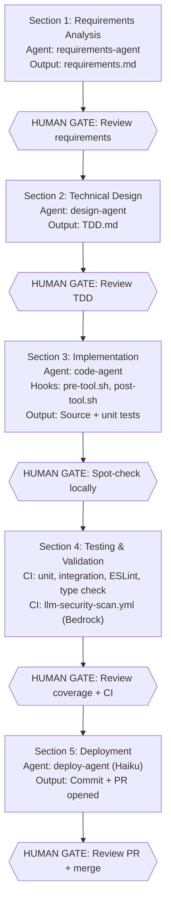

# AI-Driven Development Setup Plan — OrderFlow

> **Project context:** Phases 0–10 of the master plan are complete. This is an entirely new layer on top
> of the existing repo — AI tooling infrastructure, not feature work.

---

## Table of Contents

1. [Phase A — Project Brain (Claude Context Layer)](#phase-a--project-brain-claude-context-layer)
2. [Phase B — Agent Infrastructure](#phase-b--agent-infrastructure)
3. [Phase C — MCP Configuration](#phase-c--mcp-configuration)
4. [Phase D — LLM Security in CI/CD](#phase-d--llm-security-in-cicd)
5. [Phase E — Operator Script](#phase-e--operator-script-ties-it-all-together)
6. [Execution Order & Priority](#execution-order--priority)
7. [What You Get After Each Phase](#what-you-get-after-each-phase)
8. [5-Section Agentic Workflow (Optimized)](#5-section-agentic-workflow-optimized)
9. [Status Tracking](#status-tracking)

---

## Phase A — Project Brain (Claude Context Layer)

_Estimated effort: 1–2 hours | No AWS needed | Zero risk_

### A.1 — Create `.claudeignore` at repo root

**Why first:** Prevents every subsequent Claude session from wasting tokens reading `node_modules/`,
`.nx/`, `cdk.out/` etc.

**File:** `.claudeignore`

```
node_modules/
dist/
build/
cdk.out/
coverage/
.nx/
.angular/
*.env
*.env.*
*.log
*.sqlite
tmp/
```

---

### A.2 — Create root `CLAUDE.md`

**Why:** Every Claude session in this repo automatically loads this — it's the "project brain". Without
it, Claude doesn't know the tech stack, standards, or domain rules.

**File:** `CLAUDE.md`

Key sections to include (based on what already exists in this project):

- Architecture: Nx monorepo, ECS Fargate, SQS+EventBridge, Angular 18 frontend + Vyasa RAG (Lambda + Bedrock)
- Language standards: Node 22, TypeScript strict, Express 4.x, Zod validation
- Existing libs: `@orderflow/shared-types`, `@orderflow/event-schemas`, `@orderflow/logger`, `@orderflow/auth`, `@orderflow/http-client`, `@orderflow/testing-utils`
- Code standards: OWASP Top 10, Conventional Commits, 80% test coverage gate
- Forbidden: `aws-sdk v2` (already in deps — flag this!), `any` type, force push
- Compaction protection block
- Environment: Single `prod` environment (per ADR-011) — no dev/staging

> **⚠️ Stale line in `CLAUDE.md` line 25:** Still says `Environments: dev → staging → pre-prod → prod` but project uses only `prod`. Update this to match `infra/config/environments.ts`.

---

### A.3 — Create per-service `CLAUDE.md` files

**Why:** When Claude works inside a service directory, it loads the service-scoped file automatically
— domain rules, API contracts, local dev commands.

> **Note:** The original plan referenced `order-service`, `notification-svc`, and `web` —
> those apps were planned but not yet scaffolded. The actual apps in the repo are
> `vyasa-rag-service` and `vyasa-ui`.

**Files needed:**

**`apps/vyasa-rag-service/CLAUDE.md`** ✅ (exists)

- Domain: Agentic RAG service — ReAct loop, query planner, self-reflection
- Infra: Lambda + API Gateway, Bedrock KB (S3 Vectors), DynamoDB sessions
- Model: Amazon Nova Pro (`amazon.nova-pro-v1:0`)
- Local dev: `npm run dev` (Express wrapper), eval scripts

**`apps/vyasa-ui/CLAUDE.md`** ❌ (not yet created)

- React 18 + Vite + TailwindCSS chat interface
- SSE streaming support, session management sidebar
- Vite proxy `/api` → `vyasa-rag-service`
- Dev server on port 4201

**`infra/CLAUDE.md`** ✅ (exists)

- CDK TypeScript stacks, single `prod` environment config
- Stack names, existing stacks list
- `npm run cdk:diff` before any changes

**Future (when scaffolded):**

- `apps/order-service/CLAUDE.md` — orders CRUD, Prisma + PostgreSQL, EventBridge
- `apps/notification-svc/CLAUDE.md` — SQS consumer, Socket.IO WebSocket push
- `apps/web/CLAUDE.md` — Angular 18, NgRx Signal Store, 3 screens

---

### A.4 — Create global `~/.claude/CLAUDE.md`

**Why:** Machine-level rules that apply across ALL your projects, not just this repo.

```markdown
# Global Claude Rules

## Commit Format

Always use Conventional Commits: feat:, fix:, chore:, docs:, test:

## Branch Naming

feature/TICKET-short-desc | fix/TICKET-desc | hotfix/desc

## Test Runner

npm test (Nx workspace — runs Jest via nx run-many)

## IMPORTANT: Never auto-run

Never run `git push --force`, `npm publish`, `cdk deploy` without explicit confirmation
```

---

## Phase B — Agent Infrastructure

_Estimated effort: 2–3 hours | No AWS needed | Moderate complexity_

### B.1 — Create `.cloud/permissions.yaml`

**Why:** Hard-stops on destructive operations that apply to ALL agents. These are guardrails enforced at
the system level — Claude cannot override these.

**File:** `.cloud/permissions.yaml`

```yaml
deny:
  - pattern: 'git push --force'
    reason: 'Force push blocked — branch protection enforced on main'
  - pattern: 'git push -f'
    reason: 'Force push blocked — branch protection enforced on main'
  - pattern: 'cdk destroy'
    reason: 'Infrastructure destruction requires manual approval outside agents'
  - pattern: 'DROP TABLE'
    reason: 'Destructive DB operations blocked in agent context'
  - pattern: 'DROP COLUMN'
    reason: 'Destructive DB migrations blocked — require human review'
  - pattern: 'rm -rf'
    reason: 'Recursive deletion blocked'
  - pattern: 'process.env.*='
    reason: 'Env var mutation blocked — use AWS Secrets Manager or SSM'
  - pattern: 'npm publish'
    reason: 'Package publishing requires manual human approval'
  - pattern: 'prisma migrate reset'
    reason: 'Database reset blocked — would destroy all data'

allow_with_confirmation:
  - pattern: 'cdk deploy'
    reason: 'Require human to confirm before deploying infrastructure'
  - pattern: 'prisma migrate deploy'
    reason: 'Require human to confirm before running DB migrations'
  - pattern: 'prisma db push'
    reason: 'Require human to confirm before schema push'
  - pattern: 'git push origin'
    reason: 'Confirm branch and target before pushing'
```

---

### B.2 — Create Orchestrator agent

**File:** `agents/orchestrator/instructions.md`

This is the entry point for any autonomous task. Current implementation is an 8-step pipeline:

```
1. Parse ticket (extract acceptance criteria, affected services)
2. Create feature branch
3. Call design-agent  → wait → verify TDD.md created
4. Call code-agent    → wait → verify lint + tests pass (max 2 retries)
5. Call test-agent    → wait → verify 80% coverage (max 1 retry)
6. Update changelog   → via skills/update-changelog/skill.md
7. Call deploy-agent  → open PR with correct labels
8. Report summary     → ticket, branch, PR URL, coverage, changed files
```

> **Evolution note:** The 5-Section Agentic Workflow (below) is the target architecture
> that adds a dedicated requirements analysis phase and human review gates. The
> current orchestrator will be updated to align with that model.

---

### B.3 — Create sub-agent instruction files

Each is a focused, constrained `instructions.md`:

**`agents/design-agent/instructions.md`** — model: `claude-sonnet`

- Input: ticket description
- Output: `docs/features/{TICKET_ID}/TDD.md` with Mermaid diagrams, API contract, DB changes
- Tools allowed: read files, write docs only
- Tools forbidden: git, cdk, npm

**`agents/code-agent/instructions.md`** — model: `claude-sonnet`

- Input: TDD.md path
- Output: implementation + failing tests fixed
- Must follow: CLAUDE.md standards, existing patterns in the codebase
- Run `npm run lint` and `npm test` before finishing

**`agents/test-agent/instructions.md`** — model: `claude-sonnet`

- Input: changed files list
- Output: additional tests to reach 80% coverage threshold
- Write unit tests only — no integration tests (those need Docker)

**`agents/deploy-agent/instructions.md`** — model: `claude-haiku` (cheapest — it's just scripting)

- Input: branch name, ticket ID, changed files
- Output: PR opened via GitHub MCP with correct labels, linked ticket, checklist

---

### B.4 — Create hooks

**`hooks/pre-tool.sh`** — runs before every agent tool call:

```bash
#!/bin/bash
# 1. Check for secret patterns in any file being written
# 2. Validate .cloud/permissions.yaml — deny blocked commands
# 3. Log audit trail: timestamp, agent, tool, file
```

**`hooks/post-tool.sh`** — runs after every agent tool call:

```bash
#!/bin/bash
# 1. Run eslint on any .ts file that was written
# 2. Verify no .env files were modified
# 3. Append to audit log
```

---

### B.5 — Create skills library

Reusable sub-tasks any agent can call:

**`skills/create-test-file/skill.md`** ✅
Template for Jest test files in this project (imports, describe blocks, AAA pattern, mock patterns for
`@orderflow/logger`)

**`skills/generate-prisma-migration/skill.md`** ❌ (not created — Prisma not yet in active use)
How to safely create Prisma migrations in this project. Deferred until `order-service` is scaffolded.

**`skills/update-changelog/skill.md`** ✅
How to update `CHANGELOG.md` following Keep a Changelog format (already used in this project)

**`skills/open-pr/skill.md`** ✅
PR creation using GitHub MCP with the existing PR template at `.github/PULL_REQUEST_TEMPLATE.md`

---

## Phase C — MCP Configuration

_Estimated effort: 1 hour | Needs API tokens_

### C.1 — Create `.mcp.json` at repo root

```json
{
  "mcpServers": {
    "github": {
      "command": "npx",
      "args": ["-y", "@modelcontextprotocol/server-github"],
      "env": {
        "GITHUB_PERSONAL_ACCESS_TOKEN": "${GITHUB_PERSONAL_ACCESS_TOKEN}"
      }
    },
    "aws-unified": {
      "command": "npx",
      "args": ["-y", "@aws/mcp-unified"],
      "env": {
        "AWS_REGION": "${AWS_REGION}",
        "AWS_PROFILE": "${AWS_PROFILE}"
      }
    },
    "jira": {
      "command": "npx",
      "args": ["-y", "@anthropic-ai/mcp-server-jira"],
      "env": {
        "JIRA_URL": "${JIRA_URL}",
        "JIRA_API_TOKEN": "${JIRA_API_TOKEN}",
        "JIRA_EMAIL": "${JIRA_EMAIL}"
      }
    },
    "langfuse": {
      "url": "https://cloud.langfuse.com/api/public/mcp",
      "headers": {
        "Authorization": "Basic <base64-encoded-credentials>"
      }
    }
  }
}
```

**Tokens needed:**

- GitHub PAT: `https://github.com/settings/tokens`
- Jira API token + email: `https://id.atlassian.com/manage-profile/security/api-tokens`
- Langfuse: Public + Secret key from Langfuse project settings (Base64-encoded as `pk:sk`)
- AWS: Profile configured via `aws configure` or SSO

> **Note:** Slack MCP was originally planned but replaced by Langfuse MCP for RAG evaluation
> observability. Slack can be added later if notification integration is needed.

---

## Phase D — LLM Security in CI/CD

_Estimated effort: 1–2 hours | Needs Bedrock setup_

### D.1 — Enable Claude in AWS Bedrock

```
AWS Console → Bedrock → Model access → Request access:
  - us.anthropic.claude-sonnet-4-5-20250929-v1:0  (used in llm-security-scan.yml)
  - amazon.nova-pro-v1:0                          (used in vyasa-rag-service)
```

> **Note:** Claude Opus is available but not actively used. Amazon Nova Pro is the
> primary model for RAG inference due to no-approval-required access.

### D.2 — Create IAM role for GitHub Actions → Bedrock

- OIDC trust policy for `repo:nilesh0604/f500:*`
- Permission: `bedrock:InvokeModel` on `arn:aws:bedrock:us-east-1::foundation-model/anthropic.claude-*`
- Already have OIDC in `deploy-staging.yml` — extend the same role

### D.3 — Create VPC endpoint for Bedrock (recommended)

```
AWS Console → VPC → Endpoints
  Service: com.amazonaws.us-east-1.bedrock-runtime
  VPC: your existing orderflow VPC
```

Keeps all Claude API calls inside AWS private network — no data touches the public internet.

### D.4 — Add `llm-security-scan.yml` workflow

**File:** `.github/workflows/llm-security-scan.yml`

```yaml
name: LLM Security Review (Bedrock)

on:
  pull_request:
    types: [opened, synchronize]

permissions:
  pull-requests: write
  contents: read
  id-token: write

jobs:
  llm-security:
    runs-on: ubuntu-latest
    steps:
      - uses: actions/checkout@v4
        with: { fetch-depth: 2 }

      - uses: aws-actions/configure-aws-credentials@v4
        with:
          role-to-assume: ${{ secrets.AWS_BEDROCK_ROLE_ARN }}
          aws-region: us-east-1

      - name: Claude Security Review via Bedrock
        run: |
          DIFF=$(git diff origin/main...HEAD -- '*.ts' '*.js')
          # Call Bedrock with diff, parse findings
          # Fail on HIGH/CRITICAL
          # Post summary as PR comment via GitHub API
```

---

## Phase E — Operator Script (ties it all together)

_Estimated effort: 30 min_

### E.1 — Create `scripts/ai-dev.sh`

A single script you run to trigger the orchestrator for a given ticket:

```bash
#!/bin/bash
# Usage: ./scripts/ai-dev.sh JIRA-456
# Fetches Jira ticket, runs orchestrator headlessly

TICKET_ID="$1"

# Fetch ticket via Jira API (or Jira MCP)
TICKET_JSON=$(curl -s -H "Authorization: Bearer $JIRA_API_TOKEN" \
  "https://yourcompany.atlassian.net/rest/api/3/issue/$TICKET_ID")

# Run orchestrator
claude -p agents/orchestrator/instructions.md \
  --var TICKET_ID="$TICKET_ID" \
  --var TICKET_CONTEXT="$TICKET_JSON" \
  --var BRANCH="feature/$TICKET_ID" \
  --max-turns 30
```

---

## Execution Order & Priority

| #      | Step                            | File(s) Created | Effort | Prerequisite |
| ------ | ------------------------------- | --------------- | ------ | ------------ |
| **1**  | `.claudeignore`                 | 1 file          | 5 min  | None         |
| **2**  | Root `CLAUDE.md`                | 1 file          | 30 min | None         |
| **3**  | Per-service `CLAUDE.md` (×4)    | 4 files         | 45 min | Step 2       |
| **4**  | `~/.claude/CLAUDE.md`           | 1 file          | 10 min | None         |
| **5**  | `.cloud/permissions.yaml`       | 1 file          | 15 min | None         |
| **6**  | Orchestrator + sub-agents       | 5 files         | 60 min | Steps 2–5    |
| **7**  | Hooks + skills                  | 6 files         | 45 min | Step 6       |
| **8**  | `.mcp.json` + Jira/Slack tokens | 1 file          | 60 min | API tokens   |
| **9**  | Bedrock IAM role + model access | AWS setup       | 30 min | AWS access   |
| **10** | `llm-security-scan.yml`         | 1 file          | 30 min | Step 9       |
| **11** | `scripts/ai-dev.sh`             | 1 file          | 15 min | Steps 6+8    |

---

## What You Get After Each Phase

| After Phase         | What works                                                                                                                 |
| ------------------- | -------------------------------------------------------------------------------------------------------------------------- |
| **A** (Brain)       | Every Claude session in Windsurf instantly knows the full project context — no re-explaining stack, patterns, or standards |
| **B** (Agents)      | Can run `claude -p agents/orchestrator/instructions.md --var TICKET="..."` and get autonomous PR generation                |
| **C** (MCPs)        | Orchestrator can read Jira tickets itself + Langfuse observability for RAG eval — no manual copy-paste                     |
| **D** (Security CI) | Every PR gets AI security review via Bedrock — no code leaves your AWS VPC                                                 |
| **E** (Script)      | One command: `./scripts/ai-dev.sh JIRA-456` → PR opened autonomously                                                       |

---

## 5-Section Agentic Workflow (Optimized)

> **Goal:** Token-efficient, accuracy-optimized pipeline with natural human checkpoints.
>
> **Status:** Target architecture — partially implemented. The current orchestrator
> (Phase B.2) uses the 8-step linear pipeline. This section defines the evolution path.

### Overview

Replaces the linear 8-step pipeline with 5 specialized sections. Each section is a self-contained agentic flow with defined inputs, outputs, and human review gates.

### Section 1: Requirements Analysis

| Aspect       | Details                                                                       |
| ------------ | ----------------------------------------------------------------------------- |
| **Agent**    | `requirements-agent` ❌ **not yet created**                                   |
| **Input**    | Jira ticket (fetched via Jira MCP)                                            |
| **Output**   | `docs/features/TICKET/requirements.md`                                        |
| **Model**    | Claude Sonnet (deep reasoning on ambiguous requirements)                      |
| **Contents** | Problem statement, constraints, user stories, acceptance criteria, edge cases |

**Why separate from Technical Design:** Prevents token waste. If requirements are wrong, technical design will be wrong too. Clean input = better output.

**TODO:** Create `agents/requirements-agent/instructions.md` with read-only permissions (Jira MCP + file read/write to `docs/` only).

🚪 **Human Gate:** Review requirements accuracy before proceeding to design.

---

### Section 2: Technical Design

| Aspect       | Details                                                                                                |
| ------------ | ------------------------------------------------------------------------------------------------------ |
| **Agent**    | `design-agent` (existing)                                                                              |
| **Input**    | Approved `requirements.md`                                                                             |
| **Output**   | `docs/features/TICKET/TDD.md`                                                                          |
| **Model**    | Claude Sonnet (system interaction reasoning)                                                           |
| **Contents** | API contract diff, DB schema changes, Mermaid sequence diagram, rollback plan, security considerations |

**Guardrail:** Read-only agent — no git, npm, or file writes outside docs folder.

🚪 **Human Gate:** Review TDD (API contract, schema design, rollback plan) before implementation.

---

### Section 3: Implementation

| Aspect       | Details                                               |
| ------------ | ----------------------------------------------------- |
| **Agent**    | `code-agent` (existing)                               |
| **Input**    | Approved `TDD.md`                                     |
| **Output**   | Source files + unit test skeletons                    |
| **Model**    | Sonnet (complex logic), Haiku (boilerplate/templates) |
| **Approach** | Strict TDD: failing test → implementation → refactor  |

**Safety Layer:** `hooks/pre-tool.sh` runs before every file write:

- Blocks force push, `cdk destroy`, `prisma migrate reset`
- Secret pattern detection (AWS keys, RSA keys, passwords)
- Blocks `.env` file writes

**Post-write:** `hooks/post-tool.sh` auto-lints with ESLint.

**Checkpoint (optional):** Skeleton + interfaces only → human confirms structure matches TDD → full implementation.

🚪 **Human Gate:** Spot-check implementation vs TDD, run locally.

---

### Section 4: Testing & Validation

| Aspect              | Details                                            |
| ------------------- | -------------------------------------------------- |
| **Unit Tests**      | `test-agent` generates tests to reach 80% coverage |
| **Integration**     | Existing CI workflows (`integration-tests.yml`)    |
| **Static Analysis** | ESLint, TypeScript type check (CI)                 |
| **Security Scan**   | `llm-security-scan.yml` (Claude via Bedrock on PR) |
| **Model**           | Sonnet for test generation                         |

**Why no dedicated "Code Review" agent:** Style → ESLint (deterministic). Security → Bedrock workflow. Logic review → human reviews PR diff directly. No token waste on deterministic checks.

🚪 **Human Gate:** Review coverage report + CI status.

---

### Section 5: Deployment

| Aspect         | Details                                                                            |
| -------------- | ---------------------------------------------------------------------------------- |
| **Approach A** | `deploy-agent` with Claude Haiku (cheapest model — pure scripting)                 |
| **Approach B** | Direct MCP calls from bash (no LLM — maximum efficiency)                           |
| **Actions**    | Git stage → commit (Conventional Commits) → push → open PR via GitHub MCP          |
| **Output**     | PR opened with title `[TICKET-123] description`, body with summary + test evidence |

**Skill reference:** `skills/open-pr/skill.md`

🚪 **Human Gate:** Review PR diff + security findings → merge.

---

### Token Efficiency Improvements

| Technique                                   | Savings                                                  |
| ------------------------------------------- | -------------------------------------------------------- |
| Separate requirements → design calls        | ~30% — design agent gets clean input, not raw Jira noise |
| Haiku for deployment (scripting only)       | ~60% vs Sonnet — no reasoning needed                     |
| Skip code-review agent (use CI gates)       | 100% of that section's tokens                            |
| Human gates prevent bad-context propagation | Saves re-running downstream agents                       |
| Direct MCP calls for deterministic tasks    | 100% LLM tokens eliminated                               |

---

### Workflow Diagram



### Implementation Readiness

| Section | Agent                | Status                          |
| ------- | -------------------- | ------------------------------- |
| 1       | `requirements-agent` | Not yet created                 |
| 2       | `design-agent`       | Exists (`agents/design-agent/`) |
| 3       | `code-agent`         | Exists (`agents/code-agent/`)   |
| 4       | `test-agent`         | Exists (`agents/test-agent/`)   |
| 5       | `deploy-agent`       | Exists (`agents/deploy-agent/`) |

<details>
<summary>ASCII fallback (for terminals without Mermaid support)</summary>

```
┌─────────────────────────────────────────────────────────────────────┐
│ SECTION 1: Requirements Analysis                                    │
│ Output: requirements.md                                             │
├─────────────────────────────────────────────────────────────────────┤
│ 🚪 HUMAN GATE: Review requirements                                 │
├─────────────────────────────────────────────────────────────────────┤
│ SECTION 2: Technical Design                                         │
│ Output: TDD.md                                                      │
├─────────────────────────────────────────────────────────────────────┤
│ 🚪 HUMAN GATE: Review TDD                                          │
├─────────────────────────────────────────────────────────────────────┤
│ SECTION 3: Implementation                                           │
│ Output: Source + unit tests                                         │
│ Hooks: pre-tool.sh (security), post-tool.sh (lint)                 │
├─────────────────────────────────────────────────────────────────────┤
│ 🚪 HUMAN GATE: Spot-check locally                                   │
├─────────────────────────────────────────────────────────────────────┤
│ SECTION 4: Testing & Validation                                       │
│ CI: unit tests, integration tests, ESLint, type check                 │
│ CI: llm-security-scan.yml (Bedrock Claude review)                  │
├─────────────────────────────────────────────────────────────────────┤
│ 🚪 HUMAN GATE: Review coverage + CI status                         │
├─────────────────────────────────────────────────────────────────────┤
│ SECTION 5: Deployment                                               │
│ Output: Commit + PR opened                                          │
├─────────────────────────────────────────────────────────────────────┤
│ 🚪 HUMAN GATE: Review PR diff + security findings → MERGE            │
└─────────────────────────────────────────────────────────────────────┘
```

</details>

---

## Status Tracking

### Phase A — Project Brain

- [x] A.1 — `.claudeignore`
- [x] A.2 — Root `CLAUDE.md`
  - [ ] ⚠️ Fix stale environments line (line 25 still says dev → staging → pre-prod → prod)
- [x] A.3 — Per-service `CLAUDE.md` files
  - [x] `apps/vyasa-rag-service/CLAUDE.md`
  - [x] `infra/CLAUDE.md`
  - [ ] `apps/vyasa-ui/CLAUDE.md` — not yet created
  - [ ] `apps/order-service/CLAUDE.md` — deferred (service not scaffolded)
  - [ ] `apps/notification-svc/CLAUDE.md` — deferred (service not scaffolded)
  - [ ] `apps/web/CLAUDE.md` — deferred (service not scaffolded)
- [x] A.4 — Global `~/.claude/CLAUDE.md` (updated existing file)

### Phase B — Agent Infrastructure

- [x] B.1 — `.cloud/permissions.yaml`
- [x] B.2 — `agents/orchestrator/instructions.md` (9-step pipeline — includes requirements-agent + human gate)
- [x] B.3 — Sub-agent instruction files (requirements, design, code, test, deploy)
- [x] B.4 — `hooks/pre-tool.sh` + `hooks/post-tool.sh`
- [x] B.5 — Skills library
  - [x] `skills/create-test-file/skill.md`
  - [x] `skills/update-changelog/skill.md`
  - [x] `skills/open-pr/skill.md`
  - [ ] `skills/generate-prisma-migration/skill.md` — deferred (Prisma not in active use)

### Phase C — MCP Configuration

- [x] C.1 — `.mcp.json` with GitHub, AWS Unified, Jira, Langfuse MCPs

### Phase D — LLM Security in CI/CD

- [x] D.1 — AWS Bedrock model access enabled (Claude Sonnet 4.5 + Nova Pro)
- [x] D.2 — IAM role created: `orderflow-github-bedrock-role` (arn:aws:iam::947612421212:role/orderflow-github-bedrock-role)
- [x] D.2b — Add `AWS_BEDROCK_ROLE_ARN` secret to GitHub repo
- [ ] D.3 — VPC endpoint for Bedrock ⚠️ OPTIONAL — recommended for production
- [x] D.4 — `.github/workflows/llm-security-scan.yml`

### Phase E — Operator Script

- [x] E.1 — `scripts/ai-dev.sh`

### 5-Section Agentic Workflow (target)

- [x] Create `agents/requirements-agent/instructions.md`
- [x] Update orchestrator to add human gate after requirements (Step 3)
- [x] Design-agent updated: consumes `requirements.md`, appends Spec Validation Checklist to TDD.md
- [x] Orchestrator passes `REQUIREMENTS_PATH` to design-agent
- [ ] Add human gate after TDD review (Step 4) — currently optional
- [ ] Add human gate after implementation spot-check (Step 5) — currently optional
