# AI-Driven Development Setup Plan — OrderFlow

> **Project context:** Phases 0–10 of the master plan are complete. This is an entirely new layer on top
> of the existing repo — AI tooling infrastructure, not feature work.

---

## Table of Contents

1. [Phase A — Project Brain (Claude Context Layer)](#phase-a--project-brain-claude-context-layer)
2. [Phase B — Agent Infrastructure](#phase-b--agent-infrastructure)
3. [Phase C — MCP Configuration](#phase-c--mcp-configuration)
4. [Phase D — LLM Security in CI/CD](#phase-d--llm-security-in-cicd)
5. [Phase E — Operator Script](#phase-e--operator-script-jira-backed-async-pipeline)
6. [Execution Order & Priority](#execution-order--priority)
7. [What You Get After Each Phase](#what-you-get-after-each-phase)
8. [Agentic Pipeline (10-Step Workflow)](#agentic-pipeline-10-step-workflow)
9. [Status Tracking](#status-tracking)
10. [Known Gaps & Planned Enhancements](#known-gaps--planned-enhancements)
11. [Future Improvements Priority Matrix](#future-improvements-priority-matrix)

---

## Phase A — Project Brain (Claude Context Layer)

_Estimated effort: 1–2 hours | No AWS needed | Zero risk_

### A.1 — Create `.claudeignore` at repo root

**Why first:** Prevents every subsequent Claude session from wasting tokens reading `node_modules/`,
`.nx/`, `cdk.out/` etc.

**File:** `.claudeignore`

```
node_modules/
dist/
build/
cdk.out/
coverage/
.nx/
.angular/
*.env
*.env.*
*.log
*.sqlite
tmp/
```

---

### A.2 — Create root `CLAUDE.md`

**Why:** Every Claude session in this repo automatically loads this — it's the "project brain". Without
it, Claude doesn't know the tech stack, standards, or domain rules.

**File:** `CLAUDE.md`

Key sections to include (based on what already exists in this project):

- Architecture: Nx monorepo, ECS Fargate, SQS+EventBridge, Angular 18 frontend + Vyasa RAG (Lambda + Bedrock)
- Language standards: Node 22, TypeScript strict, Express 4.x, Zod validation
- Existing libs: `@orderflow/shared-types`, `@orderflow/event-schemas`, `@orderflow/logger`, `@orderflow/auth`, `@orderflow/http-client`, `@orderflow/testing-utils`
- Code standards: OWASP Top 10, Conventional Commits, 80% test coverage gate
- Forbidden: `aws-sdk v2` (already in deps — flag this!), `any` type, force push
- Compaction protection block
- Environment: Single `prod` environment (per ADR-011) — no dev/staging

> **⚠️ Stale line in `CLAUDE.md` line 25:** Still says `Environments: dev → staging → pre-prod → prod` but project uses only `prod`. Update this to match `infra/config/environments.ts`.

---

### A.3 — Create per-service `CLAUDE.md` files

**Why:** When Claude works inside a service directory, it loads the service-scoped file automatically
— domain rules, API contracts, local dev commands.

> **Note:** The original plan referenced `order-service`, `notification-svc`, and `web` —
> those apps were planned but not yet scaffolded. The actual apps in the repo are
> `vyasa-rag-service` and `vyasa-ui`.

**Files needed:**

**`apps/vyasa-rag-service/CLAUDE.md`** ✅ (exists)

- Domain: Agentic RAG service — ReAct loop, query planner, self-reflection
- Infra: Lambda + API Gateway, Bedrock KB (S3 Vectors), DynamoDB sessions
- Model: Amazon Nova Pro (`amazon.nova-pro-v1:0`)
- Local dev: `npm run dev` (Express wrapper), eval scripts

**`apps/vyasa-ui/CLAUDE.md`** ❌ (not yet created)

- React 18 + Vite + TailwindCSS chat interface
- SSE streaming support, session management sidebar
- Vite proxy `/api` → `vyasa-rag-service`
- Dev server on port 4201

**`infra/CLAUDE.md`** ✅ (exists)

- CDK TypeScript stacks, single `prod` environment config
- Stack names, existing stacks list
- `npm run cdk:diff` before any changes

**Future (when scaffolded):**

- `apps/order-service/CLAUDE.md` — orders CRUD, Prisma + PostgreSQL, EventBridge
- `apps/notification-svc/CLAUDE.md` — SQS consumer, Socket.IO WebSocket push
- `apps/web/CLAUDE.md` — Angular 18, NgRx Signal Store, 3 screens

---

### A.4 — Create global `~/.claude/CLAUDE.md`

**Why:** Machine-level rules that apply across ALL your projects, not just this repo.

```markdown
# Global Claude Rules

## Commit Format

Always use Conventional Commits: feat:, fix:, chore:, docs:, test:

## Branch Naming

feature/TICKET-short-desc | fix/TICKET-desc | hotfix/desc

## Test Runner

npm test (Nx workspace — runs Jest via nx run-many)

## IMPORTANT: Never auto-run

Never run `git push --force`, `npm publish`, `cdk deploy` without explicit confirmation
```

---

## Phase B — Agent Infrastructure

_Estimated effort: 2–3 hours | No AWS needed | Moderate complexity_

### B.1 — Create `.cloud/permissions.yaml`

**Why:** Hard-stops on destructive operations that apply to ALL agents. These are guardrails enforced at
the system level — Claude cannot override these.

**File:** `.cloud/permissions.yaml`

```yaml
deny:
  - pattern: 'git push --force'
    reason: 'Force push blocked — branch protection enforced on main'
  - pattern: 'git push -f'
    reason: 'Force push blocked — branch protection enforced on main'
  - pattern: 'cdk destroy'
    reason: 'Infrastructure destruction requires manual approval outside agents'
  - pattern: 'DROP TABLE'
    reason: 'Destructive DB operations blocked in agent context'
  - pattern: 'DROP COLUMN'
    reason: 'Destructive DB migrations blocked — require human review'
  - pattern: 'rm -rf'
    reason: 'Recursive deletion blocked'
  - pattern: 'process.env.*='
    reason: 'Env var mutation blocked — use AWS Secrets Manager or SSM'
  - pattern: 'npm publish'
    reason: 'Package publishing requires manual human approval'
  - pattern: 'prisma migrate reset'
    reason: 'Database reset blocked — would destroy all data'

allow_with_confirmation:
  - pattern: 'cdk deploy'
    reason: 'Require human to confirm before deploying infrastructure'
  - pattern: 'prisma migrate deploy'
    reason: 'Require human to confirm before running DB migrations'
  - pattern: 'prisma db push'
    reason: 'Require human to confirm before schema push'
  - pattern: 'git push origin'
    reason: 'Confirm branch and target before pushing'
```

---

### B.2 — Create Orchestrator agent

**File:** `agents/orchestrator/instructions.md`

This is the entry point for any autonomous task. Current implementation is an 8-step pipeline:

```
1. Parse ticket (extract acceptance criteria, affected services)
2. Create feature branch
3. Call design-agent  → wait → verify TDD.md created
4. Call code-agent    → wait → verify lint + tests pass (max 2 retries)
5. Call test-agent    → wait → verify 80% coverage (max 1 retry)
6. Update changelog   → via skills/update-changelog/skill.md
7. Call deploy-agent  → open PR with correct labels
8. Report summary     → ticket, branch, PR URL, coverage, changed files
```

> **Evolution note:** The 5-Section Agentic Workflow (below) is the target architecture
> that adds a dedicated requirements analysis phase and human review gates. The
> current orchestrator will be updated to align with that model.
>
> **CLI note:** Agents are invoked via `runAgent()` in the TypeScript CLI (`scripts/ai-dev/cli.ts`) using valid
> `codemie-claude`/`claude` CLI flags (`-p --system-prompt --model --max-budget-usd`).
> The earlier `--var` and `--max-turns` flags were aspirational and never existed in the CLI.

---

### B.3 — Create sub-agent instruction files

Each is a focused, constrained `instructions.md`:

**`agents/design-agent/instructions.md`** ✅ — model: `claude-sonnet`

- Input: `requirements.md` path, ticket context
- Output: `docs/features/{TICKET_ID}/TDD.md` — API contract, DB schema, Mermaid sequence diagram, rollback plan, Spec Validation Checklist
- Tools allowed: read files, write docs only
- Tools forbidden: git, cdk, npm

**`agents/code-impl-agent/instructions.md`** ✅ — model: `claude-sonnet`, budget: `$3.00`

- Input: `TDD.md` path, `requirements.md` path
- Output: source files + `docs/features/{TICKET_ID}/IMPL_CHECKLIST.md` (all items ✅)
- Spec-driven TDD: failing test → implementation → refactor
- Gate: IMPL_CHECKLIST.md must exist with no ❌ items before `code-test` unlocks

**`agents/code-test-agent/instructions.md`** ✅ — model: `claude-sonnet`, budget: `$2.00`

- Input: requirements.md, TDD.md, IMPL_CHECKLIST.md, changed files
- Output: spec-compliance tests; each AC tagged `// AC: <id>`
- Gate: 80% coverage (branches/functions/lines/statements) — auto-retries once

**`agents/code-quality-agent/instructions.md`** ✅ — model: `claude-sonnet`, budget: `$0.50`

- Invoked only when `eslint --fix + prettier --write` leave remaining errors
- Input: changed files, remaining error list
- Gate: ESLint + `tsc --noEmit` must pass before `code-security` unlocks

**`agents/code-security-agent/instructions.md`** ✅ — model: `claude-sonnet`, budget: `$1.00`

- Input: TDD.md, changed files, `npm audit` output
- Output: `docs/features/{TICKET_ID}/SECURITY_REVIEW.md` with `## Overall Verdict`
- Pre-flight: secrets pattern scan on `git diff` (blocks on hit); `npm audit` run before agent
- Gate: verdict must not be `FAIL` before `code-perf` unlocks

**`agents/code-perf-agent/instructions.md`** ✅ — model: `claude-sonnet`, budget: `$2.00`

- Input: TDD.md, changed files
- Output: N+1/cache review findings + E2E stubs for new API endpoints

**`agents/deploy-agent/instructions.md`** ✅ — model: `claude-haiku`, budget: `$0.50`

- Input: branch name, ticket ID, changed files
- Output: PR opened via `gh` CLI with filled PR template, Conventional Commit title, correct labels

**`agents/ticket-creator/instructions.md`** ✅ — model: `claude-sonnet`, budget: `$2.00`

- Input: one-liner idea, project key
- Output: structured JSON between `---JSON_OUTPUT_START---` markers (summary, description, type, priority, labels)
- Used by `create` subcommand to generate detailed Jira tickets

**Fix agents** (all ✅, used by `deploy-ship` auto-dispatch and standalone `fix-*` subcommands):

| Agent                 | Model  | Budget | Trigger                                                |
| --------------------- | ------ | ------ | ------------------------------------------------------ |
| `fix-lint-agent`      | haiku  | $0.25  | ESLint errors remain after `eslint --fix`              |
| `fix-types-agent`     | sonnet | $0.50  | `tsc --noEmit` errors (max 2 attempts)                 |
| `fix-tests-agent`     | sonnet | $1.00  | Jest `FAIL` lines (max 2 attempts, spec as tiebreaker) |
| `fix-build-agent`     | sonnet | $0.50  | `npm run build` failures (max 2 attempts)              |
| `fix-security-agent`  | sonnet | $0.50  | HIGH/CRITICAL vulns after `npm audit fix`              |
| `fix-conflicts-agent` | sonnet | $0.75  | ≤10 conflicted files after failed `git rebase`         |

**Legacy agents** (still present, not called by current pipeline):

- `agents/code-agent/instructions.md` — superseded by `code-impl-agent` + `code-test-agent`
- `agents/test-agent/instructions.md` — superseded by `code-test-agent`
- `agents/orchestrator/instructions.md` — superseded by TypeScript CLI (`scripts/ai-dev/`)
- `agents/requirements-agent/instructions.md` ✅ — active (called by `requirements` subcommand)

---

### B.4 — Create hooks

**`hooks/pre-tool.sh`** — runs before every agent tool call:

```bash
#!/bin/bash
# 1. Check for secret patterns in any file being written
# 2. Validate .cloud/permissions.yaml — deny blocked commands
# 3. Log audit trail: timestamp, agent, tool, file
```

**`hooks/post-tool.sh`** — runs after every agent tool call:

```bash
#!/bin/bash
# 1. Run eslint on any .ts file that was written
# 2. Verify no .env files were modified
# 3. Append to audit log
```

---

### B.5 — Create skills library

Reusable sub-tasks any agent can call:

**`skills/create-test-file/skill.md`** ✅
Template for Jest test files in this project (imports, describe blocks, AAA pattern, mock patterns for
`@orderflow/logger`)

**`skills/generate-prisma-migration/skill.md`** ❌ (not created — Prisma not yet in active use)
How to safely create Prisma migrations in this project. Deferred until `order-service` is scaffolded.

**`skills/update-changelog/skill.md`** ✅
How to update `CHANGELOG.md` following Keep a Changelog format (already used in this project)

**`skills/open-pr/skill.md`** ✅
PR creation using GitHub MCP with the existing PR template at `.github/PULL_REQUEST_TEMPLATE.md`

---

## Phase C — MCP Configuration

_Estimated effort: 1 hour | Needs API tokens_

### C.1 — Create `.mcp.json` at repo root

```json
{
  "mcpServers": {
    "github": {
      "command": "npx",
      "args": ["-y", "@modelcontextprotocol/server-github"],
      "env": {
        "GITHUB_PERSONAL_ACCESS_TOKEN": "${GITHUB_PERSONAL_ACCESS_TOKEN}"
      }
    },
    "aws-unified": {
      "command": "npx",
      "args": ["-y", "@aws/mcp-unified"],
      "env": {
        "AWS_REGION": "${AWS_REGION}",
        "AWS_PRSCRUMILE": "${AWS_PRSCRUMILE}"
      }
    },
    "jira": {
      "command": "npx",
      "args": ["-y", "mcp-jira-cloud"],
      "env": {
        "JIRA_BASE_URL": "${JIRA_BASE_URL}",
        "JIRA_API_TOKEN": "${JIRA_API_TOKEN}",
        "JIRA_EMAIL": "${JIRA_EMAIL}"
      }
    },
    "langfuse": {
      "type": "sse",
      "url": "https://cloud.langfuse.com/api/public/mcp",
      "headers": {
        "Authorization": "Basic ${LANGFUSE_API_TOKEN}"
      }
    }
  }
}
```

**Tokens needed:**

- GitHub PAT (`GITHUB_PERSONAL_ACCESS_TOKEN`): `https://github.com/settings/tokens`
- Jira API token + email (`JIRA_BASE_URL`, `JIRA_EMAIL`, `JIRA_API_TOKEN`): `https://id.atlassian.com/manage-profile/security/api-tokens`
- Langfuse (`LANGFUSE_API_TOKEN`): Base64-encoded `pk:sk` from Langfuse project settings
- AWS: Profile configured via `aws configure` or SSO (`AWS_REGION`, `AWS_PRSCRUMILE`)

> **Note:** Slack MCP was originally planned but replaced by Langfuse MCP for RAG evaluation
> observability. Slack can be added later if notification integration is needed.

---

## Phase D — LLM Security in CI/CD

_Estimated effort: 1–2 hours | Needs Bedrock setup_

### D.1 — Enable Claude in AWS Bedrock

```
AWS Console → Bedrock → Model access → Request access:
  - us.anthropic.claude-sonnet-4-5-20250929-v1:0  (used in llm-security-scan.yml)
  - amazon.nova-pro-v1:0                          (used in vyasa-rag-service)
```

> **Note:** Claude Opus is available but not actively used. Amazon Nova Pro is the
> primary model for RAG inference due to no-approval-required access.

### D.2 — Create IAM role for GitHub Actions → Bedrock

- OIDC trust policy for `repo:nilesh0604/f500:*`
- Permission: `bedrock:InvokeModel` on `arn:aws:bedrock:us-east-1::foundation-model/anthropic.claude-*`
- Already have OIDC in `deploy-staging.yml` — extend the same role

### D.3 — Create VPC endpoint for Bedrock (recommended)

```
AWS Console → VPC → Endpoints
  Service: com.amazonaws.us-east-1.bedrock-runtime
  VPC: your existing orderflow VPC
```

Keeps all Claude API calls inside AWS private network — no data touches the public internet.

### D.4 — Add `llm-security-scan.yml` workflow

**File:** `.github/workflows/llm-security-scan.yml`

```yaml
name: LLM Security Review (Bedrock)

on:
  pull_request:
    types: [opened, synchronize]

permissions:
  pull-requests: write
  contents: read
  id-token: write

jobs:
  llm-security:
    runs-on: ubuntu-latest
    steps:
      - uses: actions/checkout@v4
        with: { fetch-depth: 2 }

      - uses: aws-actions/configure-aws-credentials@v4
        with:
          role-to-assume: ${{ secrets.AWS_BEDROCK_ROLE_ARN }}
          aws-region: us-east-1

      - name: Claude Security Review via Bedrock
        run: |
          DIFF=$(git diff origin/main...HEAD -- '*.ts' '*.js')
          # Call Bedrock with diff, parse findings
          # Fail on HIGH/CRITICAL
          # Post summary as PR comment via GitHub API
```

---

## Phase E — Operator Script (Jira-Backed Async Pipeline)

_Estimated effort: 2 hours_

### E.1 — `scripts/ai-dev/` — TypeScript CLI (Migrated from Bash)

> **Status:** Migration complete. The original 3,109-line `scripts/ai-dev.sh` bash script has been migrated to a modular
> TypeScript CLI. The bash version is preserved as `scripts/ai-dev.sh.bak` (deprecated, can be removed).

An async pipeline where each step is independently triggered. State lives in Jira —
each pipeline step maps to a subtask under the parent ticket. Human approval = transitioning
the subtask to "Done" in the Jira UI.

#### CLI Invocation

```bash
# Development (no build needed):
npx tsx scripts/ai-dev/cli.ts <TICKET_ID> <command>

# Via npm script (recommended):
npm run ai-dev -- <TICKET_ID> <command>
```

#### Module Architecture

```
scripts/ai-dev/
├── cli.ts                    # Entry point — commander setup + dispatch
├── config.ts                 # Load ai-dlc.config.ts or defaults
├── types.ts                  # Shared types (StepName, Config, etc.)
│
├── clients/
│   ├── jira-client.ts        # Typed Jira REST API wrapper
│   ├── http.ts               # fetch wrapper with Basic auth header
│   ├── github.ts             # gh CLI wrapper
│   └── aws.ts                # aws CLI wrapper
│
├── core/
│   ├── agent-runner.ts       # runAgent() — read instructions, substitute vars, exec claude
│   ├── prerequisite.ts       # checkPrerequisite() — gating logic per step
│   ├── git.ts                # git operations
│   ├── file-helpers.ts       # featureDir(), subtasksFile(), markers
│   ├── ci-status.ts          # getCIStatus(), classifyCIFailure()
│   ├── logger.ts             # Colored console output
│   └── shell.ts              # execSync wrapper
│
└── steps/
    ├── create.ts, init.ts, status.ts
    ├── requirements.ts, resolve.ts, design.ts
    ├── code-impl.ts, code-test.ts, code-quality.ts, code-security.ts, code-perf.ts
    ├── code.ts (alias), validate.ts
    ├── deploy-pr.ts, deploy-ship.ts
    ├── release.ts, rollback.ts
    └── fix-lint.ts, fix-types.ts, fix-tests.ts, fix-build.ts, fix-security.ts, fix-conflicts.ts
```

**Agent invocation:** Uses the same `codemie-claude`/`claude` CLI but via Node.js `execSync`:

- Reads agent instructions file (Markdown)
- Substitutes `{KEY}` placeholders with `String.replaceAll()` (no `perl` needed)
- Invokes `$CLAUDE_CMD -p --system-prompt "$instructions" --model <model> --max-budget-usd <budget> --dangerously-skip-permissions`

**Eliminated dependencies:** `jq`, `perl`, `curl`, `base64`, `awk`, `sed` — all replaced by Node.js native APIs.

**Budget allocation per agent:**

| Agent               | Model  | Budget | Rationale                                      |
| ------------------- | ------ | ------ | ---------------------------------------------- |
| ticket-creator      | sonnet | $2.00  | Codebase analysis + structured JSON output     |
| requirements-agent  | sonnet | $1.50  | Deep reasoning on ambiguous requirements       |
| design-agent        | sonnet | $2.00  | System interaction, Mermaid, API contract      |
| code-impl-agent     | sonnet | $3.00  | Spec-driven implementation + IMPL_CHECKLIST.md |
| code-test-agent     | sonnet | $2.00  | Spec compliance tests; 80% coverage (1 retry)  |
| code-quality-agent  | sonnet | $0.50  | Residual lint/tsc errors after auto-fix        |
| code-security-agent | sonnet | $1.00  | OWASP review → SECURITY_REVIEW.md              |
| code-perf-agent     | sonnet | $2.00  | N+1/cache review + E2E stubs                   |
| deploy-agent        | haiku  | $0.50  | Pure scripting — opens PR via `gh` CLI         |
| fix-lint-agent      | haiku  | $0.25  | ESLint residuals after auto-fix                |
| fix-types-agent     | sonnet | $0.50  | TypeScript type errors (max 2 attempts)        |
| fix-tests-agent     | sonnet | $1.00  | Jest failures, spec as tiebreaker (max 2)      |
| fix-build-agent     | sonnet | $0.50  | Build/compile errors (max 2 attempts)          |
| fix-security-agent  | sonnet | $0.50  | HIGH/CRITICAL vulns after `npm audit fix`      |
| fix-conflicts-agent | sonnet | $0.75  | ≤10 conflicted files after failed `git rebase` |

**Configurable CLI:** Set `AI_DEV_CLAUDE_CMD=claude` to bypass CodeMie and use raw Claude Code CLI.

**Subtask architecture (9 subtasks per ticket):**

```
Parent ticket: SCRUM-123
├── [AI] Requirements Analysis      → requirements.md (gated: human Done)
├── [AI] Technical Design           → TDD.md (gated: human Done)
├── [AI] Implementation: SCRUM-123     → IMPL_CHECKLIST.md (gated: human Done)
├── [AI] Spec Tests: SCRUM-123         → coverage report (gated: human Done)
├── [AI] Code Quality: SCRUM-123       → lint/tsc pass (gated: human Done)
├── [AI] Security Review: SCRUM-123    → SECURITY_REVIEW.md (gated: human Done)
├── [AI] Performance Review: SCRUM-123 → perf findings (gated: human Done)
├── [AI] PR: SCRUM-123                 → PR opened, transitions to "In Review"
└── [AI] Ship: SCRUM-123               → CI green, transitions to "Done"
```

**Local state files** (stored in `docs/features/{TICKET_ID}/`):

| File                      | Purpose                                                   |
| ------------------------- | --------------------------------------------------------- |
| `.jira-subtasks`          | step → Jira key mapping (source of truth for subtask IDs) |
| `.ticket-context`         | ticket summary + description (passed to agents)           |
| `.pr_number`              | PR number for `deploy-ship` and `release`                 |
| `.fix_retries.json`       | retry counter per failure type (max 3 before hard-block)  |
| `.last-known-good-commit` | rollback target written by `release` before CDK deploy    |
| `.validate-passed`        | marker touched by `validate` — gates `deploy-pr`          |
| `.questions-round`        | Q&A round counter for `resolve` multi-round loop          |

**Full subcommand reference:**

| Subcommand                | Agent                   | Model             | Budget | Rationale                                                                                                                  |
| ------------------------- | ----------------------- | ----------------- | ------ | -------------------------------------------------------------------------------------------------------------------------- |
| `create "idea"`           | `ticket-creator`        | Claude Sonnet 4.6 | $1.0   | Maps a vague one-liner to a structured Jira ticket (summary, description, ACs, story points) — requires creative reasoning |
| `init SCRUM-123`          | — (script)              | —                 | —      | Deterministic: parses ticket via Jira API, creates 9 subtasks, creates git branch — no AI reasoning needed                 |
| `requirements SCRUM-123`  | `requirements-agent`    | Claude Sonnet 4.6 | $1.5   | Detects ambiguities, writes BDD-style acceptance criteria, generates clarifying questions — requires analytical reasoning  |
| `resolve SCRUM-123`       | — (script)              | —                 | —      | Pulls PO answers from Jira comments and patches requirements.md — deterministic text merge                                 |
| `design SCRUM-123`        | `design-agent`          | Claude Sonnet 4.6 | $2.0   | Plans TDD test structure, maps ACs to test cases, reasons about edge cases and mocking strategy                            |
| `code SCRUM-123`          | alias                   | —                 | —      | Chains code-impl → code-test → code-quality → code-security → code-perf (auto-approves each)                               |
| `code-impl SCRUM-123`     | `code-impl-agent`       | Claude Sonnet 4.6 | $3.0   | Highest budget — generates multi-file implementation per CLAUDE.md conventions, produces IMPL_CHECKLIST.md                 |
| `code-test SCRUM-123`     | `code-test-agent`       | Claude Sonnet 4.6 | $2.0   | Writes spec tests targeting 80% branch/line coverage; must reason about async patterns and edge cases                      |
| `code-quality SCRUM-123`  | `code-quality-agent`    | Claude Sonnet 4.6 | $1.5   | Reviews residual ESLint/tsc errors after auto-fix pass; non-trivial fixes require judgment                                 |
| `code-security SCRUM-123` | `code-security-agent`   | Claude Sonnet 4.6 | $1.5   | OWASP Top 10 + SOC 2 review — must reason about injection vectors, auth gaps, PII exposure                                 |
| `code-perf SCRUM-123`     | `code-perf-agent`       | Claude Sonnet 4.6 | $1.5   | Detects N+1 queries, unnecessary re-renders, missing indexes; generates E2E performance stubs                              |
| `validate SCRUM-123`      | — (script)              | —                 | —      | CI dry-run: runs lint / tsc / jest / build / npm audit sequentially — no AI needed                                         |
| `deploy-pr SCRUM-123`     | `deploy-agent`          | Claude Sonnet 4.6 | $2.0   | Crafts PR description, applies branch-naming convention, pushes branch, opens GitHub PR                                    |
| `deploy-ship SCRUM-123`   | — (script + fix agents) | —                 | —      | Monitors CI; classifies failure type; dispatches the matching `fix-*` agent (max 3 retries per type)                       |
| `release SCRUM-123`       | — (script)              | —                 | —      | Smart CDK targeting (rag-only vs full infra), smoke tests, writes `.last-known-good-commit`                                |
| `rollback SCRUM-123`      | — (script)              | —                 | —      | Reverts CDK stacks to `.last-known-good-commit` — deterministic git + CDK operation                                        |
| `fix-lint SCRUM-123`      | `fix-lint-agent`        | Claude Haiku 4.5  | $1.0   | ESLint/Prettier fixes are rule-based and mechanical — Haiku is fast and cost-efficient here                                |
| `fix-types SCRUM-123`     | `fix-types-agent`       | Claude Haiku 4.5  | $1.0   | TypeScript type annotations are mostly mechanical (add types, fix null checks) — Haiku sufficient                          |
| `fix-tests SCRUM-123`     | `fix-tests-agent`       | Claude Sonnet 4.6 | $2.0   | Failing tests often need reasoning about what changed vs what was expected — Sonnet required                               |
| `fix-build SCRUM-123`     | `fix-build-agent`       | Claude Sonnet 4.6 | $2.0   | Build errors can involve complex dependency resolution and config changes — Sonnet required                                |
| `fix-security SCRUM-123`  | `fix-security-agent`    | Claude Sonnet 4.6 | $2.0   | `npm audit fix` may need reasoning about which CVEs to fix vs accept and manual patching                                   |
| `fix-conflicts SCRUM-123` | `fix-conflicts-agent`   | Claude Sonnet 4.6 | $2.0   | Semantic merge conflicts require understanding intent of both branches — Sonnet required                                   |
| `status SCRUM-123`        | — (script)              | —                 | —      | Reads live pipeline state from Jira subtask statuses — no AI needed                                                        |

**Gated steps** (each checks the prior subtask = "Done" before running):
`requirements → design → code-impl → code-test → code-quality → code-security → code-perf → deploy-pr`

**Approval mechanism:** Transition subtask to "Done" in Jira UI — no CLI `approve` command.

**`deploy-ship` CI failure handling:**

1. Fetches `gh pr checks` output
2. Classifies failure: `lint | types | tests | build | security | conflicts | unknown`
3. Dispatches the corresponding `fix-*` subcommand (max 3 retries per type → hard-block)
4. Commits + pushes fix, re-runs `deploy-ship`

**`release` deployment strategy** (smart CDK targeting):

| Changed paths                  | Stacks deployed                                                                  |
| ------------------------------ | -------------------------------------------------------------------------------- |
| `apps/vyasa-rag-service/` only | `OrderFlow-VyasaRag` (fast path — ~2s Lambda update)                             |
| `infra/` (any)                 | `OrderFlow-VyasaVector` + `OrderFlow-VyasaRag` (+ `VyasaUi` if ui-stack changed) |
| `apps/vyasa-ui/`               | S3 sync + CloudFront invalidation (CF dist ID `E1W56P4E23UU5Y`)                  |
| scripts/docs only              | No deploy                                                                        |

`release` also runs smoke tests on the RAG `/health` endpoint and UI domain; auto-rollbacks on failure.

**Prerequisites:** Node.js 22+, `codemie-claude` CLI (`npm install -g @codemieai/code`) or `claude` CLI, `gh` (GitHub CLI), `aws` (AWS CLI), Jira env vars (`JIRA_BASE_URL`, `JIRA_EMAIL`, `JIRA_API_TOKEN`)

> **Note:** Set `AI_DEV_CLAUDE_CMD=claude` to use raw Claude Code CLI instead of the CodeMie enterprise wrapper.

---

## Execution Order & Priority

| #      | Step                            | File(s) Created | Effort | Prerequisite |
| ------ | ------------------------------- | --------------- | ------ | ------------ |
| **1**  | `.claudeignore`                 | 1 file          | 5 min  | None         |
| **2**  | Root `CLAUDE.md`                | 1 file          | 30 min | None         |
| **3**  | Per-service `CLAUDE.md` (×4)    | 4 files         | 45 min | Step 2       |
| **4**  | `~/.claude/CLAUDE.md`           | 1 file          | 10 min | None         |
| **5**  | `.cloud/permissions.yaml`       | 1 file          | 15 min | None         |
| **6**  | Orchestrator + sub-agents       | 5 files         | 60 min | Steps 2–5    |
| **7**  | Hooks + skills                  | 6 files         | 45 min | Step 6       |
| **8**  | `.mcp.json` + Jira/Slack tokens | 1 file          | 60 min | API tokens   |
| **9**  | Bedrock IAM role + model access | AWS setup       | 30 min | AWS access   |
| **10** | `llm-security-scan.yml`         | 1 file          | 30 min | Step 9       |
| **11** | `scripts/ai-dev/` (TS CLI)      | 1 dir           | 15 min | Steps 6+8    |

---

## What You Get After Each Phase

| After Phase         | What works                                                                                                                 |
| ------------------- | -------------------------------------------------------------------------------------------------------------------------- |
| **A** (Brain)       | Every Claude session in Windsurf instantly knows the full project context — no re-explaining stack, patterns, or standards |
| **B** (Agents)      | `runAgent()` helper invokes `codemie-claude -p --system-prompt <instructions> --model sonnet` for autonomous PR generation |
| **C** (MCPs)        | Orchestrator can read Jira tickets itself + Langfuse observability for RAG eval — no manual copy-paste                     |
| **D** (Security CI) | Every PR gets AI security review via Bedrock — no code leaves your AWS VPC                                                 |
| **E** (Script)      | Async pipeline: `npm run ai-dev -- JIRA-456 <step>` — review offline, approve, trigger next step                           |

---

## Agentic Pipeline (10-Step Workflow)

> **Status:** Fully implemented in TypeScript CLI (`scripts/ai-dev/`). The original 5-section model has
> evolved into a 10-step pipeline with dedicated code sub-phases (impl → test → quality →
> security → perf), automated CI monitoring, and a post-merge release/rollback lifecycle.

### Overview

Each step is independently triggerable. State lives in Jira subtasks + local marker files.
Human approval = transitioning the subtask to "Done". The `code` subcommand is an alias that
runs all 5 code sub-steps automatically (useful for trusted changes).

### Step 1: Requirements Analysis

| Aspect      | Details                                                                                   |
| ----------- | ----------------------------------------------------------------------------------------- |
| **Agent**   | `requirements-agent` ✅                                                                   |
| **Input**   | Jira ticket context (`.ticket-context`)                                                   |
| **Output**  | `docs/features/TICKET/requirements.md` (Given/When/Then ACs + Design Decisions)           |
| **Model**   | Sonnet — $1.50                                                                            |
| **Resolve** | Open questions posted to Jira as `## Design Decisions` blocks; `resolve` pulls PO answers |

🚪 **Human Gate:** Review `requirements.md`, transition subtask to "Done". Run `resolve` if open questions remain (multi-round Q&A loop).

---

### Step 2: Technical Design

| Aspect     | Details                                                                                                                     |
| ---------- | --------------------------------------------------------------------------------------------------------------------------- |
| **Agent**  | `design-agent` ✅                                                                                                           |
| **Input**  | Approved `requirements.md`                                                                                                  |
| **Output** | `docs/features/TICKET/TDD.md` — API contract, DB schema, Mermaid sequence diagram, rollback plan, Spec Validation Checklist |
| **Model**  | Sonnet — $2.00                                                                                                              |

🚪 **Human Gate:** Review TDD (API contract, schema, rollback plan, open questions section). Transition to "Done".

---

### Step 3: Implementation

| Aspect       | Details                                                   |
| ------------ | --------------------------------------------------------- |
| **Agent**    | `code-impl-agent` ✅                                      |
| **Input**    | Approved `TDD.md` + `requirements.md`                     |
| **Output**   | Source files + `IMPL_CHECKLIST.md` (all items must be ✅) |
| **Model**    | Sonnet — $3.00                                            |
| **Approach** | Spec-driven TDD: failing test → implementation → refactor |

**Gate:** `IMPL_CHECKLIST.md` must exist with no ❌ before `code-test` can run.

🚪 **Human Gate:** Review implementation + IMPL_CHECKLIST.md, run locally. Transition to "Done".

---

### Step 4: Spec Compliance Testing

| Aspect     | Details                                                                      |
| ---------- | ---------------------------------------------------------------------------- |
| **Agent**  | `code-test-agent` ✅                                                         |
| **Input**  | `requirements.md`, `TDD.md`, `IMPL_CHECKLIST.md`, changed files              |
| **Output** | Tests with `// AC: <id>` tags tracing each acceptance criterion              |
| **Model**  | Sonnet — $2.00 (+ $2.00 retry if coverage < 80%)                             |
| **Gate**   | 80% branches/functions/lines/statements (`jest --coverage`) — blocks on fail |

🚪 **Human Gate:** Review coverage report. Transition to "Done".

---

### Step 5: Code Quality

| Aspect       | Details                                                                 |
| ------------ | ----------------------------------------------------------------------- |
| **Agent**    | `code-quality-agent` ✅ (invoked only if auto-fix leaves errors)        |
| **Input**    | Changed files, residual ESLint error list                               |
| **Auto-fix** | `eslint --fix` + `prettier --write` run first; agent handles remainders |
| **Model**    | Sonnet — $0.50                                                          |
| **Gate**     | `eslint` clean + `tsc --noEmit` pass                                    |

🚪 **Human Gate:** Transition to "Done" when quality checks pass.

---

### Step 6: Security Review

| Aspect         | Details                                                                                          |
| -------------- | ------------------------------------------------------------------------------------------------ |
| **Agent**      | `code-security-agent` ✅                                                                         |
| **Pre-flight** | Secrets scan on `git diff` (regex patterns for credentials/keys); `npm audit --audit-level=high` |
| **Output**     | `docs/features/TICKET/SECURITY_REVIEW.md` with `## Overall Verdict`                              |
| **Model**      | Sonnet — $1.00                                                                                   |
| **Gate**       | Verdict must not be `FAIL`; secrets scan must be clean                                           |

🚪 **Human Gate:** Review `SECURITY_REVIEW.md`. Transition to "Done" when verdict is acceptable.

---

### Step 7: Performance Review

| Aspect     | Details                                         |
| ---------- | ----------------------------------------------- |
| **Agent**  | `code-perf-agent` ✅                            |
| **Input**  | `TDD.md`, changed files                         |
| **Output** | N+1 query review, cache hit analysis, E2E stubs |
| **Model**  | Sonnet — $2.00                                  |

🚪 **Human Gate:** Transition to "Done" when performance findings are acceptable.

---

### Step 8: Validate (CI Dry-Run)

| Aspect     | Details                                                                         |
| ---------- | ------------------------------------------------------------------------------- |
| **Type**   | Script-only — no agent, no Jira subtask                                         |
| **Checks** | [1] ESLint, [2] `tsc --noEmit`, [3] jest 80% coverage, [4] build, [5] npm audit |
| **Output** | `.validate-passed` marker (gates `deploy-pr`)                                   |

No human gate — either passes and unlocks `deploy-pr`, or fails with per-check fix guidance.

---

### Step 9: Deploy PR + Ship

| Subcommand    | Agent                            | Details                                                                           |
| ------------- | -------------------------------- | --------------------------------------------------------------------------------- |
| `deploy-pr`   | `deploy-agent` (haiku — $0.50)   | Push branch, open PR with filled template via `gh` CLI; poll CI for 60s           |
| `deploy-ship` | `fix-*` agents (auto-dispatched) | Monitor CI; classify failure type → dispatch fix agent → commit + push → re-check |

**CI failure classification (`deploy-ship`):**

| CI Failure  | Fix dispatched                       | Max retries |
| ----------- | ------------------------------------ | ----------- |
| `lint`      | `fix-lint-agent` (haiku $0.25)       | 3           |
| `types`     | `fix-types-agent` (sonnet $0.50)     | 3           |
| `tests`     | `fix-tests-agent` (sonnet $1.00)     | 3           |
| `build`     | `fix-build-agent` (sonnet $0.50)     | 3           |
| `security`  | `fix-security-agent` (sonnet $0.50)  | 3           |
| `conflicts` | `fix-conflicts-agent` (sonnet $0.75) | 3           |
| `unknown`   | — (manual required)                  | —           |

No auto-merge — Fortune 500 compliance requires human approval: `gh pr merge <N> --squash --delete-branch`

---

### Step 10: Release + Rollback

| Subcommand | Details                                                                                                                  |
| ---------- | ------------------------------------------------------------------------------------------------------------------------ |
| `release`  | Verifies PR merged; `cdk synth` pre-flight; builds; smart CDK deploy; smoke tests; auto-rollback on failure; Jira "Done" |
| `rollback` | Manual escape hatch: reads `.last-known-good-commit`, checks out infra + apps at that commit, re-deploys CDK stacks      |

---

### Token Efficiency

| Technique                                             | Savings                                                  |
| ----------------------------------------------------- | -------------------------------------------------------- |
| Separate requirements → design → impl phases          | ~30% — each agent gets clean, focused input              |
| Auto-fix before quality agent                         | ~80% of quality agent calls eliminated                   |
| Haiku for deploy + fix-lint (scripting only)          | ~60% vs Sonnet per call                                  |
| Script-only `validate` (no LLM)                       | 100% LLM tokens for CI check eliminated                  |
| `deploy-ship` classifies then fixes (not blind retry) | Avoids re-running whole pipeline on simple lint failures |

---

### Workflow Diagram

```mermaid
flowchart TD
    S0["create: ticket-creator-agent\nOutput: Jira ticket"]
    S1["requirements: requirements-agent\nOutput: requirements.md + Design Decisions"]
    R1{{"resolve loop: PO answers → update requirements.md"}}
    G1{{"HUMAN GATE: requirements Done"}}
    S2["design: design-agent\nOutput: TDD.md + Spec Checklist"]
    G2{{"HUMAN GATE: design Done"}}
    S3["code-impl: code-impl-agent\nOutput: source + IMPL_CHECKLIST.md"]
    G3{{"HUMAN GATE: code-impl Done"}}
    S4["code-test: code-test-agent\nOutput: AC-tagged tests, 80% coverage"]
    G4{{"HUMAN GATE: code-test Done"}}
    S5["code-quality: auto-fix + quality-agent\nOutput: ESLint + tsc clean"]
    G5{{"HUMAN GATE: code-quality Done"}}
    S6["code-security: secrets scan + security-agent\nOutput: SECURITY_REVIEW.md"]
    G6{{"HUMAN GATE: code-security Done"}}
    S7["code-perf: perf-agent\nOutput: N+1 review + E2E stubs"]
    G7{{"HUMAN GATE: code-perf Done"}}
    S8["validate: script-only CI dry-run\nESLint / tsc / jest / build / audit"]
    S9a["deploy-pr: deploy-agent\nOutput: PR opened"]
    S9b["deploy-ship: CI monitor + fix-* agents\nLoop until green"]
    G9{{"HUMAN: merge PR\ngh pr merge N --squash"}}
    S10["release: CDK deploy + smoke tests\nAuto-rollback on failure"]

    S0 --> S1 --> R1 --> G1 --> S2 --> G2 --> S3 --> G3
    G3 --> S4 --> G4 --> S5 --> G5 --> S6 --> G6 --> S7 --> G7
    G7 --> S8 --> S9a --> S9b --> G9 --> S10
```



### Implementation Readiness

| Step | Subcommand                  | Agent                    | Status |
| ---- | --------------------------- | ------------------------ | ------ |
| 0    | `create`                    | `ticket-creator`         | ✅     |
| 1    | `requirements` + `resolve`  | `requirements-agent`     | ✅     |
| 2    | `design`                    | `design-agent`           | ✅     |
| 3    | `code-impl`                 | `code-impl-agent`        | ✅     |
| 4    | `code-test`                 | `code-test-agent`        | ✅     |
| 5    | `code-quality`              | `code-quality-agent`     | ✅     |
| 6    | `code-security`             | `code-security-agent`    | ✅     |
| 7    | `code-perf`                 | `code-perf-agent`        | ✅     |
| 8    | `validate`                  | script-only              | ✅     |
| 9    | `deploy-pr` + `deploy-ship` | `deploy-agent` + `fix-*` | ✅     |
| 10   | `release` + `rollback`      | script-only + CDK        | ✅     |

---

## Status Tracking

### Phase A — Project Brain

- [x] A.1 — `.claudeignore`
- [x] A.2 — Root `CLAUDE.md`
- [x] A.3 — Per-service `CLAUDE.md` files
  - [x] `apps/vyasa-rag-service/CLAUDE.md`
  - [x] `infra/CLAUDE.md`
  - [x] `apps/vyasa-ui/CLAUDE.md`
  - [ ] `apps/order-service/CLAUDE.md` — deferred (service not scaffolded)
  - [ ] `apps/notification-svc/CLAUDE.md` — deferred (service not scaffolded)
  - [ ] `apps/web/CLAUDE.md` — deferred (service not scaffolded)
- [x] A.4 — Global `~/.claude/CLAUDE.md` (updated existing file)

### Phase B — Agent Infrastructure

- [x] B.1 — `.cloud/permissions.yaml`
- [x] B.2 — `agents/orchestrator/instructions.md` (legacy — superseded by TypeScript CLI dispatcher)
- [x] B.3 — Sub-agent instruction files
  - [x] `agents/requirements-agent/instructions.md`
  - [x] `agents/design-agent/instructions.md`
  - [x] `agents/code-impl-agent/instructions.md`
  - [x] `agents/code-test-agent/instructions.md`
  - [x] `agents/code-quality-agent/instructions.md`
  - [x] `agents/code-security-agent/instructions.md`
  - [x] `agents/code-perf-agent/instructions.md`
  - [x] `agents/deploy-agent/instructions.md`
  - [x] `agents/ticket-creator/instructions.md`
  - [x] `agents/fix-lint-agent/instructions.md`
  - [x] `agents/fix-types-agent/instructions.md`
  - [x] `agents/fix-tests-agent/instructions.md`
  - [x] `agents/fix-build-agent/instructions.md`
  - [x] `agents/fix-security-agent/instructions.md`
  - [x] `agents/fix-conflicts-agent/instructions.md`
- [x] B.4 — `hooks/pre-tool.sh` + `hooks/post-tool.sh`
- [x] B.5 — Skills library
  - [x] `skills/create-test-file/skill.md`
  - [x] `skills/update-changelog/skill.md`
  - [x] `skills/open-pr/skill.md`
  - [ ] `skills/generate-prisma-migration/skill.md` — deferred (Prisma not in active use)

### Phase C — MCP Configuration

- [x] C.1 — `.mcp.json` with GitHub, AWS Unified, Jira, Langfuse MCPs

### Phase D — LLM Security in CI/CD

- [x] D.1 — AWS Bedrock model access enabled (Claude Sonnet 4.5 + Nova Pro)
- [x] D.2 — IAM role created: `orderflow-github-bedrock-role` (arn:aws:iam::947612421212:role/orderflow-github-bedrock-role)
- [x] D.2b — `AWS_BEDROCK_ROLE_ARN` secret added to GitHub repo
- [ ] D.3 — VPC endpoint for Bedrock ⚠️ OPTIONAL — recommended for production
- [x] D.4 — `.github/workflows/llm-security-scan.yml`

### Phase E — Operator Script (10-Step Pipeline)

- [x] E.1 — `scripts/ai-dev/` — TypeScript CLI (Jira-backed subcommand dispatcher)
  - [x] 22 subcommands: `create, init, requirements, resolve, design, code, code-impl, code-test, code-quality, code-security, code-perf, validate, deploy-pr, deploy-ship, deploy (deprecated), release, rollback, fix-lint, fix-types, fix-tests, fix-build, fix-security, fix-conflicts, status`
  - [x] `runAgent()` helper — native `{VAR}` substitution via `String.replaceAll()`, `--dangerously-skip-permissions`
  - [x] 9 Jira subtasks created per ticket (requirements → deploy-ship)
  - [x] 8 gated steps (each validates prior subtask = "Done" in Jira)
  - [x] Jira REST API helpers (create, comment, attachment, transition, get status)
  - [x] `resolve` — multi-round PO Q&A loop via Jira comments
  - [x] `validate` — script-only CI dry-run (5 checks, no LLM, no Jira subtask)
  - [x] `deploy-ship` — CI classification + auto-dispatch to `fix-*` agents (max 3 retries/type)
  - [x] `release` — smart CDK deploy + smoke tests + auto-rollback on failure
  - [x] `rollback` — manual CDK revert to `.last-known-good-commit`
  - [x] Local state files: `.jira-subtasks`, `.pr_number`, `.fix_retries.json`, `.last-known-good-commit`, `.validate-passed`, `.questions-round`
  - [x] Budget-based cost control (`--max-budget-usd`) per agent
  - [x] `AI_DEV_CLAUDE_CMD` env var (default: `codemie-claude`; set to `claude` for raw CLI)
- [x] E.2 — `agents/ticket-creator/instructions.md` — structured JSON output from one-liner idea

### Agentic Pipeline (all steps implemented)

- [x] Step 1: `requirements` — requirements-agent + `resolve` Q&A loop
- [x] Step 2: `design` — design-agent, Spec Validation Checklist in TDD.md
- [x] Step 3: `code-impl` — code-impl-agent, IMPL_CHECKLIST.md gate
- [x] Step 4: `code-test` — code-test-agent, 80% coverage gate with 1 auto-retry
- [x] Step 5: `code-quality` — auto-fix first, quality-agent for remainders
- [x] Step 6: `code-security` — secrets scan pre-flight + security-agent + SECURITY_REVIEW.md gate
- [x] Step 7: `code-perf` — perf-agent, N+1 review + E2E stubs
- [x] Step 8: `validate` — script-only 5-check CI dry-run, `.validate-passed` marker
- [x] Step 9: `deploy-pr` + `deploy-ship` — PR creation + CI monitoring + auto-fix dispatch
- [x] Step 10: `release` + `rollback` — CDK deploy, smoke tests, auto-rollback, Jira Done

---

## Known Gaps & Planned Enhancements

> Identified during design review on 2026-06-14. These are process/architecture gaps —
> not bugs — that surface when comparing the pipeline against its original stated intentions:
> spec-driven, async, human-gated, green/brownfield-compatible, tool-integrated.

### Gap 1 — Missing dev plan step between design and code-impl

**Current state:** The pipeline goes `design → code-impl`. The `code-impl-agent` receives `TDD.md` and must infer the implementation order from the design document.

**Problem:** Build order is non-deterministic. If the agent fails mid-way, there is no checkpoint to resume from. There is also no explicit dependency graph (e.g., "scaffold shared types before handlers").

**Planned fix:** Add a `plan` step between `design` and `code-impl` that produces a `docs/features/{TICKET_ID}/dev-plan.md` — an ordered, dependency-aware task breakdown (WBD). The `code-impl-agent` consumes this as its primary sequencing input. Each task in the plan maps to a verifiable checkpoint.

```
requirements → design → [plan] → code-impl → ...
```

---

### Gap 2 — Human review gates are passive, not enforced

**Current state:** Each pipeline step auto-transitions its Jira subtask to `Done` upon completion, then prints "next command: ai-dev \<step\>". The human gate works by convention — the developer must choose not to run the next command.

**Problem:** Nothing prevents a developer (or a script) from immediately running the next step without reviewing the artifact. The gate is advisory, not systemic.

**Planned fix:** End each AI step in a `Pending Review` Jira status (not `Done`). Each subsequent step's `checkPrerequisite()` must verify the prior subtask is `Done` — which only happens after a human explicitly transitions it in Jira. This makes human approval a hard system gate, not a convention.

---

### Gap 3 — No brownfield context injection in design agent

**Status:** ✅ **Fixed** (implemented in `scripts/ai-dev/steps/design.ts`)

**What was done:**

1. Added `gatherBrownfieldContext()` function in `scripts/ai-dev/steps/design.ts` that proactively collects:
   - Shared types from `libs/shared-types/src/` (index.ts, order.types.ts, event.types.ts, auth.types.ts)
   - Handler structure from `apps/vyasa-rag-service/src/handlers/`
   - Service layer patterns from `apps/vyasa-rag-service/src/services/`
   - Error handling patterns from `apps/vyasa-rag-service/src/lib/`

2. The context is injected as `{BROWNFIELD_CONTEXT}` variable to the design agent — no token cost for the agent to discover these patterns.

3. Updated `agents/design-agent/instructions.md` to use the injected context as the primary source for existing patterns, with explicit guidance to reuse existing shared types rather than creating duplicates.

**Result:** The design agent now receives a structured snapshot of existing conventions before producing `TDD.md`, reducing divergence from established patterns.

---

### Gap 4 — Slack not integrated into the ai-dev pipeline

**Current state:** The pipeline integrates with Jira (state) and GitHub (PRs/CI) but has no Slack notifications. Developers must poll Jira or the terminal to know when a gate is ready for review.

**Problem:** Breaks the async workflow intention — the value of async steps is that a developer can context-switch away and be notified when attention is needed, not poll for status.

**Planned fix:** Post a Slack message at each human gate event:

- Step completes → "✅ `design` ready for review — SCRUM-123 \[link\]"
- Step blocked → "⛔ `code-impl` blocked — approve design first"
- CI fails → "🔴 CI failing on `SCRUM-123` — dispatching fix agent"

This closes the feedback loop without requiring the developer to watch the terminal or Jira board.

---

### Gap 5 — No scope drift detection after agent dispatch

**Current state:** After `code-impl-agent` runs, there is no automated check that the agent only touched files relevant to the task. The `validate` step checks lint/tsc/tests but not file scope.

**Problem:** Agents may write to unexpected locations (unrelated configs, unrelated tests, unrelated services). This goes undetected until human PR review — wasting review bandwidth.

**Planned fix:** Add a zero-LLM scope-check script (inspired by AI-SDLC's `check-drift.ps1`). After `code-impl`, run `git diff --name-only` and compare against declared file scope from `dev-plan.md`. Drift = hard-block with a clear report of which files were out-of-scope.

**Effort:** ~1 hour (shell script + wire into CLI)

---

### Gap 6 — No structured agent return format

**Current state:** Agents communicate results via file artifacts (IMPL_CHECKLIST.md, SECURITY_REVIEW.md). The TypeScript CLI detects success/failure by checking file existence or parsing exit codes.

**Problem:** Unreliable — an agent may exit 0 but produce incomplete output. The CLI cannot distinguish "done successfully" from "gave up silently". Auto-dispatch logic (e.g., `deploy-ship`) must rely on heuristics.

**Planned fix:** Define a JSON return contract for all agents. Each agent must output a structured block between markers:

```
---AGENT_RESULT_START---
{ "status": "done|fail|blocked|setup-error", "summary": "...", "followups": [...] }
---AGENT_RESULT_END---
```

The `runAgent()` helper parses this from stdout and uses `status` for deterministic orchestration decisions (retry, re-plan, hard-block).

**Effort:** ~2 hours (update `runAgent()` + all agent instructions)

---

### Gap 7 — No fabrication guard in agent instructions

**Current state:** Agents are instructed to follow `CLAUDE.md` conventions and use `TDD.md` as reference, but there is no explicit rule preventing fabrication of non-existent paths, types, or endpoints.

**Problem:** In brownfield repos, agents may hallucinate file paths, class names, or API endpoints that don't exist — leading to broken imports and runtime errors that waste downstream agent budgets.

**Planned fix:** Add a "No Fabrication Rule" paragraph to every code-writing agent's `instructions.md`:

> "Every file path, class name, namespace, and endpoint you reference must trace to: (1) an existing file in the repo, (2) the approved TDD.md spec, or (3) a resolved design decision. If you cannot find a reference, STOP and report `status: blocked` with the missing reference."

**Effort:** ~30 minutes (add paragraph to 6 agent instruction files)

---

**Status:** ✅ Implemented — 15 Jun 2026

**Implementation:**

Added `## No Fabrication Rule` section to 6 code-writing agent instruction files:

- `agents/code-agent/instructions.md`
- `agents/code-impl-agent/instructions.md`
- `agents/code-perf-agent/instructions.md`
- `agents/code-quality-agent/instructions.md`
- `agents/code-security-agent/instructions.md`
- `agents/code-test-agent/instructions.md`

Each section is positioned after "Allowed tools" and before "Inputs" for visibility.

---

### Gap 8 — No circuit breaker with re-planning

**Current state:** The pipeline has max retries per failure type (3 for `deploy-ship` fix agents, 1 for `code-test` coverage retry). When retries exhaust, the pipeline hard-blocks and the developer must manually investigate.

**Problem:** Hard-blocking is a dead end. The developer has no structured guidance on what to do next. Often the fix is to decompose the task differently (smaller scope, different order), which is exactly what an AI planner could do.

**Planned fix:** Implement a "Mode 3" re-planning mechanism (inspired by AI-SDLC's circuit breaker pattern):

1. After `code-impl` fails 2x → invoke a `re-plan` step that splits the failing task into smaller sub-tasks
2. After `code-test` coverage fails 2x → re-plan identifies untestable code and suggests refactoring
3. After `deploy-ship` exhausts all fix retries → produce a structured "Blockers Report" posted to Jira

This pairs with Gap 1 (dev-plan step) — the re-planner rewrites `dev-plan.md` with finer granularity.

**Effort:** ~4 hours (new `re-plan` step logic + planner agent instructions)

---

### Gap 9 — No code intelligence MCP (CodeGraph)

**Current state:** Agents rely on Claude's built-in file search (grep, read) to navigate the codebase. This is token-expensive for large repos and produces imprecise results.

**Problem:** Without a structural code index, agents spend significant tokens on exploratory reads. The design agent cannot quickly answer "what calls this function?" or "what implements this interface?" — leading to brownfield context gaps (Gap 3) and higher budgets.

**Planned fix:** Add CodeGraph MCP (`@colbymchenry/codegraph`) to `.mcp.json`:

- Tree-sitter-powered symbol graph with sub-millisecond queries
- Tools: `codegraph_search`, `codegraph_context`, `codegraph_callers`, `codegraph_impact`
- Agents use it instead of grep for structural lookups

This also provides the brownfield grounding needed for Gap 3 — the design agent can query existing interfaces, types, and patterns before proposing new ones.

**Effort:** ~2 hours (install, `codegraph init -i`, add to `.mcp.json`, update agent instructions)

---

### Gap 10 — No warm-continue on agent retries

**Current state:** When a `fix-*` agent retries (or `code-test` retries for coverage), it cold-spawns a fresh claude process with no context from the previous failed attempt.

**Problem:** The retry agent re-reads the entire codebase from scratch, wasting tokens on context it already built. It may also repeat the same mistake if it doesn't know what was tried before.

**Planned fix:** On retry, prepend the previous agent's failure output to the system prompt. Since `runAgent()` already constructs the prompt via string substitution, add a `{PREVIOUS_ATTEMPT_CONTEXT}` placeholder:

- First attempt: placeholder is empty
- Retry: placeholder contains the previous agent's stdout summary + error messages

This gives the retry agent "memory" of what failed without maintaining a persistent session.

**Effort:** ~1 hour (capture previous stdout in `runAgent()`, inject on retry)

---

### Gap 11 — No dedicated code review agent after implementation

**Current state:** The pipeline goes `code-impl → code-test → code-quality → code-security → code-perf`. There is no general "does this implementation match the spec?" review between implementation and testing.

**Problem:** If the implementation diverges from TDD.md (wrong patterns, missing edge cases, spec misinterpretation), the test agent writes tests for incorrect code — then both must be rewritten. This wastes ~$4 (test + impl redo).

**Planned fix:** Add a `code-review` step between `code-impl` and `code-test`:

- Agent: `code-review-agent` (sonnet, $1.50)
- Input: `TDD.md`, `dev-plan.md`, `git diff` of implementation
- Output: `pass | concerns-only | fail` with structured findings
- Gate: `fail` → retry `code-impl` with reviewer feedback (warm-continue)

Pipeline becomes: `code-impl → [code-review] → code-test → ...`

**Effort:** ~2 hours (new agent instructions + new step in CLI)

---

### Gap 12 — No trivial-skip gate for small changes

**Current state:** Every ticket runs through all 10 pipeline steps regardless of change size. A 3-line README fix goes through security review, performance review, and full validation.

**Problem:** Overkill for trivial changes. A typo fix costs ~$8+ in agent budget when it should cost $0.

**Planned fix:** Add a change-size heuristic after `code-impl` that skips expensive downstream steps when ALL conditions are met:

- ≤ 10 changed lines
- All changed files are on a trivial-surface allowlist (`.md`, `.css`, `.json`, config files)
- No security-sensitive paths touched (`*.env*`, `*auth*`, `*secret*`, `infra/`)
- `tsc --noEmit` passes

When triggered, skip `code-test`, `code-security`, `code-perf` and go directly to `validate → deploy-pr`.

**Effort:** ~1 hour (heuristic function in CLI + allowlist config)

---

### Gap 13 — No OTLP telemetry dashboard for cost visibility

**Current state:** Budget caps (`--max-budget-usd`) control per-agent spend, but there is no post-hoc visibility into actual spend per agent, per ticket, or over time. The only cost signal is the claude CLI's final output.

**Problem:** Cannot identify optimization opportunities (which agents burn the most tokens? where are cache hits low? which ticket types are most expensive?) without manual log parsing.

**Planned fix:** Deploy an OTLP telemetry stack (inspired by AI-SDLC's ClickHouse + OTel Collector + React dashboard):

- OTel Collector receives telemetry from claude sessions (Claude Code already supports OTLP export)
- ClickHouse stores token/cost/timing data per session
- Simple dashboard shows: spend per agent, spend per ticket, trend over time
- Docker Compose deployment (minimal: 1 CPU, 1GB RAM per container)

**Priority:** Lower — most valuable at team scale. For solo developer, periodic manual review of claude CLI output may suffice.

**Effort:** ~6 hours (Docker Compose stack + basic dashboard)

---

## Future Improvements Priority Matrix

> **Source:** Cross-referenced from `ai-dlc/AI-SDLC-ARCHITECTURE.md` patterns on 2026-06-15.

| Gap | Title                                   | Impact | Effort | Priority |
| --- | --------------------------------------- | ------ | ------ | -------- |
| 5   | Scope drift detection                   | High   | ~1h    | P1       |
| 7   | No-fabrication guard                    | High   | ~30min | P1       |
| 6   | Structured agent return format          | High   | ~2h    | P1       |
| 10  | Warm-continue on retries                | Medium | ~1h    | P2       |
| 12  | Trivial-skip gate                       | Medium | ~1h    | P2       |
| 8   | Circuit breaker + re-planning           | High   | ~4h    | P2       |
| 9   | CodeGraph MCP                           | High   | ~2h    | P2       |
| 11  | Code review agent post-impl             | Medium | ~2h    | P3       |
| 1   | Dev plan step (existing)                | High   | ~3h    | P2       |
| 2   | Enforced human gates (existing)         | Medium | ~2h    | P2       |
| 3   | Brownfield context injection (existing) | Medium | ~2h    | P3       |
| 4   | Slack notifications (existing)          | Low    | ~3h    | P4       |
| 13  | OTLP telemetry dashboard                | Low    | ~6h    | P4       |

**Recommended implementation order (P1 first):**

1. Gap 7 → Gap 5 → Gap 6 (quick wins, improve every subsequent run)
2. Gap 1 + Gap 8 (plan step + re-planning — architectural improvement)
3. Gap 9 + Gap 3 (CodeGraph + brownfield context — synergistic)
4. Gap 10 → Gap 12 → Gap 11 (cost optimizations)
5. Gap 2 → Gap 4 → Gap 13 (process maturity)
