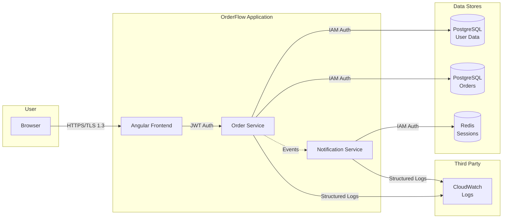

# Data Governance Policy

This document defines data classification, handling, retention, and privacy requirements for OrderFlow.

## Data Classification

| Level            | Description                                | Examples                                          | Handling Requirements                                            |
| ---------------- | ------------------------------------------ | ------------------------------------------------- | ---------------------------------------------------------------- |
| **Public**       | Information intended for public disclosure | Marketing content, API documentation              | Standard handling, no special controls                           |
| **Internal**     | Business data for internal use             | System logs (non-PII), metrics, architecture docs | Access control, no external sharing                              |
| **Confidential** | Sensitive business/customer data           | Order details (without PII), business metrics     | Encryption at rest, access logging, need-to-know                 |
| **Restricted**   | Highly sensitive, regulated data           | User PII, authentication tokens, payment info     | Encryption at rest/transit, strict access control, audit logging |

## PII (Personally Identifiable Information)

### PII Fields

| Field          | Classification | Storage                | Encryption        |
| -------------- | -------------- | ---------------------- | ----------------- |
| Email address  | Restricted     | PostgreSQL (encrypted) | AES-256 at rest   |
| Password hash  | Restricted     | PostgreSQL             | bcrypt (cost 12)  |
| Order details  | Confidential   | PostgreSQL             | Encrypted backups |
| Session tokens | Restricted     | Redis                  | TLS in transit    |
| IP addresses   | Internal       | CloudWatch Logs        | 90-day retention  |

### PII Handling Requirements

1. **Encryption at Rest**
   - RDS PostgreSQL: Encryption enabled with AWS KMS
   - ElastiCache Redis: Encryption in transit and at rest
   - S3 buckets: Server-side encryption (SSE-S3 or SSE-KMS)

2. **Encryption in Transit**
   - TLS 1.3 for all API communications
   - HTTPS only, no HTTP fallback
   - Certificate pinning for mobile (future consideration)

3. **Data Masking**
   - Logs: Email addresses masked (`use***@example.com`)
   - Logs: User IDs logged instead of emails where possible
   - Error messages: No PII in stack traces sent to clients

4. **Access Controls**
   - Database: IAM authentication, no static credentials
   - Row-level security for multi-tenant data
   - Audit log of all data access

## Data Retention Schedule

| Data Type              | Retention Period          | Rationale                      | Disposal Method                      |
| ---------------------- | ------------------------- | ------------------------------ | ------------------------------------ |
| User accounts          | 7 years after deletion    | Legal compliance (tax records) | Soft delete, then hard delete        |
| Order data             | 7 years                   | Business/tax requirements      | Archive to cold storage, then delete |
| Session logs           | 90 days                   | Security analysis, debugging   | Automated CloudWatch retention       |
| Application logs       | 30 days hot, 90 days cold | Operational monitoring         | S3 lifecycle policy                  |
| Audit logs             | 7 years                   | Compliance, security forensics | Immutable storage                    |
| WebSocket session data | 24 hours                  | Ephemeral session state        | Redis TTL automatic                  |
| Refresh tokens         | Until revoked or expired  | Session management             | Redis expiration                     |

## GDPR Compliance

### Lawful Basis

- **Consent**: Obtained at registration with timestamp stored
- **Contract**: Processing necessary for order fulfillment
- **Legal obligation**: Tax record retention

### User Rights Implementation

| Right                            | Implementation                   | Endpoint              |
| -------------------------------- | -------------------------------- | --------------------- |
| **Right to Access**              | User can view all their data     | GET /v1/auth/me       |
| **Right to Rectification**       | User can update profile          | PATCH /v1/auth/me     |
| **Right to Erasure**             | Account deletion with data purge | DELETE /v1/auth/me    |
| **Right to Restrict Processing** | Account suspension               | POST /v1/auth/suspend |
| **Right to Data Portability**    | Data export (CSV/JSON)           | GET /v1/auth/export   |

### Consent Management

```typescript
{
  "userId": "uuid",
  "consents": [
    {
      "type": "terms_of_service",
      "version": "1.2.0",
      "grantedAt": "2024-11-15T10:30:00Z",
      "ipAddress": "masked"
    },
    {
      "type": "marketing_emails",
      "version": "1.0.0",
      "grantedAt": "2024-11-15T10:30:00Z",
      "withdrawnAt": null
    }
  ]
}
```

## Data Flow Diagram



## Data Breach Response

### Detection

- Automated alerting on unusual data access patterns
- CloudWatch alarms for high error rates
- Regular audit log reviews

### Response (within 72 hours)

1. **Containment**: Revoke access, isolate affected systems
2. **Assessment**: Determine scope of breach, data affected
3. **Notification**: GDPR requires notification within 72 hours
4. **Remediation**: Fix vulnerability, restore from clean backups
5. **Post-mortem**: Document lessons learned, update procedures

## Data Processing Agreements

| Third Party | Service              | Data Shared          | DPA Required | Status   |
| ----------- | -------------------- | -------------------- | ------------ | -------- |
| AWS         | Cloud infrastructure | All application data | AWS GDPR DPA | In place |
| GitHub      | Source control       | Source code, logs    | GitHub DPA   | In place |

## Audit and Compliance

### Quarterly Reviews

- [ ] Access permissions review
- [ ] Data retention compliance check
- [ ] Encryption key rotation verification
- [ ] PII inventory update

### Annual Reviews

- [ ] Full data governance policy review
- [ ] GDPR compliance audit
- [ ] Security penetration test
- [ ] Disaster recovery drill

---

**Last Updated**: 2024-11-XX

**Next Review**: 2025-02-XX
