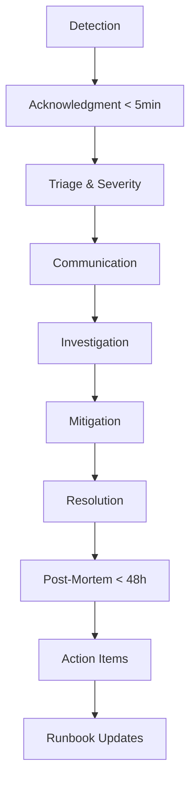

# Incident Response Plan

This document defines the incident response process for OrderFlow.

## Incident Lifecycle



## Severity Levels

| Level             | Criteria                                      | Examples                                                   | Response Time     | Channel                   |
| ----------------- | --------------------------------------------- | ---------------------------------------------------------- | ----------------- | ------------------------- |
| **P1 - Critical** | Complete outage, data loss, security breach   | All services down, DB corruption, unauthorized data access | 5 min             | PagerDuty + Phone + Slack |
| **P2 - High**     | Major feature broken, significant degradation | Order service down, >1% error rate, >500ms latency         | 15 min            | PagerDuty + Slack         |
| **P3 - Medium**   | Partial degradation, workaround exists        | Notification delay, minor UI issues                        | 1 hour            | Slack                     |
| **P4 - Low**      | Cosmetic issues, no user impact               | Log noise, minor monitoring gaps                           | Next business day | Email/Jira                |

## Roles & Responsibilities

### Incident Commander (IC)

- Coordinates response effort
- Makes decisions on mitigation steps
- Communicates with stakeholders
- **Rotation**: L2+ engineer on-call

### Scribe

- Documents timeline in shared doc
- Records all actions taken
- Captures commands run
- **Assigned by**: IC

### Subject Matter Expert (SME)

- Provides deep technical expertise
- Executes technical mitigation steps
- **Identified by**: IC based on affected service

### Communications Lead

- Manages external communications
- Updates status page
- **For P1/P2**: Engineering Manager or delegate

## Response Procedures

### Phase 1: Detection (Automated)

**Detection Sources**:

- CloudWatch Alarms (P1/P2)
- Synthetic Canaries (failed health checks)
- Error rate thresholds
- Latency thresholds
- User reports (P3/P4)

### Phase 2: Acknowledgment (< 5 min)

1. **PagerDuty alert received**
2. **Acknowledge alert** in PagerDuty (stops escalation)
3. **Join incident Slack channel**: `#incidents-YYYY-MM-DD`
4. **Announce presence**: "Jane (On-call) acknowledging, investigating"

### Phase 3: Triage & Severity Assessment (< 10 min)

1. Check service health dashboard
2. Determine affected services
3. Estimate user impact
4. **Confirm or adjust severity**
5. Create incident document from template

### Phase 4: Communication

#### Internal (Immediate - within 5 min of acknowledgment)

**Slack #incidents channel**:

```
🚨 INCIDENT: [SEVERITY] [BRIEF DESCRIPTION]
- Affected: [Services]
- Impact: [User impact description]
- IC: @person
- Status: Investigating
- Channel: #incidents-YYYY-MM-DD
```

#### Status Updates (Every 15 min for P1, 30 min for P2)

```
⏱️ UPDATE: [Timestamp]
- Status: [Investigating/Mitigating/Monitoring/Resolved]
- Actions taken: [Brief summary]
- Next update: [Time]
```

#### External (P1/P2 only)

- Post to status page
- Notify customer support for inbound inquiries
- Social media update if widespread impact

### Phase 5: Investigation

1. **Check logs**: CloudWatch Logs Insights
2. **Check traces**: X-Ray service map
3. **Check metrics**: CloudWatch dashboard
4. **Check infrastructure**: ECS, RDS, SQS status
5. **Check recent changes**: Last deployment, config change

**Key questions**:

- What changed recently?
- Can we correlate with a deployment?
- Is it affecting all users or subset?
- Is it regional?

### Phase 6: Mitigation

**Priorities** (in order):

1. **Stop the bleeding**: Rollback, scale up, enable circuit breaker
2. **Restore service**: Apply fix, restart, failover
3. **Preserve evidence**: Capture logs, snapshots before they rotate

**Decision matrix**:

| Situation                                  | Action                     | Authority     |
| ------------------------------------------ | -------------------------- | ------------- |
| Recent deployment correlates with incident | Rollback deployment        | IC            |
| Resource exhaustion                        | Scale up manually          | IC            |
| Database issue                             | Failover to read replica   | IC + DBA      |
| Suspected security breach                  | Isolate, preserve evidence | IC + Security |

### Phase 7: Resolution

**Definition of Resolved**:

- Error rates back to baseline
- Synthetic canaries passing
- No user complaints for 15 minutes
- IC confident issue is addressed

**Resolution announcement**:

```
✅ RESOLVED: [SEVERITY] [BRIEF DESCRIPTION]
- Duration: [Start time] to [End time]
- Resolution: [Brief description of fix]
- IC: @person
- Monitoring: Will monitor for 1 hour
```

## Post-Mortem Process

### Timeline (< 48 hours after resolution)

1. **Schedule post-mortem**: Within 48 hours for P1/P2
2. **Attendees**: IC, responders, affected service owners
3. **Duration**: 60 minutes

### Post-Mortem Document Template

```markdown
# Post-Mortem: [Incident Title]

## Summary

- Date: YYYY-MM-DD
- Duration: HH:MM
- Severity: P1/P2/P3
- Affected: [Services]
- Impact: [User impact metric]

## Timeline (All times in UTC)

| Time  | Event                   |
| ----- | ----------------------- |
| 10:00 | Alert fired             |
| 10:03 | Acknowledged by @person |
| ...   | ...                     |

## Root Cause

[Detailed technical explanation]

## Resolution

[Steps taken to resolve]

## What Went Well

- [Item 1]
- [Item 2]

## What Went Poorly

- [Item 1]
- [Item 2]

## Action Items

| ID  | Action | Owner | Due Date |
| --- | ------ | ----- | -------- |
| 1   |        |       |          |
| 2   |        |       |          |

## Lessons Learned

[Insights for future prevention]
```

### Action Item Tracking

- All action items created as GitHub issues
- Tracked in project board
- Reviewed weekly until closed

## Escalation Matrix

| Trigger                       | Escalate To                 | Response Time |
| ----------------------------- | --------------------------- | ------------- |
| No acknowledgment in 10 min   | L2 engineer                 | 15 min        |
| No resolution in 30 min (P1)  | Engineering Manager         | 30 min        |
| No resolution in 2 hours (P1) | Director of Engineering     | 1 hour        |
| Security incident             | Security team + Legal       | Immediate     |
| Data loss                     | Engineering Manager + Legal | Immediate     |

## Communication Templates

### Initial Incident Notification

```
Subject: [INCIDENT P1] OrderFlow Service Degraded

OrderFlow is experiencing a service degradation affecting order creation.

Impact: Users cannot place new orders
Start Time: 10:00 UTC
Status: Investigating
ETA: Unknown

Updates: https://status.orderflow.io
```

### Status Update

```
Subject: [UPDATE P1] OrderFlow Incident - Mitigation in Progress

We have identified the issue as [description] and are implementing a fix.

Status: Mitigating
Next Update: 10:30 UTC
```

### Resolution

```
Subject: [RESOLVED] OrderFlow Incident Resolved

The incident has been resolved. Order creation is fully operational.

Duration: 45 minutes
Resolution: Database connection pool increased
Post-mortem: Scheduled for tomorrow 14:00 UTC
```

## Tools & Access

| Tool             | Purpose                    | Access        |
| ---------------- | -------------------------- | ------------- |
| PagerDuty        | Alerting, on-call rotation | All engineers |
| Slack #incidents | Communication              | All engineers |
| Status Page      | External status            | Comms lead    |
| CloudWatch       | Logs, metrics              | All engineers |
| X-Ray            | Distributed tracing        | All engineers |
| ECS Console      | Container status           | All engineers |

## Training & Drills

### Quarterly Drills

- Schedule tabletop exercise
- Walk through P1 scenario
- Test communication channels
- Verify access to tools

### New On-call Engineer Checklist

- [ ] PagerDuty setup verified
- [ ] Access to all monitoring tools confirmed
- [ ] Runbooks reviewed
- [ ] Shadow experienced on-call engineer for one rotation
- [ ] Participate in incident response drill

---

**Last Updated**: 2024-11-XX

**Next Drill**: 2025-02-XX
