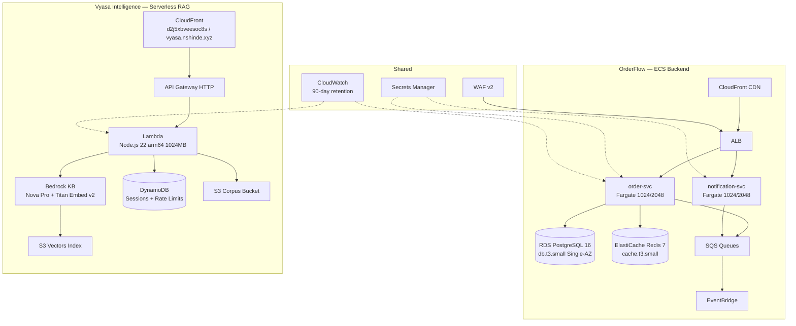

# Infrastructure Reference

> **Last Updated:** May 2026  
> **Region:** `us-east-1` | **Account:** `947612421212`  
> **Environment:** Single `prod` only (per [ADR-011](#adr-011-single-environment-cost-optimisation))  
> **Owner:** Platform Team | **IaC:** AWS CDK (TypeScript) in `infra/`
>
> ⚠️ **Stack names carry a `-dev-` prefix — this is a historical naming artifact. These ARE the production resources.**  
> ⚠️ **Do NOT create new AWS resources. Reuse existing stacks, buckets, tables, Lambda, and Bedrock assets only.**

---

## Table of Contents

1. [Architecture Overview](#1-architecture-overview)
2. [CDK Stacks](#2-cdk-stacks)
3. [Live Resources & Endpoints](#3-live-resources--endpoints)
4. [Environment Configuration](#4-environment-configuration)
5. [Networking](#5-networking)
6. [Compute (ECS Fargate)](#6-compute-ecs-fargate)
7. [Database & Cache](#7-database--cache)
8. [Event Bus & Queues](#8-event-bus--queues)
9. [Vyasa Intelligence (Serverless RAG)](#9-vyasa-intelligence-serverless-rag)
10. [CDN & Custom Domain](#10-cdn--custom-domain)
11. [Security](#11-security)
12. [Observability & Monitoring](#12-observability--monitoring)
13. [Cost Analysis](#13-cost-analysis)
14. [Capacity Plan](#14-capacity-plan)
15. [Disaster Recovery](#15-disaster-recovery)
16. [CDK Operations](#16-cdk-operations)
17. [Key Architectural Decisions (ADRs)](#17-key-architectural-decisions-adrs)

---

## 1. Architecture Overview

Two product domains share a single AWS account:



---

## 2. CDK Stacks

All stacks are prefixed `OrderFlow-*` (no environment suffix in prod).

### OrderFlow (ECS) Stacks

| Stack                | File                         | Purpose                                            |
| -------------------- | ---------------------------- | -------------------------------------------------- |
| `NetworkStack`       | `lib/network-stack.ts`       | VPC, subnets, NAT GW, security groups, Flow Logs   |
| `SecurityStack`      | `lib/security-stack.ts`      | Secrets Manager, IAM roles, WAF v2                 |
| `DatabaseStack`      | `lib/database-stack.ts`      | RDS PostgreSQL 16, ElastiCache Redis 7             |
| `EventStack`         | `lib/event-stack.ts`         | EventBridge bus, SQS queues, DLQs                  |
| `ECSStack`           | `lib/ecs-stack.ts`           | Fargate cluster, task defs, ALB, auto-scaling      |
| `CDNStack`           | `lib/cdn-stack.ts`           | CloudFront, S3 (frontend), OAC                     |
| `MonitoringStack`    | `lib/monitoring-stack.ts`    | CloudWatch alarms, dashboards, SNS topics          |
| `ObservabilityStack` | `lib/observability-stack.ts` | SLO alarms, Synthetics canaries, anomaly detection |
| `AppConfigStack`     | `lib/appconfig-stack.ts`     | AWS AppConfig feature flags                        |
| `RollbackStack`      | `lib/rollback-stack.ts`      | Auto-rollback Lambda on error rate spike           |

### Vyasa Intelligence Stacks

> Stack names use `-dev-` prefix (historical artifact) — these are the live prod stacks.

| Stack (actual CF name)      | File                        | Purpose                                          |
| --------------------------- | --------------------------- | ------------------------------------------------ |
| `OrderFlow-dev-VyasaVector` | `lib/vyasa-vector-stack.ts` | S3 Vectors index + IAM role for Bedrock KB       |
| `OrderFlow-dev-VyasaRag`    | `lib/vyasa-lambda-stack.ts` | Lambda, API Gateway, DynamoDB, CloudWatch alarms |
| `OrderFlow-dev-VyasaUi`     | `lib/vyasa-ui-stack.ts`     | CloudFront, S3 UI bucket, OAC, CF Function       |

---

## 3. Live Resources & Endpoints

| Resource                       | ID / Value                                                         |
| ------------------------------ | ------------------------------------------------------------------ |
| **Vyasa UI (custom domain)**   | `https://vyasa.nshinde.xyz` (Namecheap CNAME → CloudFront)         |
| **Vyasa UI (direct)**          | `https://d2j5xbveesoc8s.cloudfront.net`                            |
| **CloudFront Distribution ID** | `E1W56P4E23UU5Y`                                                   |
| **CloudFront OAC**             | `E2E7JDA13AWNM9`                                                   |
| **CloudFront Function**        | `vyasa-api-rewrite-dev-v2`                                         |
| **Vyasa RAG API**              | `https://lkbzhoe1pj.execute-api.us-east-1.amazonaws.com`           |
| **Vyasa RAG health**           | `https://lkbzhoe1pj.execute-api.us-east-1.amazonaws.com/health`    |
| **Lambda Function**            | `vyasa-rag-dev` (arm64, 1024 MB, Node.js 22)                       |
| **S3 UI Bucket**               | `orderflow-dev-vyasaui-vyasauibucket7b9068a5-eegjs5vw5mij`         |
| **S3 Access Logs Bucket**      | `orderflow-dev-vyasaui-vyasauiaccesslogsbucketbb002-xteeykke9i2y`  |
| **Bedrock KB ID**              | `OYAKPT9RLA` (`vyasa-rag-kb-dev`, ACTIVE)                          |
| **Bedrock Data Source ID**     | `B2VQSKC6IS`                                                       |
| **Bedrock Embedding Model**    | `amazon.titan-embed-text-v2:0` (1024-dim)                          |
| **Bedrock LLM**                | `amazon.nova-pro-v1:0`                                             |
| **S3 Vectors Index**           | `vyasa-vectors-dev-947612421212 / vyasa-index-dev` (S3 Vectors)    |
| **S3 Corpus Bucket**           | `vyasa-rag-corpus-prod-947612421212`                               |
| **S3 Prompts Bucket**          | `vyasa-rag-prompts-prod-947612421212`                              |
| **DynamoDB Sessions**          | `vyasa-rag-sessions-dev` (PAY_PER_REQUEST, TTL 7 days)             |
| **DynamoDB Rate Limits**       | `vyasa-rag-rate-limits-dev` (PAY_PER_REQUEST)                      |
| **IAM Role (RAG)**             | `OrderFlow-dev-VyasaRag-VyasaRagFunctionServiceRole3-NSCvroR0lMPF` |
| **IAM Role (KB)**              | `vyasa-rag-kb-role-dev`                                            |
| **CloudWatch Log Group**       | `/aws/lambda/vyasa-rag-dev` (90-day retention)                     |

> **Note:** `.xyz` TLD may be blocked by corporate DNS. Use the CloudFront URL on managed devices.

---

## 4. Environment Configuration

**Single `prod` environment** — `infra/config/environments.ts` exports one `config` object.

| Parameter         | Value                 |
| ----------------- | --------------------- |
| Account           | `CDK_DEFAULT_ACCOUNT` |
| Region            | `us-east-1`           |
| VPC CIDR          | `10.0.0.0/16`         |
| NAT Gateways      | 1                     |
| Log Retention     | 90 days               |
| Domain            | `vyasa.nshinde.xyz`   |
| RDS Instance      | `db.t3.small`         |
| RDS Multi-AZ      | Disabled              |
| Redis Node Type   | `cache.t3.small`      |
| ECS desired tasks | 1 per service         |

### Tagging (required on all resources)

```typescript
Tags.of(resource).add('Project', 'orderflow');
Tags.of(resource).add('Environment', config.envName);
Tags.of(resource).add('ManagedBy', 'cdk');
Tags.of(resource).add('CostCenter', 'engineering');
Tags.of(resource).add('Team', 'platform');
```

---

## 5. Networking

| Component       | Value                             |
| --------------- | --------------------------------- |
| VPC CIDR        | `10.0.0.0/16`                     |
| AZs             | 3 (us-east-1a/b/c)                |
| Public Subnets  | 1 per AZ                          |
| Private Subnets | 1 per AZ                          |
| NAT Gateways    | 1 (cost-optimised from 2)         |
| VPC Flow Logs   | Enabled (90-day retention)        |
| VPC Endpoints   | Recommended: S3 + DynamoDB (free) |

---

## 6. Compute (ECS Fargate)

### order-service

| Metric                 | Value           |
| ---------------------- | --------------- |
| CPU / Memory           | 1024 / 2048 MiB |
| Min tasks              | 1               |
| Max tasks              | 10              |
| Scale-out trigger      | CPU > 60%       |
| Scale-in trigger       | CPU < 60%       |
| Scheduled scale-out    | 08:00 UTC       |
| Scheduled scale-in     | 22:00 UTC       |
| DB connections / task  | 20              |
| Redis connections/task | 50              |
| Max RPS (sustained)    | ~1,000          |

### notification-service

| Metric                    | Value           |
| ------------------------- | --------------- |
| CPU / Memory              | 1024 / 2048 MiB |
| Min tasks                 | 1               |
| Max tasks                 | 10              |
| Scale-out trigger         | CPU > 60%       |
| SQS long-poll concurrency | 10 msgs         |
| WebSocket connections     | ~5,000          |

### IAM Rules (least-privilege)

- One IAM role per ECS service (task role)
- Never use `*` in `Resource` or `Action`
- No cross-service role sharing

---

## 7. Database & Cache

### RDS PostgreSQL 16

| Parameter                 | Value                                            |
| ------------------------- | ------------------------------------------------ |
| Instance class            | `db.t3.small`                                    |
| Storage                   | 50 GB (auto-scale up to 200 GB)                  |
| Multi-AZ                  | Disabled (single-AZ per ADR-011)                 |
| Deletion protection       | Enabled                                          |
| Backup retention          | 7 days                                           |
| Max connections           | ~200 (`db.t3.small`)                             |
| Connection limit formula  | `max_connections × 0.8 / 20` = max Fargate tasks |
| Slow query threshold      | 1,000 ms                                         |
| Storage growth projection | ~200 MB/month at 500 RPS                         |

### ElastiCache Redis 7

| Parameter               | Value                        |
| ----------------------- | ---------------------------- |
| Node type               | `cache.t3.small`             |
| Replicas                | 1                            |
| Max connections / task  | 50                           |
| Cache TTL (order lists) | 30 s                         |
| Eviction policy         | `allkeys-lru`                |
| Memory estimate         | ~50 MB at 10K cached entries |

> **RDS Read Replicas**: Documented but not deployed. Applicable when reads exceed writes by > 5:1.

---

## 8. Event Bus & Queues

| Queue                  | Alert Depth | DLQ Alert |
| ---------------------- | ----------- | --------- |
| `order-created-queue`  | 1,000 msgs  | 1 msg     |
| `order-status-changed` | 1,000 msgs  | 1 msg     |
| Dead-letter queues     | —           | 1 msg     |

---

## 9. Vyasa Intelligence (Serverless RAG)

Architecture decision: [ADR-010 — Serverless Lambda over ECS Fargate](#adr-010-vyasa-serverless-architecture)

### Lambda Configuration

| Parameter    | Value                   |
| ------------ | ----------------------- |
| Runtime      | Node.js 22.x            |
| Architecture | arm64                   |
| Memory       | 1024 MB                 |
| Timeout      | 30 seconds              |
| Invoke mode  | `RESPONSE_STREAM` (SSE) |

### Bedrock Knowledge Base

| Parameter    | Value                                      |
| ------------ | ------------------------------------------ |
| LLM          | Amazon Nova Pro v1                         |
| Embeddings   | Amazon Titan Text Embeddings V2 (1024-dim) |
| Data source  | S3 corpus bucket                           |
| Vector store | S3 Vectors (`vyasa-vectors-dev-*`)         |

### DynamoDB Tables

| Table                     | Billing         | TTL    |
| ------------------------- | --------------- | ------ |
| `vyasa-rag-sessions-*`    | PAY_PER_REQUEST | 7 days |
| `vyasa-rag-rate-limits-*` | PAY_PER_REQUEST | —      |

### DNS Configuration (Namecheap — `nshinde.xyz`)

| Type  | Host                | Value                             | Purpose                          |
| ----- | ------------------- | --------------------------------- | -------------------------------- |
| CNAME | `_14f04e88...vyasa` | `_0d85c200...acm-validations.aws` | ACM DNS validation (permanent)   |
| CNAME | `vyasa`             | `d2j5xbveesoc8s.cloudfront.net`   | `vyasa.nshinde.xyz` → CloudFront |

---

## 10. CDN & Custom Domain

| Resource                | Value                                                 |
| ----------------------- | ----------------------------------------------------- |
| CloudFront Distribution | `E1W56P4E23UU5Y`                                      |
| CloudFront Domain       | `d2j5xbveesoc8s.cloudfront.net`                       |
| Custom Domain           | `vyasa.nshinde.xyz` (Namecheap CNAME)                 |
| Price Class             | `PriceClass_100`                                      |
| CloudFront Function     | `vyasa-api-rewrite-dev-v2` (rewrites `/api/*` → `/*`) |
| OAC                     | `E2E7JDA13AWNM9`                                      |
| ACM Certificate         | `us-east-1` (required for CloudFront)                 |

### Deploy UI Assets

```bash
# Build and sync UI to the prod S3 bucket
cd apps/vyasa-ui && npm run build
aws s3 sync dist/ \
  s3://orderflow-dev-vyasaui-vyasauibucket7b9068a5-eegjs5vw5mij \
  --region us-east-1

# Invalidate CloudFront cache
aws cloudfront create-invalidation \
  --distribution-id E1W56P4E23UU5Y \
  --paths "/*"
```

---

## 11. Security

- **WAF v2** — enabled on ALB; higher-traffic rules
- **Secrets Manager** — 2 secrets (DB credentials, app secrets)
- **IAM** — least-privilege task roles, no wildcard actions
- **Destruction protection** — `terminationProtection: true` on all stateful stacks
- **CDK destroy** — blocked in `.cloud/permissions.yaml`; requires manual override
- **TLS** — ACM certificate on CloudFront; HTTPS enforced end-to-end

### Safety Rules

- **Always** run `npm run cdk:diff` before any `cdk deploy`
- Never modify prod stack without human confirmation
- Do NOT disable destruction protection on RDS, Redis, or ECS stacks

---

## 12. Observability & Monitoring

| Component           | Config                                          |
| ------------------- | ----------------------------------------------- |
| CloudWatch Logs     | 90-day retention, all services                  |
| X-Ray               | Full tracing (consider reducing to 5% sampling) |
| Synthetics Canaries | Endpoint health checks                          |
| SLO Alarms          | Via `ObservabilityStack`                        |
| Budget Alarm        | CloudWatch at **$8** threshold (Vyasa RAG only) |

> **Recommended**: Create an AWS Budgets alert at **$1,500/month** for total account spend.

---

## 13. Cost Analysis

> **Assumption:** Moderate workload — ~730 hrs/month, ~10K API requests/day

### Monthly Cost Breakdown (Prod)

| Service                          | Configuration                   | Monthly Est.        |
| -------------------------------- | ------------------------------- | ------------------- |
| VPC / NAT Gateways               | 1 NAT GW, 3 AZs                 | $35                 |
| RDS PostgreSQL                   | `db.t3.small`, 50 GB, Single-AZ | $30                 |
| ElastiCache Redis                | `cache.t3.small`, 1 replica     | $50                 |
| ECS Fargate (order-svc)          | 1024/2048 × 1 task (min)        | $33                 |
| ECS Fargate (notification-svc)   | 1024/2048 × 1 task (min)        | $33                 |
| ALB                              | ~5 LCU avg                      | $25                 |
| CloudFront CDN (OrderFlow)       | PriceClass_All                  | $10                 |
| SQS                              | 4 queues                        | $3                  |
| Secrets Manager                  | 2 secrets                       | $1                  |
| WAF                              | Enabled, higher traffic         | $25                 |
| VPC Flow Logs                    | ~20 GB/month                    | $10                 |
| Vyasa Lambda                     | 1024 MB, ARM64, ~100K req/day   | $15                 |
| API Gateway HTTP                 | ~100K req/day                   | $10                 |
| Bedrock (Nova Pro + Titan Embed) | ~10K queries/day, streaming     | $300–500            |
| S3 Vectors                       | ~50K+ vectors                   | $10–20              |
| DynamoDB (PITR enabled)          | PAY_PER_REQUEST + PITR          | $15                 |
| S3 (corpus RETAIN + versioning)  | ~10 GB                          | $3                  |
| CloudFront (Vyasa UI)            | PriceClass_All                  | $10                 |
| CloudWatch                       | 90-day retention, detailed      | $40                 |
| X-Ray + Synthetics               | Full tracing + canaries         | $25                 |
| AppConfig                        | Config deployments              | $1                  |
| Rollback Lambda                  | CloudWatch Alarm triggered      | $1                  |
|                                  | **TOTAL**                       | **~$689–898/month** |

> Bedrock inference ($300–500/month) is the dominant variable cost.

### Cost Savings Applied (ADR-011)

| Change                                 | Saving       |
| -------------------------------------- | ------------ |
| RDS: medium Multi-AZ → small Single-AZ | ~$160/mo     |
| ECS: desiredCount 2 → 1 per service    | ~$65/mo      |
| NAT GW: 2 → 1                          | ~$35/mo      |
| CloudFront: PriceClass adjustment      | ~$5/mo       |
| **Total**                              | **~$265/mo** |

### Optimization Opportunities

| Priority | Issue                            | Potential Saving | Recommendation                                      |
| -------- | -------------------------------- | ---------------- | --------------------------------------------------- |
| 🔴 High  | Bedrock Nova Pro inference       | $100–300/mo      | Cache RAG responses in DynamoDB (TTL 24h, hash key) |
| 🔴 High  | NAT data charges                 | $35/mo           | Add free VPC Gateway Endpoints for S3 + DynamoDB    |
| 🟡 Med   | X-Ray sampling rate              | $5–15/mo         | Reduce from 100% → 5% in prod                       |
| 🟡 Med   | Titan Embeddings re-sync         | $10–30/sync      | Trigger ingestion only on S3 corpus change events   |
| 🟢 Low   | S3 versioning non-current expiry | $5–15/mo         | Verify 30-day lifecycle rule is active              |

### Quick Wins Checklist

- [ ] Add VPC Gateway Endpoints for S3 and DynamoDB (free)
- [ ] Implement RAG response caching with 24h TTL
- [ ] Trigger Bedrock ingestion only on S3 corpus change (S3 Event → Lambda)
- [ ] Enable AWS Cost Anomaly Detection on `CostCenter: learning` tag
- [ ] Set AWS Budgets alert at $1,200/month for prod

---

## 14. Capacity Plan

### Storage Growth Projections

| Asset               | Size / Record | Monthly Volume | Monthly Growth |
| ------------------- | ------------- | -------------- | -------------- |
| Order record (PG)   | ~500 B        | 1M orders      | ~500 MB        |
| Audit log (PG)      | ~300 B        | 2M entries     | ~600 MB        |
| S3 analytics export | ~1 KB / order | 1M orders      | ~1 GB          |
| CloudWatch logs     | ~200 B / req  | 50M requests   | ~10 GB         |

### Cost Per Request (FinOps)

| Service                 | Unit Cost      | Basis                          |
| ----------------------- | -------------- | ------------------------------ |
| ECS Fargate (order svc) | ~$0.000 04     | 1 vCPU / 2 GiB @ $0.04/vCPU-hr |
| RDS PostgreSQL          | ~$0.000 01     | db.t3.small shared across RPMs |
| ElastiCache Redis       | ~$0.000 005    | cache.t3.small                 |
| EventBridge             | ~$0.000 001    | $1 / M events                  |
| SQS                     | ~$0.000 0004   | $0.40 / M messages             |
| CloudFront              | ~$0.000 0085   | $0.0085 / 10K requests         |
| **Total (estimate)**    | **~$0.000 07** | per API request at 500 RPS     |

---

## 15. Disaster Recovery

### Recovery Objectives

| Metric  | Target       |
| ------- | ------------ |
| **RPO** | 1 hour       |
| **RTO** | 30 minutes   |
| **RLO** | Full service |

### Backup Strategy

| Component       | Method              | Retention     |
| --------------- | ------------------- | ------------- |
| RDS snapshots   | Daily automated     | 35 days       |
| RDS PITR        | Continuous          | 35 days       |
| Manual snapshot | Pre-deployment      | Indefinite    |
| CDK code        | Git                 | Indefinite    |
| Secrets         | AWS Secrets Manager | Automatic     |
| S3 frontend     | Versioning enabled  | Version-based |

### Scenario Playbooks

#### AZ Failure (Auto-Recovery, ~2–5 min)

```bash
# Verify RDS status
aws rds describe-db-instances \
  --db-instance-identifier orderflow-prod \
  --query 'DBInstances[0].DBInstanceStatus'

# Verify ECS service
aws ecs describe-services \
  --cluster orderflow-prod \
  --services order-service \
  --query 'services[0].{running:runningCount,desired:desiredCount}'
```

#### Database Corruption (PITR, ~1–2 hr)

```bash
aws rds restore-db-instance-to-point-in-time \
  --source-db-instance-identifier orderflow-prod \
  --target-db-instance-identifier orderflow-prod-recovery \
  --use-latest-restorable-time
```

#### Full Infrastructure Rebuild (~2–3 hr)

```bash
git clone https://github.com/nilesh0604/orderflow.git
cd orderflow/infra && npm ci
CDK_DEFAULT_REGION=us-east-1 npx cdk bootstrap aws://947612421212/us-east-1
npx cdk deploy OrderFlow-dev-VyasaVector OrderFlow-dev-VyasaRag OrderFlow-dev-VyasaUi --require-approval never
```

### DR Test Schedule

| Test                   | Frequency   |
| ---------------------- | ----------- |
| Snapshot restore       | Monthly     |
| Cross-region failover  | Quarterly   |
| Infrastructure rebuild | Bi-annually |

---

## 16. CDK Operations

```bash
# From repo root
npm run cdk:diff          # ALWAYS run before deploy
npm run cdk:deploy        # Deploy (prompts for confirmation)

# From infra/ directory
cdk synth                                    # Synthesize CloudFormation
cdk diff                                     # Diff against deployed stack
cdk deploy --require-approval broadening     # Deploy with approval

# Vyasa UI only
CDK_DEFAULT_REGION=us-east-1 npx cdk deploy OrderFlow-dev-VyasaUi --exclusively --require-approval never
```

### CDK Tests

- 42 assertions across 4 suites (NetworkStack, DatabaseStack, EventStack, SecurityStack)
- `cd infra && npm test`
- Add assertion tests for every new resource — no exceptions

### Known Gaps

- Secrets rotation Lambda not wired (`SecretRotationSchedule` CDK construct missing)
- Route 53 records not provisioned (no registered domain in Route 53 yet)
- Some config still in ECS `environment` vars — should migrate to SSM Parameter Store

---

## 17. Key Architectural Decisions (ADRs)

| ADR                                                    | Title                                | Status   |
| ------------------------------------------------------ | ------------------------------------ | -------- |
| [ADR-008](adr/ADR-008-containerization-strategy.md)    | Containerization Strategy            | Accepted |
| [ADR-010](adr/010-vyasa-serverless-architecture.md)    | Vyasa Serverless Architecture        | Proposed |
| [ADR-011](adr/ADR-011-single-env-cost-optimisation.md) | Single-Environment Cost Optimisation | Accepted |
| [ADR-012](adr/ADR-012-custom-domain-cloudfront.md)     | Custom Domain (CloudFront + ACM)     | Accepted |

### ADR-010: Vyasa Serverless Architecture

**Decision:** Lambda + Bedrock KB over ECS Fargate + OpenSearch.  
**Rationale:** ~$3–5/month vs ~$200/month; scale-to-zero; managed vector DB.  
**Trade-offs:** ~500ms cold start; ~10–20ms DynamoDB session latency vs 1ms Redis.

### ADR-011: Single-Environment Cost Optimisation

**Decision:** Single `prod` only; right-size RDS to `db.t3.small` Single-AZ; reduce ECS `desiredCount` to 1.  
**Rationale:** Portfolio/demo project — no regulated release process requiring isolated staging.  
**Savings:** ~$265/month vs pre-ADR state.

### ADR-012: Custom Domain for CloudFront

**Decision:** ACM certificate (DNS validated) + CloudFront alternate domain for `vyasa.nshinde.xyz`.  
**Trade-off:** `.xyz` TLD blocked by corporate DNS on managed devices — use CloudFront URL for testing.
