# MCP 1 — CodeGraph (AST Intelligence)

## Overview

A local MCP server that provides AST-based code intelligence to AI agents during development. It enables agents to query call graphs, find symbol definitions, and perform impact analysis dynamically while reasoning about code changes.

## Problem Statement

**Solves:** Gap 9 (dynamic code queries), Gap 3 (brownfield context)

The `code-impl-agent` needs to ask questions like:

- "Who calls this function?"
- "What implements this interface?"
- "What files are affected if I change this symbol?"

These queries arise **dynamically during reasoning** — they cannot be pre-computed before dispatch.

## Tools Provided

| Tool                         | Purpose                                  |
| ---------------------------- | ---------------------------------------- |
| `codegraph_symbol_lookup`    | Find symbol definition by name           |
| `codegraph_callers_of`       | Reverse call graph for a function/method |
| `codegraph_implementors_of`  | Find all implementations of an interface |
| `codegraph_impact_analysis`  | Files affected by changing a symbol      |
| `codegraph_dependency_graph` | Nx project-level dependency edges        |

## Architecture

```
Developer's Machine
├── IDE (Windsurf/Cascade)
│   └── AI Agent
│       └── MCP call (stdio) ──→ CodeGraph Server (Node.js)
│                                    ├── Tree-sitter Parser
│                                    ├── Symbol Index (in-memory/SQLite)
│                                    ├── Call Graph (directed graph)
│                                    └── File Watcher (incremental re-index)
```

### Key Design Decisions

- **Tree-sitter-based indexer** respecting `tsconfig.base.json` path aliases
- Indexes only **Nx project graph targets** (not `node_modules/`)
- **Persistent background process** with file-watcher for incremental re-index
- Sub-millisecond query responses

## Hosting Model

**Runs entirely on developer local machine.**

| Aspect             | Detail                                                    |
| ------------------ | --------------------------------------------------------- |
| **Where**          | Local Node.js process spawned by IDE                      |
| **Lifecycle**      | Started on first MCP tool call, killed on IDE session end |
| **Shared state**   | None — each developer indexes their own working tree      |
| **Network**        | No outbound connections                                   |
| **Central server** | Not required                                              |

The MCP server source code is committed to the repo; each developer runs their own instance.

## Resource Requirements

| Resource              | Requirement                                             |
| --------------------- | ------------------------------------------------------- |
| **Runtime**           | Node.js 22 (already available)                          |
| **npm dependencies**  | `tree-sitter`, `tree-sitter-typescript`                 |
| **RAM**               | ~50MB (graph in memory for ~50 TS files)                |
| **Disk**              | ~5MB (tree-sitter pre-built binaries)                   |
| **CPU**               | Minimal — sub-second full index, incremental is instant |
| **External services** | None                                                    |
| **Model downloads**   | None                                                    |
| **API keys**          | None                                                    |
| **Docker/Cloud**      | Not required                                            |

## Complexity & Challenges

| Challenge                         | Difficulty | Notes                                                        |
| --------------------------------- | ---------- | ------------------------------------------------------------ |
| TypeScript path alias resolution  | High       | Must parse `tsconfig.base.json` to resolve `@f500/*` imports |
| Call graph accuracy               | High       | Dynamic dispatch, generics, higher-order functions are hard  |
| Interface implementation tracking | Medium     | Tree-sitter doesn't resolve types — needs extra logic        |
| Incremental re-indexing           | Medium     | Must invalidate graph edges correctly on file change         |
| Transitive impact analysis        | Medium     | Requires correct closure over directed graph                 |
| Persistent background daemon      | Low        | Standard file-watcher pattern                                |

## Consuming Agents

- `code-impl-agent` (primary)
- `code-test-agent`
- `code-perf-agent`
- `design-agent`

## Effort Estimate

**~8 hours**

| Phase                                         | Hours | Deliverable                                   |
| --------------------------------------------- | ----- | --------------------------------------------- |
| Tree-sitter indexer + path alias resolution   | 3     | Symbol index with cross-file resolution       |
| Call graph & implementors logic               | 2.5   | Reverse call graph, interface implementations |
| MCP server (stdio transport)                  | 1     | Tool handlers, JSON-RPC protocol              |
| `.mcp.json` entry + agent instruction updates | 0.5   | Integration with existing agent system        |
| Testing & edge cases                          | 1     | Verify against real repo structure            |

## Risk Assessment

| Risk                                         | Impact | Mitigation                                    |
| -------------------------------------------- | ------ | --------------------------------------------- |
| Inaccurate call graph for dynamic patterns   | Medium | Document known limitations, fallback to grep  |
| Tree-sitter binary compatibility (M1 vs x86) | Low    | Pre-built binaries available for both         |
| Performance degradation on large repos       | Low    | Current repo is ~50 files, well within limits |
| Maintenance burden as TS evolves             | Medium | Tree-sitter grammars are community-maintained |

## Detailed Implementation Plan

### Prerequisites

Before starting implementation, ensure the following are available:

- Node.js 22+ installed (`.nvmrc` already specifies this)
- Access to the monorepo at `/Users/Nilesh_Shinde/iSpace/f500`
- Understanding of `tsconfig.base.json` path aliases (`@orderflow/*`)

---

### Phase 1 — Project Scaffolding (~30 min)

**Goal:** Create the MCP server project structure with dependencies.

#### Step 1.1 — Create directory structure

```
tools/
└── mcp-codegraph/
    ├── src/
    │   ├── index.ts              # Entry point (stdio MCP server)
    │   ├── server.ts             # MCP server setup & tool registration
    │   ├── indexer/
    │   │   ├── tree-sitter-indexer.ts  # AST parsing & symbol extraction
    │   │   ├── path-resolver.ts        # tsconfig path alias resolution
    │   │   └── file-watcher.ts         # Incremental re-indexing on change
    │   ├── graph/
    │   │   ├── symbol-index.ts         # In-memory symbol storage
    │   │   ├── call-graph.ts           # Directed call graph
    │   │   └── impact-analyzer.ts      # Transitive impact computation
    │   ├── tools/
    │   │   ├── symbol-lookup.ts        # codegraph_symbol_lookup handler
    │   │   ├── callers-of.ts           # codegraph_callers_of handler
    │   │   ├── implementors-of.ts      # codegraph_implementors_of handler
    │   │   ├── impact-analysis.ts      # codegraph_impact_analysis handler
    │   │   └── dependency-graph.ts     # codegraph_dependency_graph handler
    │   └── types.ts              # Shared type definitions
    ├── __tests__/
    │   ├── indexer.test.ts
    │   ├── call-graph.test.ts
    │   └── impact-analyzer.test.ts
    ├── package.json
    ├── tsconfig.json
    └── README.md
```

#### Step 1.2 — Initialize package.json

```json
{
  "name": "@orderflow/mcp-codegraph",
  "version": "0.1.0",
  "private": true,
  "type": "module",
  "main": "dist/index.js",
  "scripts": {
    "build": "tsc",
    "start": "node dist/index.js",
    "dev": "npx tsx src/index.ts",
    "test": "jest"
  },
  "dependencies": {
    "@modelcontextprotocol/sdk": "^1.0.0",
    "tree-sitter": "^0.22.0",
    "tree-sitter-typescript": "^0.22.0",
    "chokidar": "^4.0.0"
  },
  "devDependencies": {
    "@types/node": "^22.0.0",
    "typescript": "^5.6.0",
    "jest": "^29.7.0",
    "@types/jest": "^29.5.0",
    "ts-jest": "^29.2.0"
  }
}
```

#### Step 1.3 — Create tsconfig.json

```json
{
  "compilerOptions": {
    "target": "ES2022",
    "module": "ES2022",
    "moduleResolution": "node",
    "outDir": "dist",
    "rootDir": "src",
    "strict": true,
    "esModuleInterop": true,
    "skipLibCheck": true,
    "declaration": true
  },
  "include": ["src/**/*.ts"],
  "exclude": ["node_modules", "dist", "__tests__"]
}
```

#### Step 1.4 — Install dependencies

```bash
cd tools/mcp-codegraph && npm install
```

---

### Phase 2 — Path Alias Resolution (~45 min)

**Goal:** Parse `tsconfig.base.json` and resolve `@orderflow/*` imports to file paths.

#### Step 2.1 — Implement `path-resolver.ts`

```typescript
// src/indexer/path-resolver.ts
interface PathAlias {
  prefix: string; // e.g., "@orderflow/shared-types"
  targets: string[]; // e.g., ["libs/shared-types/src/index.ts"]
}
```

**Implementation details:**

1. Read and parse `tsconfig.base.json` from workspace root
2. Extract `compilerOptions.paths` mapping
3. For each import specifier encountered during indexing:
   - Check if it matches any alias prefix
   - Replace the alias prefix with the mapped path
   - Resolve relative to `baseUrl` (workspace root)
4. Handle wildcard path aliases (e.g., `@orderflow/*` → `libs/*/src/index.ts`)

**Current aliases to resolve:**

| Alias                         | Target                               |
| ----------------------------- | ------------------------------------ |
| `@orderflow/shared-types`     | `libs/shared-types/src/index.ts`     |
| `@orderflow/shared-types/rag` | `libs/shared-types/src/rag/index.ts` |
| `@orderflow/event-schemas`    | `libs/event-schemas/src/index.ts`    |
| `@orderflow/logger`           | `libs/logger/src/index.ts`           |
| `@orderflow/auth`             | `libs/auth/src/index.ts`             |
| `@orderflow/testing-utils`    | `libs/testing-utils/src/index.ts`    |
| `@orderflow/http-client`      | `libs/http-client/src/index.ts`      |

#### Step 2.2 — Handle relative imports

For relative imports (`./`, `../`):

1. Resolve against the importing file's directory
2. Try `.ts`, `.tsx`, `/index.ts` extensions in order
3. Cache resolved paths to avoid re-computation

#### Step 2.3 — Write unit tests

- Test each alias resolves correctly
- Test relative imports from nested directories
- Test non-existent imports return `null`

---

### Phase 3 — Tree-sitter Indexer (~2 hours)

**Goal:** Parse TypeScript files and extract symbols, call sites, and interface implementations.

#### Step 3.1 — Define symbol types

```typescript
// src/types.ts
interface SymbolInfo {
  name: string;
  kind:
    | 'function'
    | 'class'
    | 'interface'
    | 'type'
    | 'variable'
    | 'method'
    | 'enum';
  filePath: string;
  line: number;
  column: number;
  exported: boolean;
  parent?: string; // class/interface containing this method
}

interface CallSite {
  caller: SymbolRef; // function making the call
  callee: SymbolRef; // function being called
  filePath: string;
  line: number;
}

interface ImplementsRelation {
  implementor: string; // class name
  interface: string; // interface name
  filePath: string;
}

type SymbolRef = { name: string; filePath: string };
```

#### Step 3.2 — Implement Tree-sitter parsing

1. **Initialize parser** with TypeScript grammar
2. **Walk AST** for each file, extracting:
   - **Function declarations** — `function_declaration`, `arrow_function` assigned to variable
   - **Class declarations** — `class_declaration` with `implements` clause
   - **Interface declarations** — `interface_declaration`
   - **Method definitions** — `method_definition` within class body
   - **Type aliases** — `type_alias_declaration`
   - **Enum declarations** — `enum_declaration`
   - **Export markers** — `export_statement` wrapping declarations

3. **Extract call sites** from:
   - `call_expression` nodes → resolve callee to a known symbol
   - `new_expression` nodes → class instantiation
   - `member_expression` → method calls (`obj.method()`)

4. **Extract implementations** from:
   - `class_declaration` with `implements_clause`
   - Parse the interface names from the clause

#### Step 3.3 — File discovery

Determine which files to index:

```typescript
const INCLUDE_PATTERNS = [
  'apps/**/*.ts',
  'libs/**/*.ts',
  'infra/**/*.ts',
  'scripts/**/*.ts',
];

const EXCLUDE_PATTERNS = [
  '**/node_modules/**',
  '**/dist/**',
  '**/*.spec.ts',
  '**/*.test.ts',
  '**/tmp/**',
];
```

Use `fs.glob()` (Node 22 native) with workspace root as base.

#### Step 3.4 — Build full index

Orchestration:

```
1. Discover all .ts files matching patterns
2. For each file:
   a. Read file contents
   b. Parse with Tree-sitter
   c. Extract symbols → add to SymbolIndex
   d. Extract call sites → add edges to CallGraph
   e. Extract implements → add to ImplementsIndex
   f. Resolve imports → link cross-file references
3. Log: "Indexed {N} files, {M} symbols, {K} call edges"
```

#### Step 3.5 — Write integration test

Create a small fixture directory with 3-4 TypeScript files that exercise:

- Cross-file function calls
- Interface implementations
- Path alias imports
- Re-exports

Verify the indexer produces correct symbols, edges, and implementations.

---

### Phase 4 — Graph Data Structures (~1.5 hours)

**Goal:** Build in-memory directed graph for call relationships and impact analysis.

#### Step 4.1 — Implement `symbol-index.ts`

```typescript
// src/graph/symbol-index.ts
class SymbolIndex {
  private byName: Map<string, SymbolInfo[]>; // name → symbols
  private byFile: Map<string, SymbolInfo[]>; // file → symbols
  private byQualified: Map<string, SymbolInfo>; // "file#name" → symbol

  addSymbol(symbol: SymbolInfo): void;
  lookup(name: string): SymbolInfo[];
  lookupInFile(filePath: string): SymbolInfo[];
  lookupQualified(filePath: string, name: string): SymbolInfo | null;
  removeFile(filePath: string): void; // for incremental re-index
}
```

#### Step 4.2 — Implement `call-graph.ts`

```typescript
// src/graph/call-graph.ts
class CallGraph {
  private forwardEdges: Map<string, Set<string>>; // caller → callees
  private reverseEdges: Map<string, Set<string>>; // callee → callers

  addEdge(caller: SymbolRef, callee: SymbolRef): void;
  callersOf(symbol: SymbolRef): SymbolRef[];
  calleesOf(symbol: SymbolRef): SymbolRef[];
  removeEdgesForFile(filePath: string): void;
  transitiveClosure(
    symbol: SymbolRef,
    direction: 'forward' | 'reverse'
  ): Set<string>;
}
```

**Key implementation notes:**

- Symbol references stored as `"filePath#symbolName"` strings for Map keys
- `transitiveClosure` uses BFS with visited set to avoid cycles
- `removeEdgesForFile` enables incremental re-indexing

#### Step 4.3 — Implement `impact-analyzer.ts`

```typescript
// src/graph/impact-analyzer.ts
class ImpactAnalyzer {
  constructor(
    private callGraph: CallGraph,
    private symbolIndex: SymbolIndex
  ) {}

  /**
   * Returns all files that could be affected by changing a symbol.
   * Traverses reverse call graph transitively.
   */
  analyze(symbolName: string): ImpactResult;
}

interface ImpactResult {
  directCallers: { file: string; symbol: string; line: number }[];
  transitiveFiles: string[];
  totalAffectedFiles: number;
}
```

**Algorithm:**

1. Find all symbols matching the name
2. For each, traverse reverse call graph (BFS)
3. Collect unique file paths from all reachable nodes
4. Sort by distance from origin (direct callers first)

#### Step 4.4 — Write unit tests

- Test call graph with cycles (should terminate)
- Test transitive closure correctness
- Test impact analysis on fixture data
- Test incremental removal and re-addition

---

### Phase 5 — MCP Server & Tool Handlers (~1.5 hours)

**Goal:** Wire up the MCP protocol with stdio transport and register all 5 tools.

#### Step 5.1 — Implement server entry point

```typescript
// src/index.ts
import { StdioServerTransport } from '@modelcontextprotocol/sdk/server/stdio.js';
import { createServer } from './server.js';

const server = createServer();
const transport = new StdioServerTransport();
await server.connect(transport);
```

#### Step 5.2 — Implement server setup

```typescript
// src/server.ts
import { McpServer } from '@modelcontextprotocol/sdk/server/index.js';

export function createServer(): McpServer {
  const server = new McpServer({
    name: 'codegraph',
    version: '0.1.0',
  });

  // Register all tool handlers
  registerSymbolLookup(server);
  registerCallersOf(server);
  registerImplementorsOf(server);
  registerImpactAnalysis(server);
  registerDependencyGraph(server);

  return server;
}
```

#### Step 5.3 — Implement tool handlers

Each tool handler follows this pattern:

**`codegraph_symbol_lookup`**

| Parameter | Type   | Required | Description                            |
| --------- | ------ | -------- | -------------------------------------- |
| `name`    | string | Yes      | Symbol name to search                  |
| `kind`    | string | No       | Filter by kind (function, class, etc.) |
| `file`    | string | No       | Filter by file path                    |

Returns: Array of `{ name, kind, filePath, line, exported }`

**`codegraph_callers_of`**

| Parameter    | Type    | Required | Description                               |
| ------------ | ------- | -------- | ----------------------------------------- |
| `name`       | string  | Yes      | Function/method name                      |
| `file`       | string  | No       | Disambiguate if multiple matches          |
| `transitive` | boolean | No       | Include indirect callers (default: false) |

Returns: Array of `{ caller, file, line }`

**`codegraph_implementors_of`**

| Parameter        | Type   | Required | Description    |
| ---------------- | ------ | -------- | -------------- |
| `interface_name` | string | Yes      | Interface name |

Returns: Array of `{ class, file, line, methods[] }`

**`codegraph_impact_analysis`**

| Parameter | Type   | Required | Description                      |
| --------- | ------ | -------- | -------------------------------- |
| `name`    | string | Yes      | Symbol being changed             |
| `file`    | string | No       | Disambiguate                     |
| `depth`   | number | No       | Max traversal depth (default: 5) |

Returns: `{ directCallers[], transitiveFiles[], totalAffectedFiles }`

**`codegraph_dependency_graph`**

| Parameter   | Type   | Required | Description                            |
| ----------- | ------ | -------- | -------------------------------------- |
| `project`   | string | No       | Specific Nx project name               |
| `direction` | string | No       | `deps` or `dependents` (default: deps) |

Returns: Array of `{ source, target, type }` edges

#### Step 5.4 — Lazy initialization

The indexer should run on first tool call, not on server startup:

```typescript
let indexReady = false;

async function ensureIndex(): Promise<void> {
  if (indexReady) return;
  const workspaceRoot = process.env.WORKSPACE_ROOT || process.cwd();
  await indexer.buildFullIndex(workspaceRoot);
  watcher.start(workspaceRoot); // begin incremental updates
  indexReady = true;
}
```

---

### Phase 6 — File Watcher & Incremental Re-indexing (~45 min)

**Goal:** Keep the index up-to-date as files change without full re-index.

#### Step 6.1 — Implement `file-watcher.ts`

```typescript
// src/indexer/file-watcher.ts
import { watch } from 'chokidar';

class FileWatcher {
  private watcher: FSWatcher | null = null;

  start(workspaceRoot: string): void {
    this.watcher = watch(['apps/**/*.ts', 'libs/**/*.ts', 'infra/**/*.ts'], {
      cwd: workspaceRoot,
      ignored: [
        '**/node_modules/**',
        '**/dist/**',
        '**/*.spec.ts',
        '**/*.test.ts',
      ],
      persistent: true,
      awaitWriteFinish: { stabilityThreshold: 300 },
    });

    this.watcher.on('change', path => this.reindexFile(path));
    this.watcher.on('add', path => this.reindexFile(path));
    this.watcher.on('unlink', path => this.removeFile(path));
  }

  stop(): void {
    this.watcher?.close();
  }
}
```

#### Step 6.2 — Incremental re-index logic

On file change:

1. Remove all symbols for that file from `SymbolIndex`
2. Remove all call edges originating from that file from `CallGraph`
3. Re-parse the changed file with Tree-sitter
4. Re-add symbols and edges
5. Log: `"Re-indexed: {filePath} ({N} symbols)"`

**Critical:** Only edges where the **caller** is in the changed file need removal. Edges where the changed file is the **callee** remain valid (callers in other files still call it).

#### Step 6.3 — Debounce rapid changes

Use 300ms debounce via `awaitWriteFinish` to batch rapid saves during development.

---

### Phase 7 — Integration with `.mcp.json` & Agents (~30 min)

**Goal:** Register the MCP server in the workspace and update agent instructions.

#### Step 7.1 — Add entry to `.mcp.json`

```json
{
  "mcpServers": {
    "codegraph": {
      "command": "npx",
      "args": ["tsx", "tools/mcp-codegraph/src/index.ts"],
      "env": {
        "WORKSPACE_ROOT": "${workspaceFolder}"
      }
    }
  }
}
```

#### Step 7.2 — Update agent instructions

Add to `agents/code-impl-agent/instructions.md` under "Allowed tools":

```markdown
- MCP tools: `codegraph_symbol_lookup`, `codegraph_callers_of`,
  `codegraph_implementors_of`, `codegraph_impact_analysis`
```

Similarly update:

- `agents/code-test-agent/instructions.md`
- `agents/code-perf-agent/instructions.md`
- `agents/design-agent/instructions.md`

#### Step 7.3 — Add usage examples to agent instructions

```markdown
### Using CodeGraph for Impact Analysis

Before modifying a function, check who calls it:

1. Call `codegraph_callers_of` with the function name
2. If callers exist, verify your change is backward-compatible
3. Call `codegraph_impact_analysis` to identify test files that need updating
```

---

### Phase 8 — Nx Dependency Graph Integration (~30 min)

**Goal:** Implement the `codegraph_dependency_graph` tool using Nx project graph.

#### Step 8.1 — Read Nx project graph

```typescript
import { execSync } from 'node:child_process';

function getNxProjectGraph(workspaceRoot: string) {
  const output = execSync('npx nx graph --file=stdout', {
    cwd: workspaceRoot,
    encoding: 'utf-8',
  });
  return JSON.parse(output);
}
```

#### Step 8.2 — Parse and expose edges

Extract `dependencies` from the Nx graph output:

```typescript
interface ProjectEdge {
  source: string; // e.g., "vyasa-rag-service"
  target: string; // e.g., "shared-types"
  type: 'static' | 'implicit';
}
```

#### Step 8.3 — Cache Nx graph

The Nx project graph is expensive to compute. Cache it and invalidate only when `project.json` or `package.json` files change.

---

### Phase 9 — Testing & Validation (~1 hour)

**Goal:** Verify the MCP server works correctly against the real repo.

#### Step 9.1 — Unit tests

| Test file                 | Coverage                                                  |
| ------------------------- | --------------------------------------------------------- |
| `indexer.test.ts`         | Path resolution, symbol extraction, file discovery        |
| `call-graph.test.ts`      | Edge addition/removal, transitive closure, cycle handling |
| `impact-analyzer.test.ts` | Direct/transitive impact, depth limiting                  |

#### Step 9.2 — Integration test with real repo

Run the indexer against the actual workspace and verify:

```bash
# Start server in test mode
WORKSPACE_ROOT=/Users/Nilesh_Shinde/iSpace/f500 npx tsx \
  tools/mcp-codegraph/src/index.ts --test
```

**Validation queries:**

1. `codegraph_symbol_lookup { name: "config" }` → should find `infra/config/environments.ts`
2. `codegraph_implementors_of { interface_name: "ITicketTracker" }` → verify from `scripts/ai-dev/`
3. `codegraph_dependency_graph { project: "vyasa-rag-service" }` → should show `shared-types` dependency
4. `codegraph_impact_analysis { name: "config" }` → should show `app.ts` as affected

#### Step 9.3 — Performance benchmarks

| Metric                    | Target  | Measurement                   |
| ------------------------- | ------- | ----------------------------- |
| Full index time           | < 2s    | Time from cold start to ready |
| Symbol lookup             | < 5ms   | Single query response time    |
| Callers-of query          | < 10ms  | Including graph traversal     |
| Impact analysis (depth 5) | < 50ms  | Transitive closure            |
| Incremental re-index      | < 100ms | Single file change            |
| Memory usage              | < 50MB  | For ~50 TS files              |

---

### Phase 10 — Documentation & README (~15 min)

**Goal:** Document the MCP server for developers.

#### Step 10.1 — Create `tools/mcp-codegraph/README.md`

Include:

- Purpose and architecture overview
- How to run locally
- Available tools with parameter schemas
- Known limitations
- Troubleshooting (e.g., if tree-sitter fails on M1)

#### Step 10.2 — Update `CLAUDE.md`

Add a section about available MCP tools:

```markdown
## MCP Servers

### CodeGraph (Local)

Provides AST-based code intelligence. Available tools:

- `codegraph_symbol_lookup` — find where a symbol is defined
- `codegraph_callers_of` — who calls this function
- `codegraph_implementors_of` — classes implementing an interface
- `codegraph_impact_analysis` — files affected by a change
- `codegraph_dependency_graph` — Nx project dependencies
```

---

## Implementation Sequence (Recommended Order)

```mermaid
gantt
    title CodeGraph MCP Implementation
    dateFormat HH:mm
    axisFormat %H:%M

    section Phase 1
    Scaffolding & deps          :p1, 00:00, 30min

    section Phase 2
    Path alias resolution       :p2, after p1, 45min

    section Phase 3
    Tree-sitter indexer         :p3, after p2, 120min

    section Phase 4
    Graph data structures       :p4, after p3, 90min

    section Phase 5
    MCP server & tools          :p5, after p4, 90min

    section Phase 6
    File watcher                :p6, after p5, 45min

    section Phase 7
    .mcp.json & agent updates   :p7, after p6, 30min

    section Phase 8
    Nx graph integration        :p8, after p7, 30min

    section Phase 9
    Testing & validation        :p9, after p8, 60min

    section Phase 10
    Documentation               :p10, after p9, 15min
```



**Total estimated time: ~8.5 hours**

---

## Acceptance Criteria

The MCP server is considered complete when:

- [ ] All 5 tools respond correctly to valid queries
- [ ] Path aliases (`@orderflow/*`) resolve correctly
- [ ] Call graph correctly identifies cross-file function calls
- [ ] Interface implementations are tracked
- [ ] Impact analysis traverses transitively with depth control
- [ ] File watcher triggers incremental re-index on save
- [ ] Full index completes in < 2s for the current repo
- [ ] Memory usage stays under 50MB
- [ ] `.mcp.json` entry allows IDE to spawn the server
- [ ] Agent instructions updated with tool usage guidance
- [ ] Unit and integration tests pass
- [ ] README documents all tools and known limitations

---

## Known Limitations (Document in README)

1. **Dynamic dispatch** — Cannot track calls via `obj[method]()` or `apply/call/bind`
2. **Higher-order functions** — Callbacks passed as arguments are not traced
3. **Type narrowing** — Tree-sitter does not resolve conditional types
4. **Re-exports** — `export * from` chains require multi-hop resolution
5. **Decorators** — Class decorators adding methods not tracked
6. **JSX/TSX** — Component usage not treated as "call"

**Fallback:** When CodeGraph cannot resolve a query, agents should fall back to `grep_search` for string-based discovery.

---

## Future Enhancements

- Type-aware resolution using TypeScript compiler API (heavier but more accurate)
- Cross-repo symbol resolution for monorepo dependencies
- Caching layer for expensive transitive queries
- Integration with Nx project graph for workspace-level analysis
- SQLite persistence for faster cold starts on large repos
- LSP protocol support as alternative to MCP stdio
