# MCP 2 — Knowledge Base (ADR & Decision Search)

## Overview

A local MCP server that provides semantic search across architectural decisions, design documents, and project conventions. It enables agents to find relevant ADRs and established patterns on-demand without injecting all documents into the prompt.

## Problem Statement

**Solves:** Gap 3 (partial — brownfield context), prevents pattern re-invention

The `design-agent` needs to ask questions like:

- "Is there an existing ADR for auth patterns?"
- "What was the decision on error handling?"
- "What patterns are established for event-driven communication?"

Pre-injecting all 11+ ADRs into the prompt consumes too many tokens. **Semantic search on-demand** is the correct pattern.

## Tools Provided

| Tool                     | Purpose                                                                      |
| ------------------------ | ---------------------------------------------------------------------------- |
| `kb_search`              | Semantic search across ADRs, CLAUDE.md files, and design docs                |
| `kb_get_adr`             | Retrieve full ADR by number or keyword                                       |
| `kb_decision_applies_to` | Given a file path, return relevant decisions/constraints                     |
| `kb_pattern_lookup`      | Find established patterns for a given concept (auth, error handling, events) |

## Architecture

```
Developer's Machine
├── IDE (Windsurf/Cascade)
│   └── AI Agent
│       └── MCP call (stdio) ──→ KB Server (Node.js)
│                                    ├── Document Loader (markdown parser)
│                                    ├── Chunking Strategy (by section/heading)
│                                    ├── Search Index
│                                    │   ├── Option A: BM25 keyword search
│                                    │   └── Option B: Vector embeddings + cosine similarity
│                                    └── SQLite store (chunks + vectors)
```

### Key Design Decisions

- **Embedding-based index** of `docs/adr/`, `CLAUDE.md` files, `docs/*.md`
- Re-indexes on file change (watch mode) or on-demand
- **Local vector store** (SQLite + cosine similarity, or FAISS)
- **No external API dependency** — runs fully local

### Indexed Corpus

| Source                    | Files     | Approx Size |
| ------------------------- | --------- | ----------- |
| `docs/adr/*.md`           | ~12       | ~30KB       |
| `**/CLAUDE.md`            | ~4        | ~15KB       |
| `docs/*.md` (design docs) | ~16       | ~200KB      |
| Total                     | ~32 files | ~245KB      |

## Hosting Model

**Runs entirely on developer local machine.**

| Aspect             | Detail                                                    |
| ------------------ | --------------------------------------------------------- |
| **Where**          | Local Node.js process spawned by IDE                      |
| **Lifecycle**      | Started on first MCP tool call, killed on IDE session end |
| **Shared state**   | None — indexes docs from local working tree               |
| **Network**        | No outbound connections (if using local embeddings)       |
| **Central server** | Not required                                              |

The MCP server source code is committed to the repo; each developer runs their own instance.

## Resource Requirements

### Option A: BM25 Keyword Search (Recommended for this corpus size)

| Resource              | Requirement                                                   |
| --------------------- | ------------------------------------------------------------- |
| **Runtime**           | Node.js 22 (already available)                                |
| **npm dependencies**  | None beyond standard lib (or lightweight `lunr`/`minisearch`) |
| **RAM**               | ~10MB                                                         |
| **Disk**              | ~1MB (SQLite index)                                           |
| **CPU**               | Negligible — full re-index in <100ms                          |
| **External services** | None                                                          |
| **Model downloads**   | None                                                          |
| **API keys**          | None                                                          |

### Option B: Local Embedding Model

| Resource              | Requirement                                         |
| --------------------- | --------------------------------------------------- |
| **Runtime**           | Node.js 22 (already available)                      |
| **npm dependencies**  | `@xenova/transformers` (transformers.js)            |
| **RAM**               | ~200–500MB (model loaded in memory)                 |
| **Disk**              | ~80MB (one-time model download: `all-MiniLM-L6-v2`) |
| **CPU**               | M1 optimized via ONNX runtime — ~50ms per embedding |
| **External services** | None                                                |
| **Model downloads**   | One-time: ~80MB                                     |
| **API keys**          | None                                                |

### Option C: External Embedding API (Not recommended)

| Resource             | Requirement                                    |
| -------------------- | ---------------------------------------------- |
| **npm dependencies** | AWS SDK or OpenAI SDK                          |
| **Network**          | Outbound HTTPS to Bedrock/OpenAI               |
| **Cost**             | ~$0.001 per re-index (trivial for this corpus) |
| **API keys**         | Required (Bedrock credentials or OpenAI key)   |
| **Latency**          | ~200ms per query (network round-trip)          |

## Complexity & Challenges

| Challenge                    | Difficulty | Notes                                    |
| ---------------------------- | ---------- | ---------------------------------------- |
| Markdown chunking by section | Low        | Split on `##` headings, standard pattern |
| BM25 keyword index           | Low        | Well-solved, libraries available         |
| Local embedding generation   | Medium     | Model download, ONNX runtime setup       |
| Semantic matching quality    | Low        | Corpus is small and well-structured      |
| Incremental re-indexing      | Trivial    | Re-embed single changed file (<100ms)    |
| File watcher                 | Low        | Standard `fs.watch` pattern              |

## Consuming Agents

- `design-agent` (primary)
- `requirements-agent`
- `code-impl-agent`
- `code-review-agent` (future)

## Effort Estimate

**~5 hours**

| Phase                                         | Hours | Deliverable                            |
| --------------------------------------------- | ----- | -------------------------------------- |
| Document loader + chunking strategy           | 1     | Markdown parser splitting by heading   |
| Search index (BM25 or embeddings)             | 1.5   | Working search with ranked results     |
| MCP server (stdio transport)                  | 1     | Tool handlers, JSON-RPC protocol       |
| `.mcp.json` entry + agent instruction updates | 0.5   | Integration with existing agent system |
| Testing & tuning relevance                    | 1     | Verify against real queries            |

## Risk Assessment

| Risk                                        | Impact | Mitigation                                      |
| ------------------------------------------- | ------ | ----------------------------------------------- |
| BM25 misses semantic matches                | Low    | Corpus is small, keyword overlap is high        |
| Embedding model too large for some machines | Low    | BM25 fallback requires zero extra resources     |
| Stale index if watcher fails                | Low    | Re-index on server startup as safety net        |
| Chunking splits relevant context            | Low    | ADRs are short; chunk per section is sufficient |

## Recommendation

**Start with Option A (BM25)** for immediate value with zero additional resources. The corpus is only ~32 files / ~245KB — keyword search provides excellent recall at this scale. Upgrade to Option B (local embeddings) later if fuzzy semantic queries prove insufficient.

## Detailed Implementation Plan

### Prerequisites

Before starting implementation, ensure the following are available:

- Node.js 22+ installed (`.nvmrc` already specifies this)
- Access to the monorepo at `/Users/Nilesh_Shinde/iSpace/f500`
- Familiarity with the MCP SDK (`@modelcontextprotocol/sdk`)

---

### Phase 1 — Project Scaffolding (~20 min)

**Goal:** Create the MCP server project structure with dependencies.

#### Step 1.1 — Create directory structure

```
tools/
└── mcp-knowledge-base/
    ├── src/
    │   ├── index.ts              # Entry point (stdio MCP server)
    │   ├── server.ts             # MCP server setup & tool registration
    │   ├── loader/
    │   │   ├── document-loader.ts    # Read & parse markdown files
    │   │   ├── chunker.ts            # Split documents by heading sections
    │   │   └── file-watcher.ts       # Watch for doc changes, trigger re-index
    │   ├── search/
    │   │   ├── bm25-index.ts         # BM25 keyword search engine
    │   │   ├── tokenizer.ts          # Text tokenization & normalization
    │   │   └── relevance-scorer.ts   # TF-IDF scoring + boost logic
    │   ├── tools/
    │   │   ├── kb-search.ts          # kb_search handler
    │   │   ├── kb-get-adr.ts         # kb_get_adr handler
    │   │   ├── kb-decision-applies.ts # kb_decision_applies_to handler
    │   │   └── kb-pattern-lookup.ts  # kb_pattern_lookup handler
    │   └── types.ts              # Shared type definitions
    ├── __tests__/
    │   ├── chunker.test.ts
    │   ├── bm25-index.test.ts
    │   ├── document-loader.test.ts
    │   └── tools.test.ts
    ├── package.json
    ├── tsconfig.json
    └── README.md
```

#### Step 1.2 — Initialize package.json

```json
{
  "name": "@orderflow/mcp-knowledge-base",
  "version": "0.1.0",
  "private": true,
  "type": "module",
  "main": "dist/index.js",
  "scripts": {
    "build": "tsc",
    "start": "node dist/index.js",
    "dev": "npx tsx src/index.ts",
    "test": "jest"
  },
  "dependencies": {
    "@modelcontextprotocol/sdk": "^1.0.0",
    "minisearch": "^7.0.0",
    "chokidar": "^4.0.0"
  },
  "devDependencies": {
    "@types/node": "^22.0.0",
    "typescript": "^5.6.0",
    "jest": "^29.7.0",
    "@types/jest": "^29.5.0",
    "ts-jest": "^29.2.0"
  }
}
```

**Why `minisearch`:** Lightweight (~10KB), zero native dependencies, supports BM25 scoring, field boosting, prefix/fuzzy search. No build step required (pure JS).

#### Step 1.3 — Create tsconfig.json

```json
{
  "compilerOptions": {
    "target": "ES2022",
    "module": "ES2022",
    "moduleResolution": "node",
    "outDir": "dist",
    "rootDir": "src",
    "strict": true,
    "esModuleInterop": true,
    "skipLibCheck": true,
    "declaration": true
  },
  "include": ["src/**/*.ts"],
  "exclude": ["node_modules", "dist", "__tests__"]
}
```

#### Step 1.4 — Install dependencies

```bash
cd tools/mcp-knowledge-base && npm install
```

---

### Phase 2 — Document Loader & Chunking (~1 hour)

**Goal:** Load all markdown files from the corpus and split them into searchable chunks by heading.

#### Step 2.1 — Define document & chunk types

```typescript
// src/types.ts
interface Document {
  id: string; // e.g., "adr/ADR-001-monorepo-strategy"
  filePath: string; // absolute path
  title: string; // first H1 or filename
  category: DocumentCategory;
  lastModified: number; // mtime for cache invalidation
}

type DocumentCategory = 'adr' | 'claude' | 'design' | 'guide';

interface Chunk {
  id: string; // "doc-id#section-heading"
  documentId: string; // parent document
  heading: string; // section heading (e.g., "## Decision")
  headingLevel: number; // 1, 2, 3...
  content: string; // full text of the section
  filePath: string;
  lineStart: number; // line number in source file
  lineEnd: number;
  category: DocumentCategory;
  metadata: ChunkMetadata;
}

interface ChunkMetadata {
  adrNumber?: string; // e.g., "ADR-001"
  status?: string; // "accepted", "superseded", etc.
  tags?: string[]; // extracted from content
}
```

#### Step 2.2 — Implement document-loader.ts

**File discovery logic:**

```typescript
const CORPUS_GLOBS: Record<DocumentCategory, string[]> = {
  adr: ['docs/adr/*.md'],
  claude: ['**/CLAUDE.md', '!node_modules/**/CLAUDE.md'],
  design: ['docs/*.md', '!docs/adr/*.md'],
  guide: ['CONTRIBUTING.md', 'DEFINITION_OF_DONE.md', 'SECURITY.md'],
};
```

**Current corpus (verified):**

| Source               | Files         | Pattern                                     |
| -------------------- | ------------- | ------------------------------------------- |
| `docs/adr/*.md`      | 12            | ADR-001 through ADR-012                     |
| `**/CLAUDE.md`       | 4             | Root, infra, vyasa-ui, vyasa-rag-service    |
| `docs/*.md` (design) | ~16           | Implementation plans, governance, proposals |
| Root guides          | ~4            | CONTRIBUTING, SECURITY, etc.                |
| **Total**            | **~36 files** | **~250KB**                                  |

**Implementation steps:**

1. Use `fs.glob()` (Node 22 native) to discover files per category
2. Read each file with `fs.readFile()` (utf-8)
3. Extract title from first `# ` heading or filename
4. Assign category based on which glob matched
5. Return array of `Document` objects

#### Step 2.3 — Implement chunker.ts

**Chunking strategy:** Split by `##` headings (H2). Each chunk contains the heading + all content until the next same-level or higher heading.

```typescript
// src/loader/chunker.ts
function chunkDocument(doc: Document, content: string): Chunk[] {
  const lines = content.split('\n');
  const chunks: Chunk[] = [];
  let currentChunk: Partial<Chunk> | null = null;

  for (let i = 0; i < lines.length; i++) {
    const headingMatch = lines[i].match(/^(#{1,3})\s+(.+)$/);

    if (headingMatch) {
      // Close previous chunk
      if (currentChunk) {
        chunks.push(finalizeChunk(currentChunk, i));
      }
      // Start new chunk
      currentChunk = {
        heading: headingMatch[2],
        headingLevel: headingMatch[1].length,
        lineStart: i + 1,
        content: '',
      };
    } else if (currentChunk) {
      currentChunk.content += lines[i] + '\n';
    }
  }

  // Close final chunk
  if (currentChunk) {
    chunks.push(finalizeChunk(currentChunk, lines.length));
  }

  return chunks;
}
```

**Special handling for ADRs:**

- Extract ADR number from filename (e.g., `ADR-001`)
- Extract status from content (look for `Status: accepted/superseded`)
- Tag with decision keywords from the "Decision" section

#### Step 2.4 — Write unit tests for chunker

- Test H2 splitting produces correct chunk boundaries
- Test ADR metadata extraction
- Test empty/single-section documents
- Test deeply nested headings (H3 within H2)

---

### Phase 3 — BM25 Search Index (~1.5 hours)

**Goal:** Build a full-text search index with ranked results using BM25 scoring.

#### Step 3.1 — Implement tokenizer.ts

```typescript
// src/search/tokenizer.ts

/**
 * Tokenizes text for BM25 indexing.
 * - Lowercases
 * - Splits on whitespace and punctuation
 * - Removes stop words
 * - Stems common suffixes (lightweight)
 */
function tokenize(text: string): string[] {
  return text
    .toLowerCase()
    .replace(/[^\w\s-]/g, ' ')
    .split(/\s+/)
    .filter(t => t.length > 2)
    .filter(t => !STOP_WORDS.has(t));
}

const STOP_WORDS = new Set([
  'the',
  'is',
  'at',
  'which',
  'on',
  'a',
  'an',
  'and',
  'or',
  'but',
  'in',
  'with',
  'to',
  'for',
  'of',
  'that',
  'this',
  'are',
  'was',
  'were',
  'be',
  'been',
  'being',
  'have',
  'has',
  'had',
  'do',
  'does',
  'did',
  'will',
  'would',
  'could',
  'should',
  'may',
  'might',
  'shall',
  'can',
]);
```

#### Step 3.2 — Implement bm25-index.ts using MiniSearch

```typescript
// src/search/bm25-index.ts
import MiniSearch from 'minisearch';

class KnowledgeBaseIndex {
  private index: MiniSearch;

  constructor() {
    this.index = new MiniSearch({
      fields: ['heading', 'content', 'title', 'category'],
      storeFields: [
        'heading',
        'filePath',
        'lineStart',
        'lineEnd',
        'category',
        'documentId',
        'adrNumber',
      ],
      searchOptions: {
        boost: { heading: 3, title: 2, content: 1 },
        fuzzy: 0.2,
        prefix: true,
      },
      tokenize: text => tokenize(text),
    });
  }

  addChunks(chunks: Chunk[]): void {
    this.index.addAll(
      chunks.map(c => ({
        id: c.id,
        heading: c.heading,
        content: c.content,
        title: c.heading,
        category: c.category,
        filePath: c.filePath,
        lineStart: c.lineStart,
        lineEnd: c.lineEnd,
        documentId: c.documentId,
        adrNumber: c.metadata.adrNumber,
      }))
    );
  }

  search(query: string, options?: SearchOptions): SearchResult[] {
    return this.index.search(query, {
      filter: options?.category
        ? result => result.category === options.category
        : undefined,
      limit: options?.limit ?? 10,
    });
  }

  removeDocument(documentId: string): void {
    this.index.discard(documentId);
  }

  rebuild(chunks: Chunk[]): void {
    this.index.removeAll();
    this.addChunks(chunks);
  }
}

interface SearchOptions {
  category?: DocumentCategory;
  limit?: number;
}

interface SearchResult {
  chunkId: string;
  heading: string;
  filePath: string;
  lineStart: number;
  lineEnd: number;
  score: number;
  category: DocumentCategory;
  adrNumber?: string;
  snippet: string; // first 200 chars of content
}
```

#### Step 3.3 — Implement relevance-scorer.ts

Additional scoring boosts beyond BM25:

```typescript
// src/search/relevance-scorer.ts
function applyBoosts(results: SearchResult[], query: string): SearchResult[] {
  return results
    .map(r => {
      let boost = 1.0;

      // Boost ADRs for decision-related queries
      if (query.match(/decision|adr|chose|why/i) && r.category === 'adr') {
        boost *= 1.5;
      }

      // Boost CLAUDE.md for convention/pattern queries
      if (
        query.match(/convention|pattern|rule|standard/i) &&
        r.category === 'claude'
      ) {
        boost *= 1.5;
      }

      // Boost sections titled "Decision" or "Context"
      if (r.heading.match(/^(Decision|Context|Consequences)$/i)) {
        boost *= 1.3;
      }

      return { ...r, score: r.score * boost };
    })
    .sort((a, b) => b.score - a.score);
}
```

#### Step 3.4 — Write unit tests for search

- Test exact keyword match returns top result
- Test fuzzy match (e.g., "authentication" matches "auth")
- Test category filtering
- Test boost logic for ADR decision queries
- Test empty/no-match queries return empty array

---

### Phase 4 — MCP Server & Tool Handlers (~1 hour)

**Goal:** Wire up the MCP protocol with stdio transport and register all 4 tools.

#### Step 4.1 — Implement server entry point

```typescript
// src/index.ts
import { StdioServerTransport } from '@modelcontextprotocol/sdk/server/stdio.js';
import { createServer } from './server.js';

const server = createServer();
const transport = new StdioServerTransport();
await server.connect(transport);
```

#### Step 4.2 — Implement server setup with lazy initialization

```typescript
// src/server.ts
import { McpServer } from '@modelcontextprotocol/sdk/server/index.js';

let indexReady = false;
let kbIndex: KnowledgeBaseIndex;
let documents: Map<string, Document>;

async function ensureIndex(): Promise<void> {
  if (indexReady) return;
  const workspaceRoot = process.env.WORKSPACE_ROOT || process.cwd();
  const loader = new DocumentLoader(workspaceRoot);
  documents = await loader.loadAll();
  const chunks = chunkerAll(documents);
  kbIndex = new KnowledgeBaseIndex();
  kbIndex.addChunks(chunks);
  startFileWatcher(workspaceRoot);
  indexReady = true;
  // Log: "Indexed {N} documents, {M} chunks"
}

export function createServer(): McpServer {
  const server = new McpServer({
    name: 'knowledge-base',
    version: '0.1.0',
  });

  registerKbSearch(server);
  registerKbGetAdr(server);
  registerKbDecisionAppliesTo(server);
  registerKbPatternLookup(server);

  return server;
}
```

#### Step 4.3 — Implement tool handlers

**`kb_search`** — Semantic search across all indexed documents

| Parameter  | Type   | Required | Description                                |
| ---------- | ------ | -------- | ------------------------------------------ |
| `query`    | string | Yes      | Natural language search query              |
| `category` | string | No       | Filter: `adr`, `claude`, `design`, `guide` |
| `limit`    | number | No       | Max results (default: 5)                   |

Returns: Array of `{ heading, filePath, lineStart, score, snippet, category }`

```typescript
// src/tools/kb-search.ts
server.tool(
  'kb_search',
  {
    query: { type: 'string', description: 'Search query' },
    category: { type: 'string', optional: true },
    limit: { type: 'number', optional: true },
  },
  async ({ query, category, limit }) => {
    await ensureIndex();
    const results = kbIndex.search(query, { category, limit });
    return {
      content: [
        {
          type: 'text',
          text: JSON.stringify(results, null, 2),
        },
      ],
    };
  }
);
```

**`kb_get_adr`** — Retrieve full ADR by number or keyword

| Parameter | Type   | Required | Description                         |
| --------- | ------ | -------- | ----------------------------------- |
| `number`  | string | No       | ADR number (e.g., "001", "ADR-001") |
| `keyword` | string | No       | Search keyword if number unknown    |

Returns: Full ADR content with metadata `{ number, title, status, content, filePath }`

```typescript
// src/tools/kb-get-adr.ts
server.tool(
  'kb_get_adr',
  {
    number: { type: 'string', optional: true },
    keyword: { type: 'string', optional: true },
  },
  async ({ number, keyword }) => {
    await ensureIndex();

    if (number) {
      // Normalize: "1" → "ADR-001", "001" → "ADR-001"
      const normalized = normalizeAdrNumber(number);
      const doc = findAdrByNumber(normalized);
      if (!doc) return { content: [{ type: 'text', text: 'ADR not found' }] };
      const content = await fs.readFile(doc.filePath, 'utf-8');
      return { content: [{ type: 'text', text: content }] };
    }

    if (keyword) {
      const results = kbIndex.search(keyword, { category: 'adr', limit: 1 });
      if (!results.length) {
        return { content: [{ type: 'text', text: 'No matching ADR found' }] };
      }
      const content = await fs.readFile(results[0].filePath, 'utf-8');
      return { content: [{ type: 'text', text: content }] };
    }

    return { content: [{ type: 'text', text: 'Provide number or keyword' }] };
  }
);
```

**`kb_decision_applies_to`** — Given a file path, return relevant decisions

| Parameter   | Type   | Required | Description                                                        |
| ----------- | ------ | -------- | ------------------------------------------------------------------ |
| `file_path` | string | Yes      | Relative file path (e.g., `apps/vyasa-rag-service/src/handler.ts`) |

Returns: Array of `{ adrNumber, title, relevance, summary }`

```typescript
// src/tools/kb-decision-applies.ts
server.tool(
  'kb_decision_applies_to',
  {
    file_path: { type: 'string', description: 'Relative file path' },
  },
  async ({ file_path }) => {
    await ensureIndex();

    // Derive search context from the path
    const pathParts = file_path.split('/');
    const app = pathParts[1]; // e.g., "vyasa-rag-service"
    const domain = inferDomain(file_path); // e.g., "api", "auth", "events"

    // Search ADRs with derived context
    const queries = [app, domain, ...extractKeywords(file_path)];
    const results = queries
      .flatMap(q => kbIndex.search(q, { category: 'adr', limit: 3 }))
      .filter(unique('adrNumber'))
      .sort((a, b) => b.score - a.score)
      .slice(0, 5);

    return {
      content: [
        {
          type: 'text',
          text: JSON.stringify(results, null, 2),
        },
      ],
    };
  }
);
```

**Path → domain mapping logic:**

| Path pattern                     | Inferred domain            |
| -------------------------------- | -------------------------- |
| `**/auth/**`                     | auth, authentication       |
| `**/event*/**`                   | events, event-driven       |
| `**/api/**`, `**/handler*`       | api, versioning            |
| `**/database/**`, `**/prisma/**` | database                   |
| `**/infra/**`, `**/cdk*`         | infrastructure, deployment |
| `**/test*/**`                    | testing                    |
| `**/security*/**`                | security                   |

**`kb_pattern_lookup`** — Find established patterns for a concept

| Parameter | Type   | Required | Description                                                |
| --------- | ------ | -------- | ---------------------------------------------------------- |
| `concept` | string | Yes      | Pattern concept (e.g., "error handling", "auth", "events") |
| `context` | string | No       | Additional context to refine results                       |

Returns: Array of `{ source, heading, pattern_summary, filePath }`

```typescript
// src/tools/kb-pattern-lookup.ts
server.tool(
  'kb_pattern_lookup',
  {
    concept: { type: 'string', description: 'Pattern concept to look up' },
    context: { type: 'string', optional: true },
  },
  async ({ concept, context }) => {
    await ensureIndex();

    // Search across CLAUDE.md files (conventions) and ADRs (decisions)
    const query = context ? `${concept} ${context}` : concept;
    const conventions = kbIndex.search(query, { category: 'claude', limit: 3 });
    const decisions = kbIndex.search(query, { category: 'adr', limit: 3 });
    const guides = kbIndex.search(query, { category: 'guide', limit: 2 });

    const combined = [...conventions, ...decisions, ...guides]
      .sort((a, b) => b.score - a.score)
      .slice(0, 5);

    return {
      content: [
        {
          type: 'text',
          text: JSON.stringify(combined, null, 2),
        },
      ],
    };
  }
);
```

---

### Phase 5 — File Watcher & Incremental Re-indexing (~30 min)

**Goal:** Keep the index fresh as docs are edited without full re-index.

#### Step 5.1 — Implement file-watcher.ts

```typescript
// src/loader/file-watcher.ts
import { watch } from 'chokidar';

class DocFileWatcher {
  private watcher: FSWatcher | null = null;

  start(workspaceRoot: string): void {
    this.watcher = watch(
      [
        'docs/**/*.md',
        '**/CLAUDE.md',
        'CONTRIBUTING.md',
        'DEFINITION_OF_DONE.md',
        'SECURITY.md',
      ],
      {
        cwd: workspaceRoot,
        ignored: ['**/node_modules/**', '**/dist/**', '**/tmp/**'],
        persistent: true,
        awaitWriteFinish: { stabilityThreshold: 500 },
      }
    );

    this.watcher.on('change', path => this.reindexFile(path));
    this.watcher.on('add', path => this.reindexFile(path));
    this.watcher.on('unlink', path => this.removeFile(path));
  }

  private async reindexFile(relativePath: string): Promise<void> {
    // 1. Remove existing chunks for this document
    // 2. Re-read and re-chunk the file
    // 3. Add new chunks to index
    // Log: "Re-indexed: {path} ({N} chunks)"
  }

  private removeFile(relativePath: string): void {
    // Remove all chunks belonging to this document
    // Log: "Removed from index: {path}"
  }

  stop(): void {
    this.watcher?.close();
  }
}
```

#### Step 5.2 — Re-index on server startup

As a safety net, always perform a full re-index when the server starts (takes <100ms for ~36 files):

```typescript
async function ensureIndex(): Promise<void> {
  if (indexReady) return;
  const start = Date.now();
  // ... full index build ...
  console.error(
    `[kb] Indexed ${documents.size} docs, ` +
      `${chunks.length} chunks in ${Date.now() - start}ms`
  );
  indexReady = true;
}
```

---

### Phase 6 — Integration with `.mcp.json` & Agents (~30 min)

**Goal:** Register the MCP server in the workspace and update agent instructions.

#### Step 6.1 — Add entry to `.mcp.json`

```json
{
  "mcpServers": {
    "knowledge-base": {
      "command": "npx",
      "args": ["tsx", "tools/mcp-knowledge-base/src/index.ts"],
      "env": {
        "WORKSPACE_ROOT": "${workspaceFolder}"
      }
    }
  }
}
```

#### Step 6.2 — Update agent instructions

Add to `agents/design-agent/instructions.md`:

```markdown
## Knowledge Base Tools

Before proposing new patterns or architectural decisions, search existing ADRs:

1. `kb_search` — find relevant existing decisions
2. `kb_get_adr` — retrieve full ADR content
3. `kb_pattern_lookup` — check if a pattern is already established
4. `kb_decision_applies_to` — find constraints for a file you're modifying
```

Similarly update:

- `agents/requirements-agent/instructions.md`
- `agents/code-impl-agent/instructions.md`

#### Step 6.3 — Add usage examples to agent instructions

```markdown
### Example: Before creating a new service

1. Call `kb_pattern_lookup { concept: "service communication" }`
2. Call `kb_search { query: "event driven architecture" }`
3. Review ADR-002 if referenced: `kb_get_adr { number: "002" }`
4. Ensure your design aligns with established decisions

### Example: Before modifying auth logic

1. Call `kb_decision_applies_to { file_path: "apps/vyasa-rag-service/src/auth/..." }`
2. Review relevant ADRs (likely ADR-005, ADR-007)
3. Call `kb_pattern_lookup { concept: "authentication" }`
```

---

### Phase 7 — Testing & Validation (~1 hour)

**Goal:** Verify the MCP server works correctly against the real repo.

#### Step 7.1 — Unit tests

| Test file                 | Coverage                                                |
| ------------------------- | ------------------------------------------------------- |
| `chunker.test.ts`         | H2 splitting, ADR metadata extraction, edge cases       |
| `bm25-index.test.ts`      | Search ranking, fuzzy match, category filtering, boosts |
| `document-loader.test.ts` | File discovery, category assignment                     |
| `tools.test.ts`           | Tool handler input/output contracts                     |

#### Step 7.2 — Integration test with real repo

```bash
WORKSPACE_ROOT=/Users/Nilesh_Shinde/iSpace/f500 npx tsx \
  tools/mcp-knowledge-base/src/index.ts --test
```

**Validation queries:**

| Query                                                                | Expected Top Result                       |
| -------------------------------------------------------------------- | ----------------------------------------- |
| `kb_search { query: "auth pattern" }`                                | ADR-007 or ADR-005 sections               |
| `kb_search { query: "event driven" }`                                | ADR-002-event-driven-architecture         |
| `kb_get_adr { number: "001" }`                                       | Full content of ADR-001-monorepo-strategy |
| `kb_get_adr { keyword: "database" }`                                 | ADR-003-database-per-service              |
| `kb_decision_applies_to { file_path: "infra/lib/network-stack.ts" }` | ADR-008, ADR-011                          |
| `kb_pattern_lookup { concept: "error handling" }`                    | CLAUDE.md error handling section          |
| `kb_pattern_lookup { concept: "observability" }`                     | ADR-006-observability-strategy            |
| `kb_search { query: "cost", category: "design" }`                    | AWS_COST_ANALYSIS.md sections             |

#### Step 7.3 — Performance benchmarks

| Metric                   | Target  | Notes                            |
| ------------------------ | ------- | -------------------------------- |
| Full index time          | < 100ms | ~36 files, ~245KB total          |
| `kb_search` response     | < 10ms  | BM25 lookup + scoring            |
| `kb_get_adr` response    | < 5ms   | Direct file read                 |
| `kb_decision_applies_to` | < 20ms  | Multiple searches + dedup        |
| `kb_pattern_lookup`      | < 15ms  | Multi-category search            |
| Memory usage             | < 10MB  | In-memory index for small corpus |
| Incremental re-index     | < 20ms  | Single file re-chunk + re-index  |

---

### Phase 8 — Documentation & README (~15 min)

**Goal:** Document the MCP server for developers.

#### Step 8.1 — Create `tools/mcp-knowledge-base/README.md`

Include:

- Purpose and architecture overview
- How to run locally (`npx tsx src/index.ts`)
- Available tools with parameter schemas and examples
- How to add new documents to the corpus
- Troubleshooting (e.g., file watcher limits on macOS)

#### Step 8.2 — Update `CLAUDE.md`

Add to the root `CLAUDE.md`:

```markdown
## MCP Servers

### Knowledge Base (Local)

Provides semantic search across ADRs, design docs, and conventions.
Available tools:

- `kb_search` — search across all indexed documents
- `kb_get_adr` — retrieve full ADR by number or keyword
- `kb_decision_applies_to` — find decisions relevant to a file
- `kb_pattern_lookup` — find established patterns for a concept
```

---

## Implementation Sequence (Recommended Order)

```mermaid
gantt
    title Knowledge Base MCP Implementation
    dateFormat HH:mm
    axisFormat %H:%M

    section Phase 1
    Scaffolding & deps          :p1, 00:00, 20min

    section Phase 2
    Document loader & chunking  :p2, after p1, 60min

    section Phase 3
    BM25 search index           :p3, after p2, 90min

    section Phase 4
    MCP server & tool handlers  :p4, after p3, 60min

    section Phase 5
    File watcher                :p5, after p4, 30min

    section Phase 6
    .mcp.json & agent updates   :p6, after p5, 30min

    section Phase 7
    Testing & validation        :p7, after p6, 60min

    section Phase 8
    Documentation               :p8, after p7, 15min
```



**Total estimated time: ~5.5 hours**

---

## Acceptance Criteria

The MCP server is considered complete when:

- [ ] All 4 tools respond correctly to valid queries
- [ ] Document loader discovers all files in the corpus (~36 files)
- [ ] Chunking splits documents by H2 headings with correct line numbers
- [ ] BM25 search returns relevant results ranked by score
- [ ] ADR retrieval works by number and keyword
- [ ] `kb_decision_applies_to` maps file paths to relevant ADRs
- [ ] `kb_pattern_lookup` searches across CLAUDE.md + ADRs + guides
- [ ] File watcher triggers incremental re-index on doc changes
- [ ] Full index completes in < 100ms for the current corpus
- [ ] Memory usage stays under 10MB
- [ ] `.mcp.json` entry allows IDE to spawn the server
- [ ] Agent instructions updated with tool usage guidance
- [ ] Unit and integration tests pass
- [ ] README documents all tools and known limitations

---

## Known Limitations (Document in README)

1. **Keyword-only matching** — BM25 cannot find semantic synonyms (e.g., "auth" won't match "login" unless both appear in text)
2. **No cross-reference resolution** — Links between ADRs are not followed
3. **Flat section chunking** — Nested H3 under H2 is treated as part of the H2 chunk, not independently searchable
4. **English only** — Tokenizer and stop words are English-specific
5. **No content summarization** — Returns raw text, not AI-generated summaries

**Mitigation:** The corpus uses consistent terminology (established by CLAUDE.md conventions), so keyword overlap is high. Fuzzy matching (0.2 edit distance) and prefix search compensate for minor variations.

---

## Future Enhancements

- Upgrade to local embeddings for better semantic recall
- Index code comments and inline documentation
- Add `kb_add_decision` tool for agents to propose new ADRs
- Cross-reference ADRs with implementation files (bidirectional linking)
- Relevance feedback loop — track which results agents actually use
