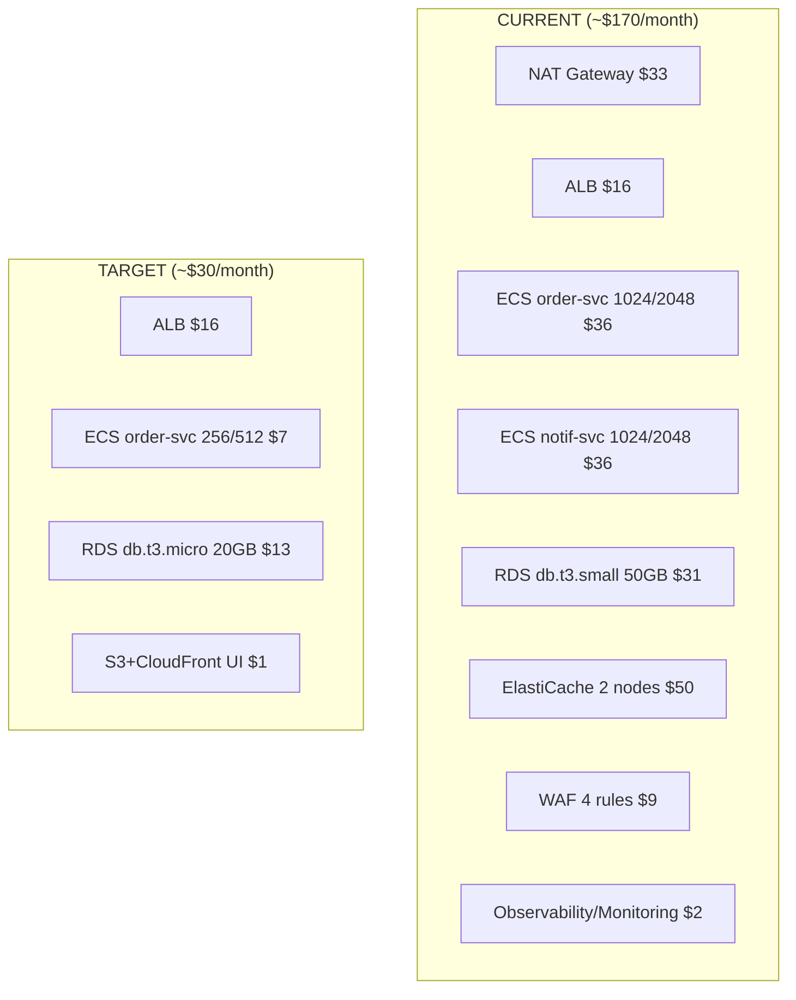

# Sandbox Cost Reduction Plan

**Goal:** Reduce personal dev sandbox from ~$170/month to ~$25–35/month while keeping a fully working backend + frontend.

**Constraint:** Max 100 requests/month, single developer, no uptime SLA.

---

## Current vs Target Architecture



---

## Cost Breakdown: Target State

| Resource                    | Monthly Cost   | Notes                                |
| --------------------------- | -------------- | ------------------------------------ |
| ALB                         | $16.22         | Fixed cost, unavoidable with Fargate |
| ECS order-service (256/512) | $7.20          | Single task, 24/7                    |
| RDS db.t3.micro (20GB)      | $12.50         | Single-AZ, no Performance Insights   |
| S3 + CloudFront (Vyasa UI)  | ~$1.00         | Minimal storage + requests           |
| SQS/EventBridge             | ~$0.00         | Free tier covers 100 req/month       |
| Secrets Manager (2 secrets) | $0.80          | $0.40/secret/month                   |
| CloudWatch Logs (7-day)     | ~$0.50         | Minimal volume                       |
| **TOTAL**                   | **~$38/month** |                                      |

---

## What Gets Removed/Disabled for Dev

| Component              | Action                                                | Reason                                                                        |
| ---------------------- | ----------------------------------------------------- | ----------------------------------------------------------------------------- |
| **NAT Gateway**        | Remove; ECS uses public subnets with `assignPublicIp` | Saves $33/month                                                               |
| **ElastiCache Redis**  | Remove entirely                                       | No caching needed at 100 req/month                                            |
| **notification-svc**   | Remove from ECS                                       | Order events can go directly to SQS; no real-time WebSocket needed in sandbox |
| **WAF**                | Disable via `enableWaf: false`                        | Already gated by config flag                                                  |
| **RollbackStack**      | Skip for dev                                          | No CI/CD pipeline exercised                                                   |
| **AppConfigStack**     | Skip for dev                                          | No feature flags needed                                                       |
| **ObservabilityStack** | Skip for dev                                          | No SLO monitoring at 0 traffic                                                |
| **MonitoringStack**    | Skip for dev                                          | No dashboards/alarms needed                                                   |
| **CDNStack**           | Skip for dev                                          | ALB direct access is fine                                                     |
| **VPC Flow Logs**      | Disable                                               | No security auditing needed                                                   |

---

## Implementation Steps

### Phase 1: Add Dev Config (environments.ts)

**File:** `infra/config/environments.ts`

1. Rename current export to `prodConfig`
2. Add `devConfig` with minimal sizing
3. Add environment selector based on `CDK_ENV` environment variable

```typescript
// New devConfig values:
{
  envName: 'dev',
  natGateways: 0,              // No NAT GW — ECS uses public subnets
  dbInstanceClass: 'db.t3.micro',
  dbAllocatedStorage: 20,
  dbMaxAllocatedStorage: 30,
  dbMultiAz: false,
  dbDeletionProtection: false,
  redisNodeType: 'cache.t3.micro',  // unused but keeps interface happy
  redisNumReplicas: 0,
  enableRedis: false,           // NEW FIELD — controls Redis creation
  enableNotificationSvc: false, // NEW FIELD — skip notification-svc
  orderServiceCpu: 256,
  orderServiceMemory: 512,
  orderServiceDesiredCount: 1,
  orderServiceMinCapacity: 1,
  orderServiceMaxCapacity: 1,   // No autoscaling
  enableWaf: false,
  enableVpcFlowLogs: false,
  enableDetailedMonitoring: false,
  logRetentionDays: 7,
  skipObservability: true,      // NEW FIELD
  skipMonitoring: true,         // NEW FIELD
  skipRollback: true,           // NEW FIELD
  skipAppConfig: true,          // NEW FIELD
  skipCdn: true,                // NEW FIELD
  usePublicSubnets: true,       // NEW FIELD — ECS in public subnets
}
```

### Phase 2: Modify EnvironmentConfig Interface

Add new optional boolean fields to the interface:

```typescript
readonly enableRedis?: boolean;
readonly enableNotificationSvc?: boolean;
readonly skipObservability?: boolean;
readonly skipMonitoring?: boolean;
readonly skipRollback?: boolean;
readonly skipAppConfig?: boolean;
readonly skipCdn?: boolean;
readonly usePublicSubnets?: boolean;
```

### Phase 3: Modify DatabaseStack (Make Redis Optional)

**File:** `infra/lib/database-stack.ts`

- Wrap Redis creation in `if (config.enableRedis !== false)`
- Export `redisEndpoint` / `redisPort` as empty strings when Redis is disabled
- Public properties become optional

### Phase 4: Modify ECSStack (Public Subnets + Optional Redis + Optional notif-svc)

**File:** `infra/lib/ecs-stack.ts`

1. When `config.usePublicSubnets === true`:
   - Place Fargate tasks in public subnets with `assignPublicIp: true`
2. When `config.enableRedis === false`:
   - Set `REDIS_HOST` to empty string (app must handle gracefully)
3. When `config.enableNotificationSvc === false`:
   - Skip notification-svc task definition, service, and target group
   - Export dummy `notificationServiceName`

### Phase 5: Modify app.ts (Conditionally Skip Stacks)

**File:** `infra/bin/app.ts`

```typescript
const config = getConfig(); // reads CDK_ENV

// Always deploy:
// - NetworkStack
// - DatabaseStack (with Redis conditionally)
// - EventStack (SQS is free)
// - SecurityStack (IAM roles needed, WAF already gated)
// - ECSStack (right-sized)
// - VyasaVectorStack + VyasaLambdaStack + VyasaUiStack

// Conditionally skip:
if (!config.skipCdn) {
  /* CDNStack */
}
if (!config.skipMonitoring) {
  /* MonitoringStack */
}
if (!config.skipObservability) {
  /* ObservabilityStack */
}
if (!config.skipAppConfig) {
  /* AppConfigStack */
}
if (!config.skipRollback) {
  /* RollbackStack */
}
```

### Phase 6: Handle Application-Level Redis Fallback

**Files:** `apps/order-service/src/...`

The order-service currently expects `REDIS_HOST`. When Redis is absent:

- The app should skip Redis connection if `REDIS_HOST` is empty
- Session/cache operations fall through to in-memory (acceptable at 100 req/month)

### Phase 7: Deploy & Validate

```bash
# Set environment
export CDK_ENV=dev

# Diff to verify changes
cd infra && npx cdk diff

# Deploy (creates new dev stacks or updates existing)
npx cdk deploy --all --require-approval broadening

# Verify
curl http://<ALB_DNS>/health
curl http://<ALB_DNS>/v1/orders
```

---

## Execution Order

| Step | Action                                                    | Risk            | Rollback                    |
| ---- | --------------------------------------------------------- | --------------- | --------------------------- |
| 1    | Add `devConfig` + interface changes                       | None (additive) | Revert file                 |
| 2    | Add `enableRedis` guard to DatabaseStack                  | Low             | Revert file                 |
| 3    | Modify ECSStack for public subnets + optional Redis/notif | Medium          | Revert file                 |
| 4    | Modify app.ts to conditionally skip stacks                | Low             | Revert file                 |
| 5    | Update order-service to handle missing Redis              | Low             | Revert file                 |
| 6    | `cdk diff` — review all changes                           | None            | —                           |
| 7    | `cdk deploy`                                              | Medium          | `cdk destroy` unused stacks |
| 8    | Manually delete old expensive resources if needed         | —               | —                           |

---

## Post-Implementation: Verify Working System

- [ ] `GET /health` returns 200
- [ ] `GET /v1/orders` returns valid response
- [ ] Vyasa UI loads at CloudFront URL
- [ ] Order creation via POST works
- [ ] SQS messages are consumed (check DLQ is empty)

---

## Risk Mitigation

1. **Public subnet security**: ECS tasks get public IPs but the service security group still restricts inbound to ALB only (port 3000). No direct public access to containers.
2. **No Redis**: Application must gracefully degrade. If Redis is used for session storage, sessions will be ephemeral (acceptable for 1 developer).
3. **No notification-svc**: If real-time notifications are needed during dev, re-enable with 256/512 sizing (adds ~$7/month).

---

## Current Deployed Infrastructure (as of 2026-05-25)

**Region:** `us-east-1` | **Account:** `947612421212` | **Env:** `dev`

### Active CloudFormation Stacks

| Stack                       | Key Resources                                                                                                                             | Purpose                       |
| --------------------------- | ----------------------------------------------------------------------------------------------------------------------------------------- | ----------------------------- |
| `OrderFlow-dev-VyasaVector` | S3 Vectors bucket (`vyasa-vectors-dev-947612421212`), index (`vyasa-index-dev`), IAM role (`vyasa-rag-kb-role-dev`)                       | Vector storage for Bedrock KB |
| `OrderFlow-dev-VyasaRag`    | Lambda (`vyasa-rag-dev`), API Gateway (`lkbzhoe1pj`), DynamoDB (`vyasa-rag-sessions-dev`, `vyasa-rag-rate-limits-dev`), CloudWatch alarms | RAG backend                   |
| `OrderFlow-dev-VyasaUi`     | S3 bucket, CloudFront (`E1W56P4E23UU5Y` / `d2j5xbveesoc8s.cloudfront.net`), OAC, CF Function                                              | Frontend hosting              |

### Endpoints

| Service           | URL                                                           |
| ----------------- | ------------------------------------------------------------- |
| **Frontend (UI)** | https://d2j5xbveesoc8s.cloudfront.net                         |
| **Backend (API)** | https://lkbzhoe1pj.execute-api.us-east-1.amazonaws.com        |
| **Health check**  | https://lkbzhoe1pj.execute-api.us-east-1.amazonaws.com/health |

### External Resources (not in stacks, referenced by ID)

| Resource            | ID                                   | Notes                                         |
| ------------------- | ------------------------------------ | --------------------------------------------- |
| Bedrock KB          | `OYAKPT9RLA`                         | S3 Vectors storage, Titan Embed v2            |
| Bedrock Data Source | `B2VQSKC6IS`                         | Points to `vyasa-rag-corpus-dev-947612421212` |
| S3 corpus bucket    | `vyasa-rag-corpus-dev-947612421212`  | Retained from previous stack                  |
| S3 prompts bucket   | `vyasa-rag-prompts-dev-947612421212` | Retained from previous stack                  |

### Estimated Monthly Cost

| Resource                          | Free Tier                   | Monthly Cost    | Notes                                     |
| --------------------------------- | --------------------------- | --------------- | ----------------------------------------- |
| Lambda (1024 MB, ARM64)           | 1M requests + 400K GB-sec   | **$0.00**       | ~100 requests/month well within free tier |
| API Gateway HTTP                  | 1M requests                 | **$0.00**       | Covered by free tier                      |
| DynamoDB (on-demand)              | 25 RCU/WCU + 25GB           | **$0.00**       | Minimal reads/writes                      |
| S3 (corpus + prompts + UI)        | 5GB + 20K GET               | **~$0.05**      | Small static files                        |
| CloudFront                        | 1TB transfer + 10M requests | **$0.00**       | Covered by free tier                      |
| S3 Vectors                        | —                           | **~$0.25**      | Storage for vector index                  |
| Bedrock Nova Pro (inference)      | —                           | **~$0.50–5.00** | Pay-per-token; depends on usage           |
| Bedrock Titan Embed (embeddings)  | —                           | **~$0.01**      | Minimal at 100 req/month                  |
| CloudWatch Logs (7-day retention) | 5GB ingest                  | **$0.00**       | Minimal volume                            |
| **TOTAL**                         |                             | **~$1–6/month** | At 100 requests/month                     |

### Deployment Commands

```bash
export CDK_ENV=dev
cd infra && npx cdk deploy OrderFlow-dev-VyasaRag OrderFlow-dev-VyasaUi --require-approval broadening

# Build & sync UI
cd apps/vyasa-ui && npm run build
aws s3 sync dist/ s3://orderflow-dev-vyasaui-vyasauibucket7b9068a5-eegjs5vw5mij --delete
aws cloudfront create-invalidation --distribution-id E1W56P4E23UU5Y --paths "/*"
```

---

## Previous Plan (Superseded)

The original plan below targeted ~$38/month with ECS/RDS/order-service right-sizing.
The actual implementation went further — **removed all ECS/RDS/Redis/ALB** and deployed
a serverless-only Vyasa RAG stack at **~$1–6/month**.

---

## Optional Further Savings (if needed)

| Option                                            | Saves     | Trade-off                                           |
| ------------------------------------------------- | --------- | --------------------------------------------------- |
| Replace ALB with direct public IP + nginx sidecar | $16/month | Lose path routing, health checks, HTTPS termination |
| Use ECS Scheduled Scaling to 0 at nights          | ~$4/month | 3-min cold start when resuming                      |
| Switch to Aurora Serverless v2 (scales to 0 ACU)  | ~$5/month | Higher per-ACU cost when active                     |
| Replace Fargate with EC2 `t4g.nano` Spot          | ~$5/month | More management overhead                            |
