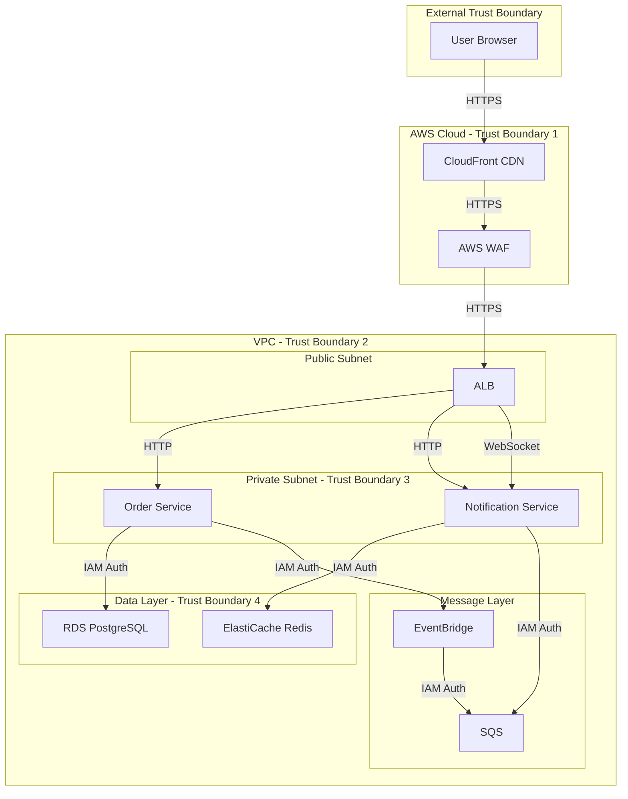

# Threat Model

This document applies STRIDE methodology to identify threats, trust boundaries, and mitigations for OrderFlow.

## STRIDE Framework

| Threat                     | Description                                | Mitigation Category |
| -------------------------- | ------------------------------------------ | ------------------- |
| **S**poofing               | Impersonating someone/something else       | Authentication      |
| **T**ampering              | Modifying data or code                     | Integrity           |
| **R**epudiation            | Claiming not to have done something        | Non-repudiation     |
| **I**nformation Disclosure | Exposing information to unauthorized users | Confidentiality     |
| **D**enial of Service      | Denying service to users                   | Availability        |
| **E**levation of Privilege | Gaining unauthorized capabilities          | Authorization       |

## System Architecture & Trust Boundaries

## Assets

| Asset                      | Value    | Owner                | Location            |
| -------------------------- | -------- | -------------------- | ------------------- |
| User PII (email, password) | High     | Order Service        | RDS PostgreSQL      |
| Order data                 | Medium   | Order Service        | RDS PostgreSQL      |
| JWT signing keys           | Critical | Order Service        | AWS Secrets Manager |
| Database credentials       | Critical | Order Service        | AWS Secrets Manager |
| Session tokens             | High     | Notification Service | Redis               |
| API access logs            | Medium   | Infrastructure       | CloudWatch          |

## Threat Analysis

### 1. Spoofing (Authentication Threats)

| Threat | Description                               | Risk   | Mitigation                                                      |
| ------ | ----------------------------------------- | ------ | --------------------------------------------------------------- |
| T1.1   | Attacker guesses weak user passwords      | High   | Enforce strong passwords, rate limiting, bcrypt hashing         |
| T1.2   | Attacker steals JWT and impersonates user | Medium | Short-lived tokens (15min), HTTP-only cookies, refresh rotation |
| T1.3   | Attacker spoofs service-to-service calls  | Low    | IAM Task Roles, no shared secrets                               |
| T1.4   | Attacker creates fake AWS credentials     | Low    | AWS IAM with MFA, regular key rotation                          |

### 2. Tampering (Integrity Threats)

| Threat | Description                             | Risk | Mitigation                                                   |
| ------ | --------------------------------------- | ---- | ------------------------------------------------------------ |
| T2.1   | Attacker modifies order data in transit | Low  | TLS 1.3 for all communications                               |
| T2.2   | Attacker modifies data in database      | Low  | IAM authentication, row-level security                       |
| T2.3   | Attacker modifies container image       | Low  | ECR scanning, immutable tags, SBOM                           |
| T2.4   | Attacker modifies event messages        | Low  | Event envelope with source verification, SQS access controls |

### 3. Repudiation (Non-repudiation Threats)

| Threat | Description                | Risk | Mitigation                                    |
| ------ | -------------------------- | ---- | --------------------------------------------- |
| T3.1   | User denies placing order  | Low  | Audit log with user ID, timestamp, IP         |
| T3.2   | User denies authentication | Low  | Authentication event logging, correlation IDs |
| T3.3   | Admin denies making change | Low  | All admin actions logged with identity        |

### 4. Information Disclosure (Confidentiality Threats)

| Threat | Description                         | Risk   | Mitigation                                      |
| ------ | ----------------------------------- | ------ | ----------------------------------------------- |
| T4.1   | Attacker eavesdrops on traffic      | Low    | TLS 1.3, certificate validation                 |
| T4.2   | Attacker accesses database directly | Low    | VPC private subnets, security groups, IAM auth  |
| T4.3   | PII in logs or error messages       | Medium | PII masking, log review process                 |
| T4.4   | Attacker enumerates user accounts   | Medium | Generic error messages, rate limiting           |
| T4.5   | Excessive data in API responses     | Medium | DTOs with explicit fields, no ORM serialization |
| T4.6   | Cache leakage between users         | Medium | Redis key namespacing, no shared cache entries  |

### 5. Denial of Service (Availability Threats)

| Threat | Description                       | Risk   | Mitigation                                          |
| ------ | --------------------------------- | ------ | --------------------------------------------------- |
| T5.1   | DDoS on public endpoints          | Medium | AWS WAF rate limiting, CloudFront DDoS protection   |
| T5.2   | Resource exhaustion (memory, CPU) | Low    | Container resource limits, HPA auto-scaling         |
| T5.3   | Database connection exhaustion    | Low    | Connection pooling, query timeouts, circuit breaker |
| T5.4   | SQS queue flooding                | Low    | Queue depth monitoring, DLQ, auto-scaling consumers |
| T5.5   | WebSocket connection exhaustion   | Medium | Connection limits per IP, connection timeouts       |

### 6. Elevation of Privilege (Authorization Threats)

| Threat | Description                                  | Risk   | Mitigation                                             |
| ------ | -------------------------------------------- | ------ | ------------------------------------------------------ |
| T6.1   | User accesses another user's orders          | High   | JWT validation, user ID from token, row-level security |
| T6.2   | Privilege escalation via parameter tampering | Medium | Server-side authorization checks, no client-side trust |
| T6.3   | Container escape to host                     | Low    | Non-root containers, read-only root filesystem         |
| T6.4   | IAM privilege escalation                     | Low    | Least privilege IAM roles, regular access reviews      |

## Attack Scenarios

### Scenario 1: Stolen JWT Token

**Attack**: Attacker steals JWT from browser localStorage

**Impact**: Can impersonate user until token expires

**Mitigations**:

- HTTP-only cookies (not accessible to JavaScript)
- 15-minute token lifetime
- Refresh token rotation on use
- Ability to revoke all sessions

### Scenario 2: SQL Injection

**Attack**: Attacker injects SQL through order ID parameter

**Impact**: Data breach, unauthorized data modification

**Mitigations**:

- Prisma ORM (parameterized queries)
- Input validation with Zod schemas
- WAF SQL injection rules

### Scenario 3: IDOR (Insecure Direct Object Reference)

**Attack**: User changes order ID in URL to access others' orders

**Impact**: Unauthorized data access

**Mitigations**:

- Authorization check: `order.userId === token.sub`
- No sequential order IDs (UUIDs)
- Generic error messages

### Scenario 4: Dependency Vulnerability

**Attack**: Exploit known vulnerability in npm package

**Impact**: Remote code execution, data breach

**Mitigations**:

- Snyk/Dependabot monitoring
- Automated security scanning in CI/CD
- Regular dependency updates
- Lockfile to prevent unexpected updates

## Risk Matrix

| Likelihood \ Impact | Low        | Medium     | High       | Critical   |
| ------------------- | ---------- | ---------- | ---------- | ---------- |
| **High**            |            | T4.3, T4.4 | T1.1       |            |
| **Medium**          |            | T5.1       | T4.2, T6.1 | T2.1       |
| **Low**             | T3.1       | T2.3, T4.1 | T4.5, T5.4 | T1.2       |
| **Very Low**        | T2.2, T3.3 | T6.3, T6.4 |            | T1.3, T1.4 |

## Mitigation Implementation Status

| Mitigation         | Implemented | Verified | Notes                    |
| ------------------ | ----------- | -------- | ------------------------ |
| TLS 1.3            |             |          | ALB configuration        |
| WAF Rules          |             |          | SQLi, XSS, rate limiting |
| JWT RS256          |             |          | Asymmetric signing       |
| bcrypt cost 12     |             |          | Password hashing         |
| IAM Task Roles     |             |          | No shared credentials    |
| PII Masking        |             |          | Log redaction            |
| Row-level Security |             |          | Database policies        |
| Rate Limiting      |             |          | Per IP and user          |
| Input Validation   |             |          | Zod schemas              |
| Container Security |             |          | Non-root, read-only      |

## Review Schedule

- **Monthly**: Review new threats, dependency vulnerabilities
- **Quarterly**: Full threat model review, penetration test findings
- **Annually**: Comprehensive threat model update

---

**Last Updated**: 2024-11-XX

**Next Review**: 2025-02-XX
