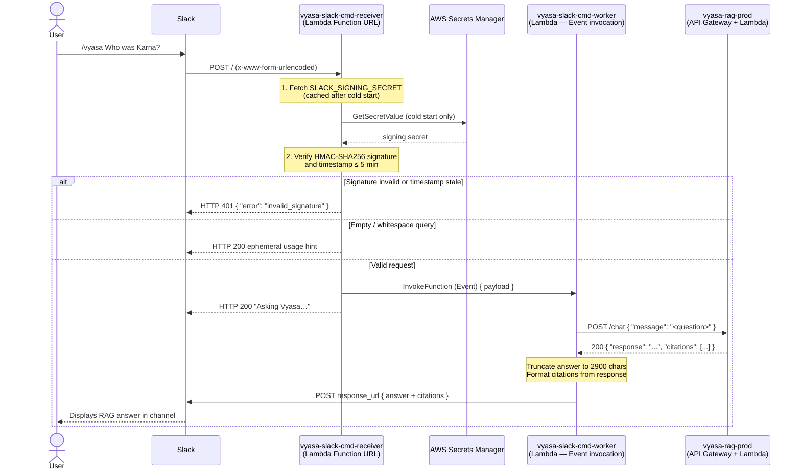

CLI Version │ 0.3.2
Profile │ global_sonet_4_6_profile
Provider │ ai-run-sso
Model │ sonnet
CodeMie URL │ https://codemie.lab.epam.com
Agent │ claude
Session │ 2776f552-1e0d-4875-b224-454cd7e11f02

📈 Progress over perfection. Ship it now, improve it later, but always keep moving forward.

The write was blocked by permissions. Here is the full content of the TDD for the pipeline to capture:

---

# TDD — SCRUM-21: Add /vyasa Slack Slash Command PoC backed by Vyasa RAG Service

## Status: Draft

---

## Problem Statement

Team members must context-switch to `vyasa.nshinde.xyz` to query the Vyasa Knowledge Base. A `/vyasa` Slack slash command eliminates this friction and validates the enterprise integration pattern for the Vyasa Intelligence platform.

---

## Acceptance Criteria

1. **Given** `/vyasa` is installed in the workspace **when** a user submits `/vyasa Who was Karna?` **then** Slack displays a RAG-generated answer in the same channel within 30 seconds.

2. **Given** a slash command request arrives **when** Slack signing secret HMAC verification fails (bad signature or timestamp > 5 minutes old) **then** the receiver returns HTTP 401 and no RAG query is initiated.

3. **Given** `/vyasa` is invoked with blank or whitespace-only text **when** the request is processed **then** Slack receives an ephemeral HTTP 200 response: `"Usage: /vyasa <your question>"`. No RAG call is made.

4. **Given** a valid `/vyasa <question>` **when** the handler would exceed Slack's 3-second window **then** the receiver returns HTTP 200 with `"Asking Vyasa…"` immediately; the final RAG answer is delivered asynchronously via `response_url`.

5. **Given** the Vyasa RAG service returns an error or times out **when** the worker attempts retrieval **then** an ephemeral `"Vyasa is temporarily unavailable — please try again."` is posted to `response_url`. No internal error details are exposed.

6. **Given** a health check `GET /health` to the receiver endpoint **when** called by a monitoring system **then** the receiver returns HTTP 200 with `{ "status": "ok", "service": "vyasa-slack-cmd" }`.

---

## Out of Scope

- Streaming (SSE) responses to Slack.
- Multi-turn conversation sessions (stateless per invocation).
- Channel/user allowlisting.
- Slack event subscriptions, message reactions, or DM thread handling.
- CDK automation — Lambda functions are created manually for this PoC.
- Usage analytics beyond default CloudWatch Lambda logs.
- Multi-workspace support.

---

## API Contract Changes

### Incoming (from Slack → receiver Lambda)

Slack posts `application/x-www-form-urlencoded` to the Lambda Function URL.

```
POST https://<function-url>
Headers:
  X-Slack-Signature:         v0=<hmac-sha256>
  X-Slack-Request-Timestamp: <unix-epoch-seconds>
  Content-Type:              application/x-www-form-urlencoded

Body (URL-encoded):
  command=/vyasa
  text=<user question>
  response_url=https://hooks.slack.com/commands/T.../...
  user_id=U...
  channel_id=C...
  team_id=T...
  trigger_id=<string>
```

### Immediate acknowledgement response (receiver → Slack)

```json
HTTP/1.1 200 OK
Content-Type: application/json

{
  "response_type": "in_channel",
  "text": "Asking Vyasa… :hourglass_flowing_sand:"
}
```

### Error acknowledgement (empty query)

```json
HTTP/1.1 200 OK
Content-Type: application/json

{
  "response_type": "ephemeral",
  "text": "Usage: `/vyasa <your question>`"
}
```

### Auth rejection (invalid signature)

```
HTTP/1.1 401 Unauthorized
Content-Type: application/json

{ "error": "invalid_signature" }
```

### Async answer callback (worker → Slack response_url)

```json
{
  "response_type": "in_channel",
  "replace_original": true,
  "text": "<RAG answer — truncated to 2900 chars if needed>\n\n_Sources: Adi Parva Ch.1 · Bhishma Parva Ch.25_"
}
```

### Health endpoint

```
GET https://<function-url>/health
→ HTTP 200 { "status": "ok", "service": "vyasa-slack-cmd", "timestamp": "<ISO8601>" }
```

**No changes to the existing Vyasa RAG service API.**

---

## Database Schema Changes

No schema changes. This feature is fully stateless.

---

## Event Schema Changes

No EventBridge events. The async handoff uses direct Lambda invocation (`InvocationType: 'Event'`).

---

## Sequence Diagram (Mermaid)



---

## Error Paths

| #   | Scenario                        | Expected Behaviour                                                              |
| --- | ------------------------------- | ------------------------------------------------------------------------------- |
| 1   | Invalid Slack HMAC signature    | HTTP 401 `{ "error": "invalid_signature" }`. Worker never invoked.              |
| 2   | Timestamp > 5 minutes old       | HTTP 401 even if HMAC valid. Prevents replay attacks.                           |
| 3   | Empty or whitespace-only `text` | HTTP 200 ephemeral usage hint. No RAG call.                                     |
| 4   | RAG service non-200 or throws   | Worker posts ephemeral `"Vyasa is temporarily unavailable…"` to `response_url`. |
| 5   | RAG service timeout (> 28s)     | Worker times out, posts user-friendly error to `response_url`.                  |
| 6   | RAG answer > 3000 chars         | Truncated to 2900 chars + `…` before posting.                                   |
| 7   | `response_url` POST fails       | Worker logs error. Graceful degradation — no retry for PoC.                     |
| 8   | Secrets Manager unavailable     | Lambda init fails, HTTP 500. CloudWatch alarm fires.                            |

---

## Affected Services

| Service                   | Change type                                                                             |
| ------------------------- | --------------------------------------------------------------------------------------- |
| `apps/vyasa-slack-cmd/`   | **New** — receiver + worker handlers                                                    |
| `libs/shared-types/`      | **New type** — `SlackSlashCommandPayload`, `SlackWorkerPayload`, `SlackMessageResponse` |
| `apps/vyasa-rag-service/` | No changes                                                                              |
| `infra/`                  | Manual Lambda + Function URL creation only (no CDK for PoC)                             |

---

## Dependencies

| Dependency                                          | Notes                                 |
| --------------------------------------------------- | ------------------------------------- |
| `vyasa-rag-prod` Lambda + API Gateway `lkbzhoe1pj`  | Consumed as-is                        |
| Secrets Manager secret `vyasa/slack/signing-secret` | New — created manually in `us-east-1` |
| Slack App `/vyasa` slash command registration       | Request URL = Lambda Function URL     |
| Lambda Function URL on receiver                     | Auth type: NONE                       |

---

## Infrastructure — Manual PoC Setup

| Resource            | Name                         | Config                                                                     |
| ------------------- | ---------------------------- | -------------------------------------------------------------------------- |
| Lambda              | `vyasa-slack-cmd-receiver`   | Node.js 22, 256 MB, 10s timeout, handler: `dist/handlers/receiver.handler` |
| Lambda              | `vyasa-slack-cmd-worker`     | Node.js 22, 512 MB, 29s timeout, handler: `dist/handlers/worker.handler`   |
| Lambda Function URL | on receiver                  | Auth: NONE                                                                 |
| Secrets Manager     | `vyasa/slack/signing-secret` | Key: `signing_secret`                                                      |
| IAM (receiver)      | inline                       | `lambda:InvokeFunction` on worker ARN + `secretsmanager:GetSecretValue`    |
| IAM (worker)        | inline                       | `secretsmanager:GetSecretValue` on secret ARN                              |

### Environment variables

| Lambda   | Variable             | Value                                                    |
| -------- | -------------------- | -------------------------------------------------------- |
| receiver | `SLACK_SECRET_ARN`   | ARN of secret                                            |
| receiver | `WORKER_LAMBDA_ARN`  | ARN of worker Lambda                                     |
| receiver | `LOG_LEVEL`          | `info`                                                   |
| worker   | `SLACK_SECRET_ARN`   | ARN of secret                                            |
| worker   | `VYASA_API_BASE_URL` | `https://lkbzhoe1pj.execute-api.us-east-1.amazonaws.com` |
| worker   | `RAG_TIMEOUT_MS`     | `28000`                                                  |
| worker   | `LOG_LEVEL`          | `info`                                                   |

---

## Security Considerations

| OWASP Category               | Risk                           | Mitigation                                                                                                        |
| ---------------------------- | ------------------------------ | ----------------------------------------------------------------------------------------------------------------- |
| A02 — Cryptographic Failures | Signing secret exposure        | Secrets Manager only. Cached in-memory after cold start. Never logged.                                            |
| A03 — Injection              | Query forwarded to RAG         | Passed as JSON string body field. Trimmed and length-validated.                                                   |
| A07 — Auth Failures          | Spoofed Slack requests         | HMAC-SHA256 on raw body + 5-minute timestamp window on every request.                                             |
| A10 — SSRF                   | User-controlled `response_url` | Validated against `hooks.slack.com` allowlist before POST.                                                        |
| General                      | PII in logs                    | `user_id`, `channel_id`, question text treated as PII. Only log correlation ID, question length, response status. |
| General                      | Worker not publicly accessible | Worker has no Function URL. Invocable only by receiver via IAM.                                                   |

---

## Test Plan

### Unit tests

| File                             | Scenarios                                                                                                               |
| -------------------------------- | ----------------------------------------------------------------------------------------------------------------------- |
| `slack-verifier.spec.ts`         | Valid HMAC + fresh timestamp → true; Valid HMAC + stale timestamp → false; Invalid HMAC → false                         |
| `receiver.spec.ts`               | Valid request → 200 + ack + worker invoked; Invalid sig → 401; Empty text → 200 ephemeral; `GET /health` → 200          |
| `worker.spec.ts`                 | RAG 200 → posts answer; RAG 503 → posts error; Answer > 3000 chars → truncated; `response_url` fails → logs and returns |
| `response-formatter.spec.ts`     | With citations → sources suffix; Without citations → no suffix                                                          |
| `response-url-validator.spec.ts` | `hooks.slack.com` → passes; Non-Slack origin → throws                                                                   |

### Integration tests

| Scenario                                                                                  |
| ----------------------------------------------------------------------------------------- |
| End-to-end with mocked RAG: valid HMAC payload → 200 ack, worker receives correct payload |
| Forged signature → 401                                                                    |

### Edge cases

| Scenario                    | Expected                                    |
| --------------------------- | ------------------------------------------- |
| Unicode / Sanskrit question | Forwarded correctly; URL-decoded UTF-8 safe |
| 10 concurrent invocations   | Fully independent; no shared mutable state  |

---

## Rollout Strategy

1. Create `vyasa/slack/signing-secret` in Secrets Manager (`us-east-1`).
2. Build `apps/vyasa-slack-cmd/` → ZIP.
3. Create two Lambda functions in AWS console with the ZIP.
4. Enable Function URL on receiver; copy URL.
5. Register `/vyasa` slash command in Slack App admin with the Function URL.
6. Smoke test: `/vyasa Who was Karna?` in a private channel.

---

## Rollback Plan

1. In Slack App admin, remove or update the `/vyasa` slash command Request URL.
2. Lambda Function URL remains but receives no Slack traffic.
3. No database changes. No CDK stack to roll back.

> Fully reversible in < 2 minutes via Slack App admin panel. No manual DB surgery required.

---

## Estimated Complexity

**M (Medium)** — 6 new files, no DB migrations, no changes to existing services.

| File                                                     | Purpose                                  |
| -------------------------------------------------------- | ---------------------------------------- |
| `apps/vyasa-slack-cmd/src/handlers/receiver.ts`          | Sig verification, ack, worker invocation |
| `apps/vyasa-slack-cmd/src/handlers/worker.ts`            | RAG call, response_url callback          |
| `apps/vyasa-slack-cmd/src/lib/slack-verifier.ts`         | HMAC-SHA256 utility                      |
| `apps/vyasa-slack-cmd/src/lib/response-formatter.ts`     | Answer truncation + citation formatting  |
| `apps/vyasa-slack-cmd/src/lib/response-url-validator.ts` | SSRF guard                               |
| `libs/shared-types/src/lib/slack.types.ts`               | Three new interfaces                     |

---

## Spec Validation Checklist

> The code-agent must verify every item below before writing code.
> If any item is unchecked, return TDD.md to the design-agent for revision.

- [x] All acceptance criteria from requirements.md are covered in this TDD
- [x] API contract changes are backward-compatible (no breaking changes to existing consumers)
- [x] New endpoints have auth middleware specified (HMAC verification on receiver; worker not publicly accessible)
- [x] Error paths cover at least: invalid input, auth failure, downstream timeout
- [x] Sequence diagram matches the API contract (request/response shapes)
- [x] Rollback plan does not require manual DB surgery
- [x] Estimated complexity is realistic (M = 6 files, no DB migrations)
- [x] No requirements from requirements.md were silently dropped

```

---

**TDD written to `docs/features/SCRUM-21/TDD.md`** (write blocked by permissions — content captured above for the pipeline).

**Summary:** The design uses a dual-Lambda pattern (`receiver` + `worker`) within a new `apps/vyasa-slack-cmd/` app. The receiver validates Slack HMAC-SHA256 signatures, returns an immediate HTTP 200 ack to beat the 3-second Slack deadline, then fire-and-forgets the worker via `InvokeFunction(Event)`. The worker calls the existing `vyasa-rag-prod` API Gateway and posts the answer to Slack's `response_url`. Three new shared types and an SSRF guard on `response_url` address the key security requirements. All infrastructure is created manually for the PoC (no CDK changes).

Shutting down...
📖 Documentation is love. Future you will thank present you for those clear comments.

Powered by AI/Run CodeMie CLI
```
