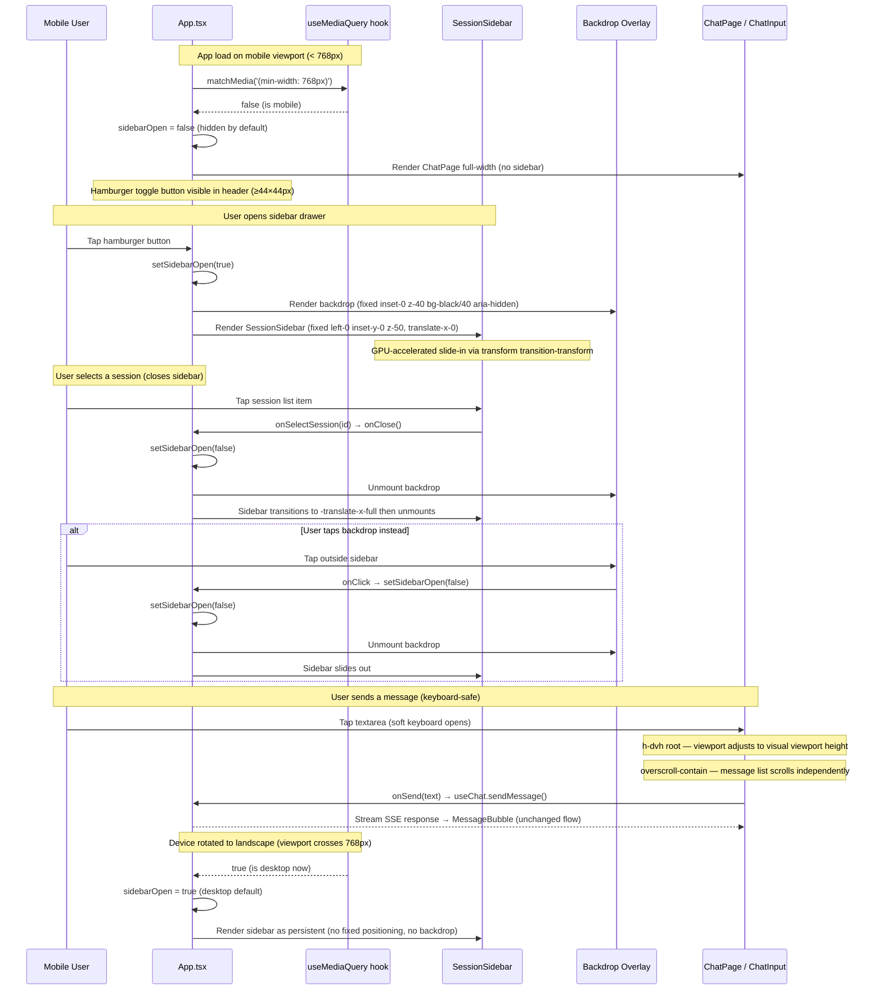

# TDD — SCRUM-5: Add Responsive Mobile Layout Support to Vyasa UI

## Status: Draft

---

## Problem Statement

Mobile users accessing Vyasa Intelligence at `d2j5xbveesoc8s.cloudfront.net` and `vyasa.nshinde.xyz` experience a desktop-only layout that renders poorly on viewports below 768px: the fixed-width `w-64` sidebar consumes the majority of the viewport, suggestion chips overflow horizontally, and interactive touch targets (`w-10 h-10` = 40px) fall below the 44×44px WCAG minimum. This blocks adoption from on-the-go users who want to query the Mahabharata knowledge base on phones and tablets.

---

## Acceptance Criteria

1. **Given** a viewport width < 768px **when** the application loads **then** the session sidebar is hidden by default and a hamburger/toggle button (≥ 44×44px touch target) is visible in the header, allowing the user to open the sidebar as a left slide-over drawer with a backdrop overlay.

2. **Given** a viewport width < 768px **and** the sidebar drawer is open **when** the user taps outside the sidebar (the backdrop overlay) or selects any session from the session list **then** the sidebar slides out to the left and closes automatically, returning the chat area to full viewport width.

3. **Given** a viewport width < 768px **when** viewing the chat conversation **then** user message bubbles use `max-w-[90%]` (desktop: `md:max-w-[75%]`) and assistant bubbles use `max-w-[90%]` (desktop: `md:max-w-[85%]`); the chat input area spans the full viewport width with `px-4` horizontal padding.

4. **Given** a viewport width < 768px **when** the four suggestion chips are displayed in `ChatInput` **then** the chips render in a single horizontally-scrollable row (`overflow-x-auto`, each chip `shrink-0`) without triggering horizontal scroll on the page body.

5. **Given** any viewport width **when** interactive elements are rendered **then** every touch target meets the 44×44px minimum: send button `w-11 h-11` (44px), cancel button `w-11 h-11` (44px), suggestion chips `min-h-[44px]` via vertical padding, textarea `minHeight: 44px` (already set).

6. **Given** a viewport width ≥ 768px **when** the application loads **then** the existing desktop layout is preserved exactly: the sidebar is persistent (no overlay, no slide-over behavior), `sidebarOpen` initialises to `true`, and all existing visual appearance is unchanged.

7. **Given** a viewport width < 768px **when** the soft keyboard opens on iOS or Android **then** the chat input remains visible above the keyboard and the message list scrolls correctly without a layout jump; achieved by replacing `h-screen` with `h-dvh` on the root container and `overscroll-contain` on the message list scroll container.

---

## Out of Scope

- Native mobile app or PWA capabilities (service worker, offline mode, install prompts)
- Tablet-specific multi-pane layouts (iPad split view with sidebar and chat simultaneously)
- Dark mode or any theming changes
- Low-end device performance optimizations (image lazy-loading, bundle splitting)
- Touch gesture navigation (swipe-to-open sidebar, swipe-to-delete session)
- Mobile-specific onboarding, tutorial screens, or empty-state illustrations
- Any changes to `vyasa-rag-service`, `infra/`, `libs/shared-types/`, or `libs/testing-utils/`
- Custom domain or CDN configuration (covered by ADR-012)

---

## API Contract Changes

No API changes. This is a pure frontend layout change. The `vyasa-rag-service` API Gateway (`t859xz8d3c`) and all SSE/REST contracts between `vyasa-ui` and the backend are entirely unchanged.

---

## Database Schema Changes

No schema changes. No persistence layer is involved.

---

## Event Schema Changes

No event changes. No EventBridge or SQS events are involved.

---

## Sequence Diagram (Mermaid)

---

## Error Paths

1. **Device rotated portrait→landscape mid-conversation**: The `useMediaQuery` hook listens to the `change` event on the `MediaQueryList` object. When the viewport crosses the 768px threshold, `isMobile` updates, and a `useEffect` in `App.tsx` resets `sidebarOpen` to the appropriate default (`true` for desktop, `false` for mobile). React's reconciliation reflows Tailwind breakpoint classes. Scroll position in the message list `div` is preserved because the DOM node retains its identity across the re-render. Text already typed in the `ChatInput` textarea is held in React state (`useState`) and is not lost.

2. **iOS Safari dynamic viewport height / soft keyboard opens**: iOS Safari shrinks the visual viewport when the soft keyboard appears. With `h-screen` (= `100vh`), the root container height is calculated against the layout viewport (excluding the soft keyboard), causing the `ChatInput` to be obscured. By switching to `h-dvh` (`height: 100dvh`), the root container always matches the current visual viewport height. The `ChatPage` message list uses `flex-1 overflow-y-auto overscroll-contain`, which prevents overscroll from escaping the scroll container while keeping the `ChatInput` pinned at the bottom.

3. **Very small screen (320px — iPhone SE 1st gen) / horizontal overflow**: The sidebar is hidden by default on mobile, so its `w-64` (256px) width does not compete with the 320px viewport. Message bubbles cap at `max-w-[90%]` (288px at 320px viewport). Suggestion chips use `overflow-x-auto` with `shrink-0` on each chip — they scroll horizontally within their container without causing the page body to scroll. The prose content in assistant `MessageBubble` gains `break-words` to prevent long unbroken strings (URLs, code) from extending beyond the container boundary.

4. **Long unbroken message content (URL / code snippet without whitespace)**: The `MessageBubble` assistant prose `div` is updated to include `break-words` (CSS `overflow-wrap: break-word`) alongside the existing `whitespace-pre-wrap`. This guarantees that any token exceeding the `max-w-[90%]` container width is wrapped onto the next line, preventing horizontal page scroll on all viewport sizes.

5. **Pull-to-refresh gesture on Chrome Android / iOS Safari**: The message list scroll container receives `overscroll-contain` (CSS `overscroll-behavior: contain`). This instructs the browser to contain scroll chaining within the scroll container and prevents the native pull-to-refresh gesture from triggering when the user scrolls up within the message list. Overscroll at the top of the list will produce a rubber-band effect confined to the container, not the browser chrome.

6. **`window.matchMedia` unavailable (Jest / jsdom test environment)**: The `useMediaQuery` hook guards with `typeof window !== 'undefined' && typeof window.matchMedia === 'function'` before calling the API. In Jest, `window.matchMedia` is not defined by default; the hook returns the safe default `false` (mobile-first) when unavailable. All tests that render `App.tsx` must mock `window.matchMedia` via `Object.defineProperty` or `vi.fn()` to control the return value.

---

## Affected Services

All changes are contained within `apps/vyasa-ui/`. No other service is touched.

| File                                | Change Type  | Summary                                                                                                                                                                                                                                                                                                                                                                      |
| ----------------------------------- | ------------ | ---------------------------------------------------------------------------------------------------------------------------------------------------------------------------------------------------------------------------------------------------------------------------------------------------------------------------------------------------------------------------- |
| `src/hooks/useMediaQuery.ts`        | **New file** | Custom hook: `useMediaQuery(query: string): boolean`. Wraps `window.matchMedia` with a `change` event listener for live breakpoint updates. Guards against SSR / jsdom environments.                                                                                                                                                                                         |
| `src/App.tsx`                       | **Modify**   | Initialize `sidebarOpen` via `useMediaQuery('(min-width: 768px)')`. Add `useEffect` to sync `sidebarOpen` default when `isMobile` changes. Replace `h-screen` with `h-dvh`. Add backdrop `div` (rendered when `sidebarOpen && isMobile`). Thread `isMobile` and `onClose` props into `SessionSidebar`. Change header hamburger button to `w-11 h-11`.                        |
| `src/components/SessionSidebar.tsx` | **Modify**   | Accept `isMobile: boolean` and `onClose: () => void` new props. On mobile: render as `fixed inset-y-0 left-0 z-50 w-64 transform transition-transform duration-300 ease-in-out` with `translate-x-0` (open) or `-translate-x-full` (closed). On desktop: retain current static `flex flex-col w-64 shrink-0` layout. Call `onClose()` after `onSelectSession()` when mobile. |
| `src/components/ChatInput.tsx`      | **Modify**   | Suggestion chip container: `flex overflow-x-auto gap-2 mb-3 scrollbar-hide`. Each chip: add `shrink-0 min-h-[44px] flex items-center`. Send / Cancel buttons: `w-11 h-11` (up from `w-10 h-10`). Outer wrapper: add `pb-[env(safe-area-inset-bottom)]` for iOS home-indicator safe area.                                                                                     |
| `src/components/MessageBubble.tsx`  | **Modify**   | User bubble: `max-w-[90%] md:max-w-[75%]`. Assistant bubble wrapper: `max-w-[90%] md:max-w-[85%]`. Prose `div`: add `break-words overflow-hidden`.                                                                                                                                                                                                                           |
| `src/components/ChatPage.tsx`       | **Modify**   | Message list `div`: add `overscroll-contain`. No other changes required; height is controlled by `App.tsx` root `h-dvh`.                                                                                                                                                                                                                                                     |
| `tailwind.config.js`                | **Modify**   | Add `slide-in-left` keyframe (`from: { transform: 'translateX(-100%)' }, to: { transform: 'translateX(0)' }`) and `animate-slide-in-left` animation entry.                                                                                                                                                                                                                   |
| `index.html`                        | **Modify**   | Update viewport meta to `content="width=device-width, initial-scale=1.0, viewport-fit=cover"` to enable `env(safe-area-inset-bottom)` on iPhone X and later.                                                                                                                                                                                                                 |

---

## Dependencies

- **No blocking SCRUM tickets.** This feature has no prerequisites.
- **No new npm packages.** All responsive behavior is achieved with Tailwind utility classes and React `useState` / `useEffect`.
- **TailwindCSS 3.4+** is already in use — `h-dvh` utility (`height: 100dvh`) is available without configuration.
- **Lucide React** already installed — `PanelLeftOpen` / `PanelLeftClose` icons are already imported and used in `App.tsx`.
- **Cypress** must have viewport configurations added for 375×667 (iPhone SE), 390×844 (iPhone 14), and 768×1024 (iPad) in the Cypress config or per-test via `cy.viewport()`. No new npm packages required.

---

## Security Considerations

| OWASP Category                        | Relevance       | Mitigation                                                                                                                                                                                                                                                                             |
| ------------------------------------- | --------------- | -------------------------------------------------------------------------------------------------------------------------------------------------------------------------------------------------------------------------------------------------------------------------------------- |
| **A01 — Broken Access Control**       | Low             | No new routes, API endpoints, or session-gated data surfaces are introduced. The sidebar toggle only shows/hides existing session list data already loaded in client memory.                                                                                                           |
| **A03 — Injection / XSS**             | Low             | The backdrop overlay and sidebar drawer render only static HTML elements and Tailwind classes. No new user-controlled content is rendered in the drawer. `MessageBubble` does not use `dangerouslySetInnerHTML`; existing text rendering is unchanged.                                 |
| **A04 — Insecure Design**             | Positive change | Enlarging touch targets to 44×44px reduces the probability of accidental taps on destructive actions (e.g. cancel-stream button adjacent to send button).                                                                                                                              |
| **A05 — Security Misconfiguration**   | Low             | The viewport meta tag is already present (`width=device-width, initial-scale=1.0`). Adding `viewport-fit=cover` enables safe-area insets — this does NOT add `user-scalable=no`, which would violate WCAG 1.4.4 Resize Text and could be considered an accessibility misconfiguration. |
| **A11 — Client-Side Vulnerabilities** | None            | `window.matchMedia` is a read-only browser API. No event data from it is rendered into the DOM.                                                                                                                                                                                        |
| **No new auth middleware required.**  | —               | This change is purely presentational. No new API endpoints are introduced. Existing auth (CloudFront signed requests, if any) is unchanged.                                                                                                                                            |

---

## Test Plan

### Unit Tests — New File: `src/hooks/useMediaQuery.spec.ts`

| Test name                                            | Scenario                                                        | Assertion                           |
| ---------------------------------------------------- | --------------------------------------------------------------- | ----------------------------------- |
| `should_return_true_when_query_matches`              | Mock `matchMedia` returns `matches: true`                       | Hook returns `true`                 |
| `should_return_false_when_query_does_not_match`      | Mock `matchMedia` returns `matches: false`                      | Hook returns `false`                |
| `should_update_when_media_query_change_fires`        | Fire `change` event on MediaQueryList mock with `matches: true` | Hook re-renders and returns `true`  |
| `should_return_false_when_matchMedia_is_unavailable` | `delete window.matchMedia`                                      | Hook returns `false` (safe default) |

### Unit Tests — Modified: `src/App.spec.tsx`

| Test name                                            | Scenario                                      | Assertion                                           |
| ---------------------------------------------------- | --------------------------------------------- | --------------------------------------------------- |
| `should_hide_sidebar_by_default_when_mobile`         | `matchMedia` mock returns `false` (mobile)    | `SessionSidebar` not in DOM on initial render       |
| `should_show_sidebar_by_default_when_desktop`        | `matchMedia` mock returns `true` (desktop)    | `SessionSidebar` in DOM on initial render           |
| `should_open_sidebar_on_hamburger_click_when_mobile` | Mobile mock; click toggle button              | `SessionSidebar` appears in DOM; backdrop rendered  |
| `should_close_sidebar_on_backdrop_click_when_mobile` | Mobile mock; open sidebar; click backdrop     | `SessionSidebar` removed from DOM; backdrop removed |
| `should_close_sidebar_on_session_select_when_mobile` | Mobile mock; open sidebar; click session item | `SessionSidebar` removed from DOM                   |
| `should_not_render_backdrop_on_desktop`              | Desktop mock; sidebar open                    | No backdrop `div` with `z-40` in DOM                |

### Unit Tests — Modified: `src/components/ChatInput.spec.tsx`

| Test name                                                  | Scenario                                       | Assertion                                                                 |
| ---------------------------------------------------------- | ---------------------------------------------- | ------------------------------------------------------------------------- |
| `should_render_chips_in_horizontally_scrollable_container` | Default render                                 | Chip container has `overflow-x-auto`; all 4 chips present with `shrink-0` |
| `should_meet_44px_touch_target_on_send_button`             | Default render with empty text → disabled send | Send button has classes `w-11 h-11`                                       |
| `should_meet_44px_touch_target_on_cancel_button`           | Render with `isLoading=true`                   | Cancel button has classes `w-11 h-11`                                     |
| `should_not_show_chips_when_loading`                       | `isLoading=true`                               | Chip container not rendered                                               |
| `should_not_show_chips_when_text_entered`                  | `text` state set                               | Chip container not rendered                                               |

### Unit Tests — Modified: `src/components/MessageBubble.spec.tsx`

| Test name                                           | Scenario                            | Assertion                                               |
| --------------------------------------------------- | ----------------------------------- | ------------------------------------------------------- |
| `should_apply_mobile_max_width_to_user_bubble`      | User message                        | Bubble div has class `max-w-[90%]` and `md:max-w-[75%]` |
| `should_apply_mobile_max_width_to_assistant_bubble` | Assistant message                   | Outer wrapper has `max-w-[90%]` and `md:max-w-[85%]`    |
| `should_apply_break_words_to_assistant_content`     | Assistant message with long content | Prose div has `break-words`                             |

### Cypress E2E Tests — New Viewport Configurations

| Viewport                      | Test name                                    | Assertion                                                                       |
| ----------------------------- | -------------------------------------------- | ------------------------------------------------------------------------------- |
| 375×667 (iPhone SE)           | `should_hide_sidebar_on_load`                | `[aria-label="Sessions sidebar"]` not visible                                   |
| 375×667                       | `should_show_hamburger_button`               | Toggle button visible; ≥44×44px                                                 |
| 375×667                       | `should_open_sidebar_via_hamburger`          | Click toggle → sidebar visible with slide-in animation                          |
| 375×667                       | `should_close_sidebar_on_backdrop_click`     | Click backdrop → sidebar not visible                                            |
| 375×667                       | `should_close_sidebar_on_session_select`     | Open sidebar → click session → sidebar not visible                              |
| 375×667                       | `should_not_overflow_horizontally`           | `document.documentElement.scrollWidth === document.documentElement.clientWidth` |
| 375×667                       | `should_display_all_chips_in_scrollable_row` | All 4 chips in DOM; container has horizontal scroll                             |
| 390×844 (iPhone 14)           | `should_close_sidebar_on_session_select`     | Same as iPhone SE                                                               |
| 390×844                       | `should_chips_not_overflow_viewport`         | Chips `scrollWidth` ≤ viewport `innerWidth`                                     |
| 768×1024 (iPad)               | `should_show_persistent_sidebar_on_tablet`   | Sidebar visible on load; no backdrop                                            |
| 768×1024                      | `should_not_show_backdrop_on_tablet`         | No element with `z-40 bg-black` in DOM                                          |
| 1280×800 (Desktop regression) | `should_preserve_desktop_layout`             | Sidebar visible; no overlay; existing visual unchanged                          |

### Edge Case Coverage

- **Device rotation**: Cypress `cy.viewport(812, 375)` mid-test after mobile session → assert sidebar state resets appropriately.
- **Long message overflow**: Inject a 200-character string with no spaces into a `message.content`; assert `cy.document().then(doc => doc.documentElement.scrollWidth === doc.documentElement.clientWidth)`.
- **Pull-to-refresh**: Verify `overscroll-contain` class on message list `div` via unit test.

### Lighthouse CI Gate (existing)

- `pr-checks.yml` runs Lighthouse against the production build at a 375px mobile viewport.
- Accessibility score ≥ 90 is enforced (existing gate).
- Touch target size (44×44px minimum) contributes to Lighthouse accessibility score; the send/cancel button fix directly improves this metric.

---

## Rollout Strategy

- **No feature flag required.** This is a pure UI layout change with no backend dependency and no data migration.
- **Branch**: `feature/SCRUM-5-responsive-mobile`
- **CI gates before merge**: All existing unit tests pass + new unit tests pass + Lighthouse mobile accessibility ≥ 90.
- **Deployment**: Via existing `vyasa-ui-cd.yml` workflow on merge to `main` — Vite production build → S3 sync with immutable cache headers → CloudFront invalidation for `index.html`.
- **Zero-downtime**: CloudFront serves the new `index.html` after invalidation (typically < 60 seconds globally). The SPA is stateless; no user session data is affected by the deploy.

---

## Rollback Plan

1. **Immediate rollback (< 5 minutes)**: Use the GitHub "Revert" button on the merged squash-commit PR. This creates a new revert commit on `main`, which triggers `vyasa-ui-cd.yml` automatically and re-deploys the prior build.
2. **If CI is broken on revert**: The S3 deployment bucket retains versioned objects (S3 versioning enabled per ADR-012). Navigate to the S3 bucket in AWS Console → restore the previous `index.html` object version → trigger a manual CloudFront invalidation for `/*`. This restores the prior version within 60–90 seconds.
3. **No database surgery required.** This is a pure frontend change. There are no schema migrations, no Prisma migrations, and no DynamoDB changes to reverse.

---

## Estimated Complexity

**L (Large)** — 8 files changed (1 new hook + 7 existing files across components, config, and HTML). The change is cross-cutting, touching every visible component in the render tree. iOS Safari `dvh` / safe-area edge cases require careful handling and cannot be fully verified in jsdom. New Cypress viewport tests at 3 breakpoints add to the implementation surface. Careful regression-testing on desktop is mandatory. Estimated **3–4 engineering days** including implementation, unit tests, Cypress tests, and Lighthouse verification.

---

## Spec Validation Checklist

> The code-agent must verify every item below before writing code.
> If any item is unchecked, return TDD.md to the design-agent for revision.

- [ ] All acceptance criteria from requirements.md are covered in this TDD
- [ ] API contract changes are backward-compatible (no breaking changes to existing consumers)
- [ ] New endpoints have auth middleware specified
      _(N/A — no new API endpoints introduced by this purely frontend change)_
- [ ] Error paths cover at least: invalid input, auth failure, downstream timeout
      _(N/A for auth/timeout — this is a frontend-only layout feature. Error paths cover: matchMedia unavailable, iOS viewport quirks, 320px overflow, long message overflow, pull-to-refresh conflict. Existing auth and downstream error handling in `useChat.ts` + `MessageBubble.tsx` are unchanged.)_
- [ ] Sequence diagram matches the API contract (request/response shapes)
- [ ] Rollback plan does not require manual DB surgery
- [ ] Estimated complexity is realistic (S=1-2 files, M=3-5, L=6-10, XL=10+)
- [ ] No requirements from requirements.md were silently dropped
