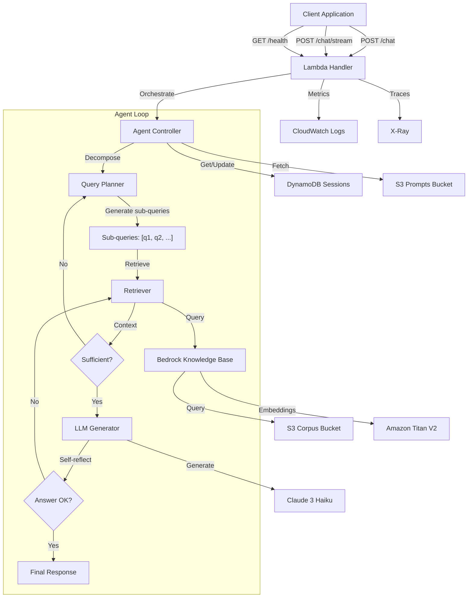

# RFC-004: Vyasa Intelligence RAG Service

## Summary

Add **agentic RAG (Retrieval-Augmented Generation)** capability to the OrderFlow platform for answering questions about the Mahabharata using AWS serverless technologies. The service implements a **ReAct-style agent loop** with query decomposition, iterative retrieval, and self-reflection to handle complex multi-hop questions. Cost-optimized solution (~$3-5/month for 100 visits) using Lambda, Bedrock Knowledge Base, and DynamoDB.

## Motivation

The OrderFlow platform needs a **conversational AI agent** that can:

- Answer complex, multi-hop questions about the Mahabharata (e.g., "Who were the parents of Karna's foster father?")
- Perform **iterative retrieval** when initial context is insufficient
- **Decompose** complex queries into sub-queries
- **Self-reflect** on answer quality before returning to user
- Maintain multi-turn conversation context via sessions
- Stream responses for better UX
- Operate at minimal cost for low-traffic scenarios (personal/learning use)
- Meet Fortune 500 SDLC standards for security, observability, and reliability

### Why Agentic RAG?

Standard RAG fails on complex Mahabharata questions that require:

- **Multi-hop reasoning**: "Who was Kunti's first husband?" → Need to find Kunti → Pandu
- **Entity disambiguation**: Multiple characters with similar names
- **Temporal reasoning**: Events across different Parvas (books)

The agentic approach adds **reasoning + tool use + reflection** to solve these challenges.

## Detailed Design

### Architecture Overview



### Key Components

1. **Lambda Function** (Node.js 22, arm64, 1024MB)
   - Function URL with CORS enabled
   - Streaming response support for SSE
   - Three handlers: `chat`, `chat-stream`, `health`

2. **Agent Controller** (ReAct Pattern)
   - **Query Planning**: Decomposes complex questions into sub-queries
   - **Iterative Retrieval**: Loops until sufficient context gathered (max 3 iterations)
   - **Self-Reflection**: Evaluates answer completeness before returning
   - **Tool Use**: Structured retrieval via Bedrock KB

3. **Bedrock Knowledge Base**
   - Vector store for Mahabharata text chunks
   - Titan V2 embeddings (1024-dim)
   - Claude 3 Haiku for generation + reasoning
   - Hybrid search (vector + keyword)

4. **DynamoDB**
   - Session table with TTL (7 days)
   - Rate limiting counters
   - On-demand billing mode

5. **S3 Buckets**
   - Corpus bucket: chunked Mahabharata text
   - Prompts bucket: versioned system prompts
   - Agent prompts: ReAct and reflection prompts

### ReAct Agent Loop

The agent follows a **Reasoning + Acting** loop with these steps:

```
Thought: The user asks "Who was Karna's foster father?"
       → I need to find Karna first, then his foster parents

Action: Retrieve("Karna foster father parents")

Observation: [Retrieved context about Karna being raised by Adhiratha]

Thought: I have the answer - Karna's foster father was Adhiratha, a charioteer

Action: GenerateAnswer()

Reflection: Is the answer complete and accurate? ✓

Final Answer: Karna's foster father was Adhiratha, a charioteer in Hastinapura.
```

**Agent Tools**:
| Tool | Description | Input | Output |
|------|-------------|-------|--------|
| `retrieve` | Query Bedrock KB | query: string | RetrievalResult[] |
| `generate` | Generate answer | context: string, query: string | ChatResponse |
| `reflect` | Self-evaluate | answer: string, query: string | {complete: boolean} |
| `decompose` | Break complex query | query: string | string[] |

**Iteration Limits**:

- Max 3 retrieval iterations per query
- Max 1 reflection per generated answer
- Timeout: 30 seconds total

### API Endpoints

| Method | Path            | Description                                  |
| ------ | --------------- | -------------------------------------------- |
| GET    | `/health`       | Health check                                 |
| POST   | `/chat`         | Non-streaming chat (with agent reasoning)    |
| POST   | `/chat/stream`  | SSE streaming chat (streams reasoning steps) |
| POST   | `/admin/ingest` | Document ingestion                           |

### Request/Response Schema

**ChatRequest**:

```json
{
  "session_id": "uuid",
  "message": "string",
  "stream": false
}
```

**ChatResponse**:

```json
{
  "session_id": "uuid",
  "response": "string",
  "citations": [{ "title": "string" }],
  "token_usage": {
    "prompt_tokens": 0,
    "completion_tokens": 0,
    "total_tokens": 0
  }
}
```

### Session Management

- Sessions persist for 7 days (DynamoDB TTL)
- Session isolation enforced (no cross-session data leakage)
- Multi-turn conversation support
- Automatic session creation if `session_id` not provided

### Cost Optimizations

| Component | Optimization                      | Savings                 |
| --------- | --------------------------------- | ----------------------- |
| Compute   | Lambda free tier (100 visits/mo)  | ~$40/mo                 |
| Vector DB | Bedrock KB vs OpenSearch          | ~$100/mo                |
| API       | Function URL vs API Gateway       | ~$10/mo                 |
| Session   | DynamoDB on-demand vs ElastiCache | ~$15/mo                 |
| **Total** |                                   | **~$165/mo → ~$3-5/mo** |

### Reliability Patterns

- **Circuit Breaker**: For Bedrock and DynamoDB calls
- **Fallback Responses**: When services are unavailable
- **Rate Limiting**: 10 RPM per IP, 100 RPM global
- **Timeouts**: 30s maximum for LLM calls

## Alternatives Considered

### Alternative 1: ECS Fargate + OpenSearch

- **Pros**: Lower latency (~50ms), persistent connections, easier local dev
- **Cons**: $150-200/month minimum cost, overkill for 100 visits/month
- **Decision**: Rejected due to cost

### Alternative 2: API Gateway + Lambda

- **Pros**: Built-in rate limiting, request validation, caching
- **Cons**: $3-5/month additional cost, unnecessary for internal use
- **Decision**: Rejected in favor of Function URL for cost savings

### Alternative 3: ElastiCache for Sessions

- **Pros**: Sub-millisecond latency, simpler session management
- **Cons**: $15-20/month minimum, requires VPC
- **Decision**: Rejected in favor of DynamoDB on-demand

## Trade-offs

| Aspect        | ECS Fargate | Lambda (Selected)        |
| ------------- | ----------- | ------------------------ |
| Cold Start    | N/A         | ~500ms (acceptable)      |
| Scale to 0    | No          | Yes (major cost win)     |
| Latency       | ~50ms       | ~200-500ms               |
| Session Store | Redis       | DynamoDB                 |
| Monthly Cost  | ~$200       | ~$3-5                    |
| Throughput    | 100+ RPM    | 100 RPM (fits free tier) |

## Impact Analysis

### Affected Systems

- [ ] Frontend
- [ ] Order Service
- [ ] Notification Service
- [x] Infrastructure (new CDK stack)
- [x] CI/CD Pipeline (new workflow)

### Backward Compatibility

- [x] Fully backward compatible
- [ ] Breaking changes with migration path
- [ ] Breaking changes without migration

### Security Implications

- IAM roles with least privilege
- Input validation via Zod
- Rate limiting to prevent abuse
- Secrets in AWS Secrets Manager
- No hardcoded credentials

### Performance Implications

- p95 latency target: < 3 seconds
- p99 latency target: < 5 seconds
- Rate limit: 100 RPM global (matches PRD NFR-PERF-003)
- Bedrock KB retrieval: ~200-500ms

## Implementation Plan

1. **Phase 1**: Governance & Planning (Day 1)
   - RFC, ADR, OpenAPI spec

2. **Phase 2**: Infrastructure (Day 2-3)
   - CDK stack, shared types, S3 buckets

3. **Phase 3**: Core Implementation (Day 4-7)
   - Handlers, services, RAG pipeline

4. **Phase 4**: Testing (Day 8-9)
   - Unit (80%), integration, contract tests

5. **Phase 5**: Evaluation System (Day 10-11)
   - Dataset, evaluators, runner

6. **Phase 6**: Observability (Day 12)
   - Logging, tracing, metrics

7. **Phase 7**: CI/CD (Day 13)
   - GitHub Actions workflow

8. **Phase 8**: Documentation (Day 14)
   - CLAUDE.md, runbooks

9. **Phase 9**: Deploy & Validate (Day 15)
   - Staging → Production

## Open Questions

1. Should we implement provisioned concurrency for Lambda if cold starts become problematic?
2. Do we need a separate CLI for local development, or can we rely on the deployed Function URL?
3. Should we implement automatic prompt A/B testing via the evaluation system?

## References

- Related ADR: docs/adr/010-vyasa-serverless-architecture.md
- Implementation Plan: docs/IMPLEMENTATION_PLAN_VYASA_RAG.md
- PRD: docs/PRD.md
- OpenAPI Spec: docs/api/vyasa-rag.yaml

## Decision Log

| Date       | Decision                      | Rationale                         | Decision Maker    |
| ---------- | ----------------------------- | --------------------------------- | ----------------- |
| 2026-05-22 | Lambda over ECS               | Cost optimization for low traffic | Architecture Team |
| 2026-05-22 | Bedrock KB over OpenSearch    | Managed service, lower cost       | Architecture Team |
| 2026-05-22 | Function URL over API Gateway | Cost savings for internal use     | Architecture Team |
| 2026-05-22 | DynamoDB over ElastiCache     | Serverless, pay-per-request       | Architecture Team |

---

**Status**: Proposed

**Created**: 2026-05-22

**Last Updated**: 2026-05-22
